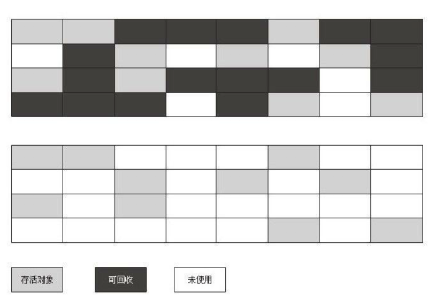
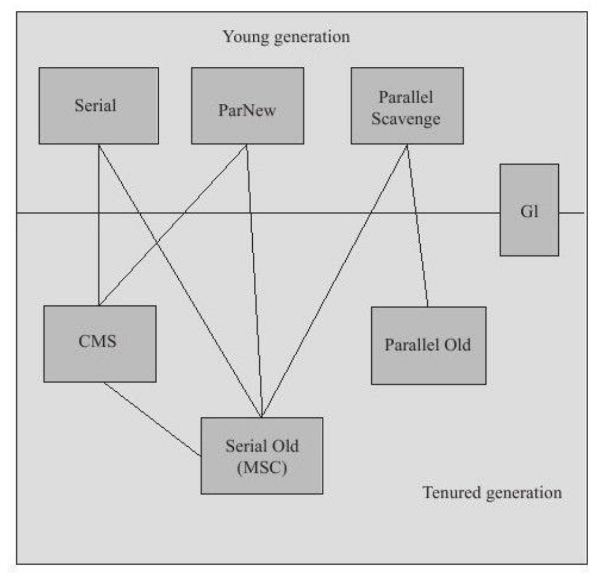
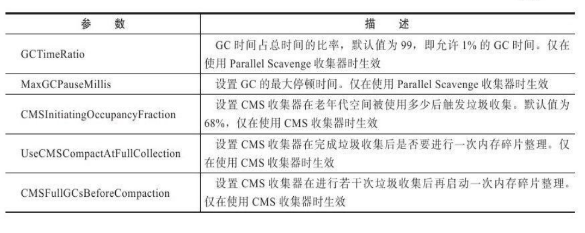

[TOC]
#### 概述
问题
- 那些内存需要回收
- 什么时候回收
- 如何回收

哪些需要回收
> 程序计数器、虚拟机栈和本地方法栈三个区域随线程而生，随线程而死；栈中栈帧随着方法调用进行入栈和出栈。内存分配和回收具备确定性，无需考虑垃圾回收。

> 堆和方法去不同，需要在运行期间动态分配内存，进行动态垃圾回收。
	
	
#### 对象已死吗
##### 引用计数算法
- 给对象添加引用计数器，被引用计数器加1，引用失效计数器减1。计数器为0则对象会被回收。
- 缺点：无法解决对象循环引用的情况。A中引用B、B中引用A。
##### 可达性分析算法
通过“GC Roots”对象作为起点，向下搜索引用链。“GC Root”对象不可达的对象需要回收。
GC Root对象：
- 虚拟机栈(栈帧中本地变量表)中引用的对象
- 方法区中类静态属性引用的对象
- 方法区中常量引用的对象
- 本地方法栈JNI引用的对象


##### 再谈引用
按引用程度依次减弱：
- 强引用：在代码中普遍存在，强引用存在，对象就不会被回收。
- 软引用：描述一些还有用但非必需的对象。在内存溢出异常之前会进行回收。
- 弱引用：也是非必需的对象。关联对象存活到下一次垃圾回收之前。
- 虚引用：无法通过该引用获取到对象实例。为对象关联虚引用为了在垃圾回收时收到系统通知。
##### 生存还是死亡
对象在真正被回收之前会经历两次标记过程。
- 可达性分析算法分析对象不可达，将对象第一次标记并进行一次筛选，筛选时看对象的finalize( )方法是否被调用。
- 若没有被调用，将对象放入可回收队列F-Queue，由Finalizer线程调用的finalize( )方法，对象可在该方法中逃逸--即重新和引用链上的对象建立关联。(如把this赋值给类变量或对象成员变量)
- 第二次标记时会被移除F-Queue队列，否则就会被回收。
- 对象的finalize( )方法只会被执行一次，若逃逸对象再次面临被回收时，无法再次逃逸。
##### 回收方法区
方法区即永久代的垃圾收集包括两部分内容：废弃常量和无用的类。
- 回收废弃常量和回收Java堆中对量类似。
- 是否需要回收无用类需要虚拟机进行配置。无用类需要同时满足以下三种情况才可以被回收：
	- 所有类实例被回收，Java堆中不存在类的实例
	-  加载类的Classloader已被回收
	-  类的java.lang.Class对象没有在任何地方被引用，无法通过反射获取该类。

#### 垃圾收集算法
内存回收方法论
##### 标记-清除算法
过程：分为“标记”和“清除”两个阶段：先标记出需要被回收的对象，标记完后统一回收所有的被标记对象。


缺点
- 效率问题，“标记”和“清除”效率都不高。
- 空间问题，会产生大量不连续的内存碎片。
##### 复制算法
过程：将内存分为两块相等大小，每次使用其中一块，当一块用完，将其中存活对像复制到另一块上，然后将已使用的内存空间统一清理。

优缺: 不用考虑内存碎片，简单且高效。但代价是缩小了一半的内存，而且在复制对象较多时，效率变低。
优化实例：将内存分为较大Eden空间和两块较小的Survivor空间(8:1:1),每次使用Eden和其中一块Survivor。垃圾回收时，将存活的对象复制到另外一块Survivor上，若空间不够会依赖其他内存空间做担保。
##### 标记-整理算法
过程：“标记”过程和“标记-清除算法”一致。整理则是将存活对象向一端移动，清理边界以外的内存。适用于老年代的垃圾回收


##### 分代收集算法
根据对象的存活周期将Java堆分为新生代和老年代。根据各个年代特点选择适当的收集算法。
- 新生代：每次垃圾回收，有大量对象死去，少量对象存活。选用“复制”算法。
- 老年代：对象存活率极高，没有额外空间对它进行分配担保。使用“标记-清除”或者“标记-整理”进行回收。
#### 垃圾收集器
内存回收的具体实现，如下7种垃圾收集器，连线表示可以搭配使用


##### Seiral收集器
特点：单线程收集器，只会使用一个CPU或一个线程完成垃圾收集工作，更重要的是会暂停其他所有线程，“Stop The World”。
基本原理：


使用场景：简单而高效，没有线程交互开销，能获得最高的单线程收集效率。适用于运行在Client模式下的虚拟机。
##### ParNew收集器
特点：Seiral收集器的多线程版本，目前除了Seiral，只有它能配合CMS工作
基本原理：


使用场景：ParNew存在线程间的交互开销，多核CPU时，可设置垃圾收集器线程数。

并发和并行收集器
- 并行：指多条垃圾收集器并行工作，但用户线程处于等待状态
- 并发：用户线程和垃圾收集线程同时执行，只是运行在不同的CPU上

##### Parallel Scavenge收集器
特点：并行的多线程收集器，特点是更多关注吞吐量。通过两个参数能精确控制吞吐量，MaxGCPauseMillis参数保证内存回收时间不超过设定值，GCTimeRatio是垃圾收集器占总时间的比率，相当于吞吐量的倒数。

特性
-	称为“吞吐量优先”收集器。
-	该收集器可配合自适应调节策略，内存管理调优任务将由虚拟机完成。
##### Serial Old收集器
特点:Serial收集器老年代版本，使用“标记-整理”算法
##### Parallel Old收集器
特点：Parallel Scavenge收集器老年代版本，使用“标记-整理”算法，成为“吞吐量”收集器的应用组合
基本原理：


##### CMS收集器
特点：以获取最短回收停顿时间为目的，适用B/S系统这类注重响应速度的服务端。适用“标记-清除”算法。
步骤
-	初始标记：标记GC Root能直接关联的对象，速度快
-	并发标记：进行GC Root Tracing的过程，耗时较长
-	重新标记：修改标记期间产生标记变动的内容，耗时居中
-	并发清除：和并发标记一起能同用户线程一起工作
> 初始标记和重新标记，仍然需要“Stop The World”

基本原理：


优缺点：
- 优点：并发收集，低停顿
- 缺点
	- 对CPU资源敏感，会占用线程，降低吞吐量 （优化变种：增量式并发收集器，效果一般不提倡使用）
	- 无法处理浮动垃圾，出现“Concurrent Mode Failure”，从而导致另一次Full GC的产生。CMS过程中产生的垃圾无法处理，只能留到下一次GC，成为“浮动垃圾”。
	- 内存碎片，导致大对象无法分配，老年代虽然有大空间但提前出现Full GC。
	- 
##### G1收集器
面向服务器端应用的垃圾收集器，整体看是使用“标记-整理算法”，局部看是“复制”算法，目的是替代“CMS”。收集范围是整个新生代和老年代。

特点：
- 并行与并发：利用多CPU缩短Stop The World的时间，利用并发让Java线程继续运行。
- 分代收集：采用不同的方式处理各个年代的对象。
- 空间整理：使用的两种算法，使得G1运行期间不会产生内存碎片，利于时间长时间运行。
- 可预测停顿：低停顿时间是G1和CMS共同特点，但G1还可以建立可预测的停顿时间模型。将内存“化整为零”，使用Remembered Set避免了在整个Java堆进行垃圾回收，在不同Region中跟踪垃圾堆积的价值大小，维护一个优先集列表，每次回收价值最大的Region。

步骤：
- 初始标记
- 并发标记
- 最终标记：对变动标记，并记录到Remembered Set Logs中。
- 筛选回收：对Region回收价值和成本排序，根据期望GC停顿时间去制定回收计划。

基本原理：


##### 理解GC日志
```
33.125:[GC[DefNew:3324K->152K(3712K),0.0025925secs]3324K->152K(11904K),0.0031680secs]
100.667:[FullGC[Tenured:0K->210K(10240K),0.0149142secs]4603K->210K(19456K),[Perm:2999K->
2999K(21248K)],0.0150007secs][Times:user=0.01sys=0.00,real=0.02secs]
```
- 33.125/100.667：表示GC发生的时间
- GC/Full GC：表示GC的停顿类型，不是用来区分新生代和老年代GC，“Full”表示需要“Stop The World”
- DefNew/Tenured/Perm：表示GC发生区域，“区域名称”和使用的收集器密切相关。
- 3324K->152K：GC前该区域已使用总容量->GC后该区域已使用总容量
- 方括号外的3324K->152K：GC前Java堆已使用总容量->GC后Java堆已使用总容量
- 0.0025925secs：GC耗时，单位s

##### 垃圾收集器参数总结




#### 内存分配和回收策略
给对象分配内存，即堆上分配内存，主要在新生代Eden区，若启动本地线程分配缓冲，将按线程优先在TLAB上分配，少数直接分配在老年代。具体细节取决于使用哪种垃圾收集器组合和虚拟机中的内存参数设置，
##### 对象优先在Eden分配
- Minor GC：发生在新生代的GC，频繁且速度快。放Eden没有足够空间分配，触发一次Minor GC。
- Major GC（Full GC)：发生在老年代的GC，会常伴随一次Minor GC。速度是Minor GC的10倍。
```
private static final int_1MB=1024*1024;
/**
*java堆大小20M,新生代10M(8:1:1),老年代10M
*VM参数:-verbose:gc-Xms20M-Xmx20M-Xmn10M-XX:+PrintGCDetails
-XX:SurvivorRatio=8
*/
public static void testAllocation(){
	byte[]allocation1,allocation2,allocation3,allocation4;
	allocation1=new byte[2*_1MB];
	allocation2=new byte[2*_1MB];
	allocation3=new byte[2*_1MB];
	allocation4=new byte[4*_1MB];//出现一次Minor GC
}
```
##### 大对象直接进入老年代
大对象是需要连续内存空间的Java对象。
>通过设置-XX：PretenureSizeThreshold参数，使得大于这个值的对象直接在老年代分配。避免Eden和Survivor之间发生大量复制。
```
private static final int_1MB=1024*1024;
/**
*VM参数:-verbose:gc-Xms20M-Xmx20M-Xmn10M-XX:+PrintGCDetails-XX:SurvivorRatio=8
*-XX:PretenureSizeThreshold=3145728
*/
public static void testPretenureSizeThreshold(){
	byte[]allocation;
	allocation=new byte[4*_1MB];//直接分配到老年代
}
```
##### 长期存活的对象将进入老年代
> 使用分代收集的思想管理内存，对象定义一个对象年龄计数器，每熬过一次Minor GC，年龄加一。通过-XX:MaxTenuringThreshold设置年龄阈值，超过阈值就会晋升为老年代。
```
private static final int_1MB=1024*1024;
/**
*VM参数:-verbose:gc-Xms20M-Xmx20M-Xmn10M-XX:+PrintGCDetails-XX:SurvivorRatio=8-XX:MaxTenuringThreshold=1
*-XX:+PrintTenuringDistribution
*/
@SuppressWarnings("unused")
public static void testTenuringThreshold(){
	byte[]allocation1,allocation2,allocation3;
	allocation1=new byte[_1MB/4];
	//什么时候进入老年代取决于XX:MaxTenuringThreshold设置
	allocation2=new byte[4*_1MB];
	allocation3=new byte[4*_1MB]; // MaxTenuringThreshold=1, allocation1进入老年代
	allocation3=null;
	allocation3=new byte[4*_1MB];  // MaxTenuringThreshold=15, allocation1仍在新生代
}
```
##### 动态对象年龄判定

> 并不是非得到达年龄阈值才会晋升为老年代，Survivor空间中相同年龄所有对象的总和，大于Survivor空间的一半时，年龄大于或等于该年龄对象的就可以直接进入老年代
```
private static final int_1MB=1024*1024;
/**
*VM参数:-verbose:gc-Xms20M-Xmx20M-Xmn10M-XX:+PrintGCDetails-XX:SurvivorRatio=8-XX:MaxTenuringThreshold=15
*-XX:+PrintTenuringDistribution
*/
@SuppressWarnings("unused")
public static void testTenuringThreshold2(){
byte[]allocation1,allocation2,allocation3,allocation4;
allocation1=new byte[_1MB/4];
//allocation1+allocation2大于survivor空间的一半
allocation2=new byte[_1MB/4];
allocation3=new byte[4*_1MB];
allocation4=new byte[4*_1MB];
allocation4=null;
allocation4=new byte[4*_1MB];
}
```
##### 空间分配担保
是什么：
新生代使用复制算法垃圾收集，将Survivor作为轮换备份，当大量对象在Minor GC存活，需要老年代进行担保，把Survivor中的对象复制到老年代。
过程：
Minor GC前，虚拟机需要确认老年代空间是否足够(大于新生代所有对象总空间大小)，若足够MinorGC安全。若不足够，通过HandlePromotionFailure参数设置是否允许担保失败。允许失败时，检查老年代最大可用连续空间是否大于晋升到老年代对象平均大小，大于时进行Minor GC。小于时，若不允许失败需要改为Full GC。一般设置允许失败，避免频繁Full GC。
```
/**
JDK Update24之后，HandlePromotionFailur参数不再使用
**/
bool TenuredGenerationPpromotion_attempt_is_safe(size_t max_promotion_in_bytes)const{
	//老年代最大可用的连续空间
	size_t available=max_contiguous_available();
	//每次晋升到老年代的平均大小
	size_t av_promo=(size_t)gc_stats()->avg_promoted()->padded_average();
	//老年代可用空间是否大于平均晋升大小，或者老年代可用空间是否大于当次GC时新生代所有对象容量
	bool res=(available>=av_promo)||(available>=max_promotion_in_bytes);
	return res;
}
```
空间分配担保实例：
```private static final int_1MB=1024*1024;
/**
*VM参数:-Xms20M-Xmx20M-Xmn10M-XX:+PrintGCDetails-XX:SurvivorRatio=8-XX:-HandlePromotionFailure
*/
@SuppressWarnings("unused")
public static void testHandlePromotion(){
	byte[]allocation1,allocation2,allocation3,allocation4,allocation5,allocation6,allocation7;
	allocation1=new byte[2*_1MB];
	allocation2=new byte[2*_1MB];
	allocation3=new byte[2*_1MB];
	allocation1=null;
	allocation4=new byte[2*_1MB];
	allocation5=new byte[2*_1MB];
	allocation6=new byte[2*_1MB];
	allocation4=null;
	allocation5=null;
	allocation6=null;
	allocation7=new byte[2*_1MB];
}

```
- HandlePromotionFailur = flase
```
[GC[DefNew:6651K->148K(9216K),0.0078936secs]6651K->4244K(19456K),0.0079192secs][Times:user=0.00sys=0.02,real=0.02secs]
[GC[DefNew:6378K->6378K(9216K),0.0000206secs][Tenured:4096K->4244K(10240K),0.0042901secs]10474K->
4244K(19456K),[Perm:2104K->2104K(12288K)],0.0043613secs][Times:user=0.00sys=0.00,real=0.00secs]
```
- HandlePromotionFailur = true (允许失败，担保失败，重新发起Full GC)
```
[GC[DefNew:6651K->148K(9216K),0.0054913secs]6651K->4244K(19456K),0.0055327secs][Times:user=0.00sys=0.00,real=0.00secs]
[GC[DefNew:6378K->148K(9216K),0.0006584secs]10474K->4244K(19456K),0.0006857secs][Times:user=0.00sys=0.00,real=0.00secs]
```