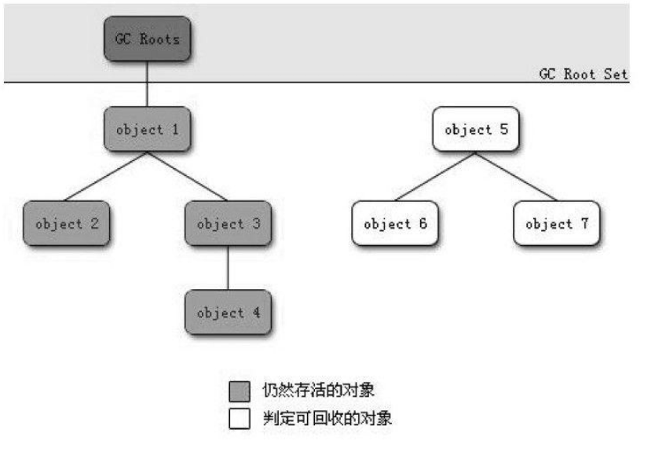

[TOC]
#### 概述
问题
- 那些内存需要回收
- 什么时候回收
- 如何回收

哪些需要回收
> 程序计数器、虚拟机栈和本地方法栈三个区域随线程而生，随线程而死；栈中栈帧随着方法调用进行入栈和出栈。内存分配和回收具备确定性，无需考虑垃圾回收。

> 堆和方法去不同，需要在运行期间动态分配内存，进行动态垃圾回收。
	
	
#### 对象已死吗
##### 引用计数算法
- 给对象添加引用计数器，被引用计数器加1，引用失效计数器减1。计数器为0则对象会被回收。
- 缺点：无法解决对象循环引用的情况。A中引用B、B中引用A。
##### 可达性分析算法
通过“GC Roots”对象作为起点，向下搜索引用链。“GC Root”对象不可达的对象需要回收。
GC Root对象：
- 虚拟机栈(栈帧中本地变量表)中引用的对象
- 方法区中类静态属性引用的对象
- 方法区中常量引用的对象
- 本地方法栈JNI引用的对象

##### 再谈引用
按引用程度依次减弱：
- 强引用：在代码中普遍存在，强引用存在，对象就不会被回收。
- 软引用：描述一些还有用但非必需的对象。在内存溢出异常之前会进行回收。
- 弱引用：也是非必需的对象。关联对象存活到下一次垃圾回收之前。
- 虚引用：无法通过该引用获取到对象实例。为对象关联虚引用为了在垃圾回收时收到系统通知。
##### 生存还是死亡
对象在真正被回收之前会经历两次标记过程。
- 可达性分析算法分析对象不可达，将对象第一次标记并进行一次筛选，筛选时看对象的finalize( )方法是否被调用。
- 若没有被调用，将对象放入可回收队列F-Queue，由Finalizer线程调用的finalize( )方法，对象可在该方法中逃逸--即重新和引用链上的对象建立关联。(如把this赋值给类变量或对象成员变量)
- 第二次标记时会被移除F-Queue队列，否则就会被回收。
- 对象的finalize( )方法只会被执行一次，若逃逸对象再次面临被回收时，无法再次逃逸。
##### 回收方法区
方法区即永久代的垃圾收集包括两部分内容：废弃常量和无用的类。
- 回收废弃常量和回收Java堆中对量类似。
- 是否需要回收无用类需要虚拟机进行配置。无用类需要同时满足以下三种情况才可以被回收：
	- 所有类实例被回收，Java堆中不存在类的实例
	-  加载类的Classloader已被回收
	-  类的java.lang.Class对象没有在任何地方被引用，无法通过反射获取该类。

#### 垃圾收集算法
##### 标记-清除算法
##### 复制算法
##### 标记-整理算法
##### 分代收集算法

#### HotSpot算法实现
#####枚举根节点
##### 安全点
##### 安全区域

#### 垃圾收集器
##### Seiral收集器
##### ParNew收集器
##### Parallel Scavenge收集器
##### Serial Old收集器
##### Parallel Old收集器
##### CMS收集器
##### G1收集器
##### 理解GC日志
##### 垃圾收集器参数总结

#### 内存分配和回收策略
##### 对象优先在Eden分配
##### 大对象直接进入老年代
##### 长期存活的对象将进入老年代
##### 动态对象年龄判定
##### 空间分配担保