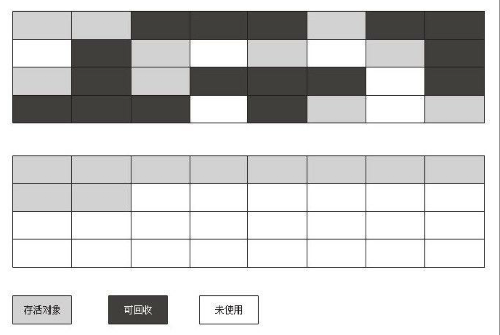

[TOC]
#### 概述
问题
- 那些内存需要回收
- 什么时候回收
- 如何回收

哪些需要回收
> 程序计数器、虚拟机栈和本地方法栈三个区域随线程而生，随线程而死；栈中栈帧随着方法调用进行入栈和出栈。内存分配和回收具备确定性，无需考虑垃圾回收。

> 堆和方法去不同，需要在运行期间动态分配内存，进行动态垃圾回收。
	
	
#### 对象已死吗
##### 引用计数算法
- 给对象添加引用计数器，被引用计数器加1，引用失效计数器减1。计数器为0则对象会被回收。
- 缺点：无法解决对象循环引用的情况。A中引用B、B中引用A。
##### 可达性分析算法
通过“GC Roots”对象作为起点，向下搜索引用链。“GC Root”对象不可达的对象需要回收。
GC Root对象：
- 虚拟机栈(栈帧中本地变量表)中引用的对象
- 方法区中类静态属性引用的对象
- 方法区中常量引用的对象
- 本地方法栈JNI引用的对象


##### 再谈引用
按引用程度依次减弱：
- 强引用：在代码中普遍存在，强引用存在，对象就不会被回收。
- 软引用：描述一些还有用但非必需的对象。在内存溢出异常之前会进行回收。
- 弱引用：也是非必需的对象。关联对象存活到下一次垃圾回收之前。
- 虚引用：无法通过该引用获取到对象实例。为对象关联虚引用为了在垃圾回收时收到系统通知。
##### 生存还是死亡
对象在真正被回收之前会经历两次标记过程。
- 可达性分析算法分析对象不可达，将对象第一次标记并进行一次筛选，筛选时看对象的finalize( )方法是否被调用。
- 若没有被调用，将对象放入可回收队列F-Queue，由Finalizer线程调用的finalize( )方法，对象可在该方法中逃逸--即重新和引用链上的对象建立关联。(如把this赋值给类变量或对象成员变量)
- 第二次标记时会被移除F-Queue队列，否则就会被回收。
- 对象的finalize( )方法只会被执行一次，若逃逸对象再次面临被回收时，无法再次逃逸。
##### 回收方法区
方法区即永久代的垃圾收集包括两部分内容：废弃常量和无用的类。
- 回收废弃常量和回收Java堆中对量类似。
- 是否需要回收无用类需要虚拟机进行配置。无用类需要同时满足以下三种情况才可以被回收：
	- 所有类实例被回收，Java堆中不存在类的实例
	-  加载类的Classloader已被回收
	-  类的java.lang.Class对象没有在任何地方被引用，无法通过反射获取该类。

#### 垃圾收集算法
内存回收方法论
##### 标记-清除算法
过程：分为“标记”和“清除”两个阶段：先标记出需要被回收的对象，标记完后统一回收所有的被标记对象。


缺点
- 效率问题，“标记”和“清除”效率都不高。
- 空间问题，会产生大量不连续的内存碎片。
##### 复制算法
过程：将内存分为两块相等大小，每次使用其中一块，当一块用完，将其中存活对像复制到另一块上，然后将已使用的内存空间统一清理。

优缺: 不用考虑内存碎片，简单且高效。但代价是缩小了一半的内存，而且在复制对象较多时，效率变低。
优化实例：将内存分为较大Eden空间和两块较小的Survivor空间(8:1:1),每次使用Eden和其中一块Survivor。垃圾回收时，将存活的对象复制到另外一块Survivor上，若空间不够会依赖其他内存空间做担保。
##### 标记-整理算法
过程：“标记”过程和“标记-清除算法”一致。整理则是将存活对象向一端移动，清理边界以外的内存。适用于老年代的垃圾回收


##### 分代收集算法
根据对象的存活周期将Java堆分为新生代和老年代。根据各个年代特点选择适当的收集算法。
- 新生代：每次垃圾回收，有大量对象死去，少量对象存活。选用“复制”算法。
- 老年代：对象存活率极高，没有额外空间对它进行分配担保。使用“标记-清除”或者“标记-整理”进行回收。
#### 垃圾收集器
内存回收的具体实现，如下7种垃圾收集器，连线表示可以搭配使用


##### Seiral收集器
特点：单线程收集器，只会使用一个CPU或一个线程完成垃圾收集工作，更重要的是会暂停其他所有线程，“Stop The World”。
基本原理：


使用场景：简单而高效，没有线程交互开销，能获得最高的单线程收集效率。适用于运行在Client模式下的虚拟机。
##### ParNew收集器
特点：Seiral收集器的多线程版本，目前除了Seiral，只有它能配合CMS工作
基本原理：


使用场景：ParNew存在线程间的交互开销，多核CPU时，可设置垃圾收集器线程数。

并发和并行收集器
- 并行：指多条垃圾收集器并行工作，但用户线程处于等待状态
- 并发：用户线程和垃圾收集线程同时执行，只是运行在不同的CPU上

##### Parallel Scavenge收集器
特点：并行的多线程收集器，特点是更多关注吞吐量。通过两个参数能精确控制吞吐量，MaxGCPauseMillis参数保证内存回收时间不超过设定值，GCTimeRatio是垃圾收集器占总时间的比率，相当于吞吐量的倒数。

特性
-	称为“吞吐量优先”收集器。
-	该收集器可配合自适应调节策略，内存管理调优任务将由虚拟机完成。
##### Serial Old收集器
特点:Serial收集器老年代版本，使用“标记-整理”算法
##### Parallel Old收集器
特点：Parallel Scavenge收集器老年代版本，使用“标记-整理”算法，成为“吞吐量”收集器的应用组合
基本原理：


##### CMS收集器
特点：以获取最短回收停顿时间为目的，适用B/S系统这类注重响应速度的服务端。适用“标记-清除”算法。
步骤
-	初始标记：标记GC Root能直接关联的对象，速度快
-	并发标记：进行GC Root Tracing的过程，耗时较长
-	重新标记：修改标记期间产生标记变动的内容，耗时居中
-	并发清除：和并发标记一起能同用户线程一起工作
> 初始标记和重新标记，仍然需要“Stop The World”

基本原理：


优缺点：
- 优点：并发收集，低停顿
- 缺点
	- 对CPU资源敏感，会占用线程，降低吞吐量 （优化变种：增量式并发收集器，效果一般不提倡使用）
	- 无法处理浮动垃圾，出现“Concurrent Mode Failure”，从而导致另一次Full GC的产生。CMS过程中产生的垃圾无法处理，只能留到下一次GC，成为“浮动垃圾”。
	- 内存碎片，导致大对象无法分配，老年代虽然有大空间但提前出现Full GC。
	- 
##### G1收集器
面向服务器端应用的垃圾收集器，整体看是使用“标记-整理算法”，局部看是“复制”算法，目的是替代“CMS”。收集范围是整个新生代和老年代。

特点：
- 并行与并发：利用多CPU缩短Stop The World的时间，利用并发让Java线程继续运行。
- 分代收集：采用不同的方式处理各个年代的对象。
- 空间整理：使用的两种算法，使得G1运行期间不会产生内存碎片，利于时间长时间运行。
- 可预测停顿：低停顿时间是G1和CMS共同特点，但G1还可以建立可预测的停顿时间模型。将内存“化整为零”，使用Remembered Set避免了在整个Java堆进行垃圾回收，在不同Region中跟踪垃圾堆积的价值大小，维护一个优先集列表，每次回收价值最大的Region。

步骤：
- 初始标记
- 并发标记
- 最终标记：对变动标记，并记录到Remembered Set Logs中。
- 筛选回收：对Region回收价值和成本排序，根据期望GC停顿时间去制定回收计划。

基本原理：


##### 理解GC日志
```
33.125:[GC[DefNew:3324K->152K(3712K),0.0025925secs]3324K->152K(11904K),0.0031680secs]
100.667:[FullGC[Tenured:0K->210K(10240K),0.0149142secs]4603K->210K(19456K),[Perm:2999K->
2999K(21248K)],0.0150007secs][Times:user=0.01sys=0.00,real=0.02secs]
```
- 33.125/100.667：表示GC发生的时间
- GC/Full GC：表示GC的停顿类型，不是用来区分新生代和老年代GC，“Full”表示需要“Stop The World”
- DefNew/Tenured/Perm：表示GC发生区域，“区域名称”和使用的收集器密切相关。
- 3324K->152K：GC前该区域已使用总容量->GC后该区域已使用总容量
- 方括号外的3324K->152K：GC前Java堆已使用总容量->GC后Java堆已使用总容量
- 0.0025925secs：GC耗时，单位s

##### 垃圾收集器参数总结


#### 内存分配和回收策略
##### 对象优先在Eden分配
##### 大对象直接进入老年代
##### 长期存活的对象将进入老年代
##### 动态对象年龄判定
##### 空间分配担保