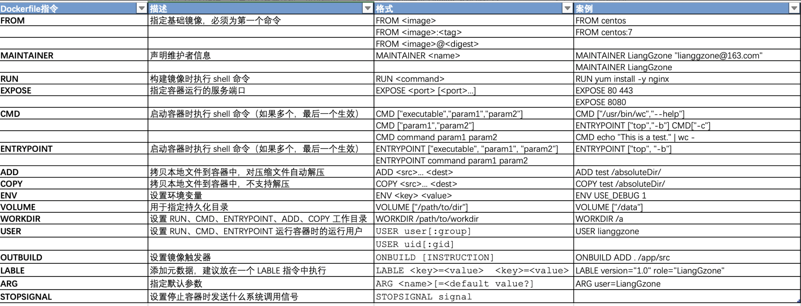

[toc]
## 阮一峰Docker 入门教程
### Linux容器背景
两大难题：
- 软件开发中最大的麻烦事，环境配置，如操作系统的设置，各种库和组件的安装
- 虚拟机是带环境安装的一种解决方案，可在一种操作系统中运行另一种系统，但缺点是资源占用多、冗余步骤复杂、启动慢

解决难题
- Linux容器产生：由上述虚拟机缺点，发展出另一种虚拟化技术，**Linux容器(LXC)**
- Linux容器不是模拟一个完整的操作系统，而是对进程进行隔离
- Linux容器优点：启动快、资源占用少、体积小

### Docker入门

#### Docker是什么
> Docker就属于Linux容器的一种封装，提供简单易用的容器使用接口，是当前最流行的Linux容器技术。
#### Docker安装
##### 安装官网地址
- [mac](https://docs.docker.com/docker-for-mac/install/)
- [ubantu](https://docs.docker.com/install/linux/docker-ce/ubuntu/)
- [centos](https://docs.docker.com/install/linux/docker-ce/centos/)
##### 安装成功验证
> $ docker version 
> or
> $ docker info
##### 给docker授权
>docker需要root权限，把用户加入root用于组
>$ sudo usermod -aG docker $USER
##### Linux下启动docker服务
> Docker是服务器-客户端架构，命令行运行docker时，需要启动docker服务
> $ sudo service docker start
> or
> $ sudo systemctl start docker
#### image文件
- 介绍：Docker把应用程序和依赖打包到镜像文件中，通过镜像文件可以生成多个同时运行的镜像实例。image文件是一个二进制的文件，通过一个image生成另外一个image，理解为继承关系。定制镜像文件，也基于别人的进行加工。
- 命令
```
#列出本机所有的images文件
$ docker images
#删除image文件
$ docker rim [imageName]
```
- 实例hello world
```
# 1.将image文件从仓库抓取到本地，library是image文件所在组，hello-world是image文件名，docker提供的image文件，都在library中，为默认组，可省略
$ docker pull library/hello-world   
# 2.抓取后本机查看，运行image文件(docker run会有从仓库自动抓取，因此pull命令非必须)
$ docker images | grep hello-world
$ docker run hello-world
# 3.有些容器不会自动终止，因为提供的是服务，比如安装运行Ubuntu的image
$ docker run -it ubuntu bash
# 4.对于不会自动终止的容器，必须手动终止
$ docker kill [containerID]
```
#### 容器文件
image文件生成的容器实例，本身也是一个文件，成为容器文件。容器一旦生成，就同时存在两个文件：image文件和容器文件。关闭容器并不会删除容器文件，只是停止运行而已。

```
# 列出本机正在运行的容器
$ docker container ls
# 列出本机所有的容器，包括终止的容器
docker container ls -a
# 删除终止的容器文件
$ docker container rm [containerID]
```

#### Dockerfile文件
该文本文件，用来配置image，docker根据该文件生成二进制的image文件。下面是制作自己的Docker容器的例子：

##### 1.准备工作，下载源码
>$ git clone https://github.com/ruanyf/koa-demos.git
$ cd koa-demos
##### 2.编写Docerfile文件
```.dockerignore 表示这三个路径要排除，不要打包进image文件
.git
node_modules
npm-debug.log
```
```Dockerfile
FROM node:8.4 # 新的image文件从node image 继承而来
COPY . /app # 将当前目录下的所有文件，拷贝到image文件的/app目录下
WORKDIR /app # 指定接下来的工作路径为/app
RUN ["npm", "install"] # 在/app目录下，运行npm install命令安装依赖
EXPOSE 3000 # 将容器 3000 端口暴露下来，允许外部连接这个端口
```

##### 3.创建image文件
```
$ docker build -t koa-demo .
```
##### 4.生成容器
```
docker run -p 8000:3000 -it koa-demo /bin/bash
```
上面命令的各个参数含义如下：
-p 参数：3000端口映射到本机的8000端口
-it参数：容器的shell映射到当前的shell，即可本机窗口输入命令传入容器
- /bin/bash: 容器启动后，为内部第一个执行的命令，这里启动的是bash，保证用户可以使用shell
```
# 执行下面的命令，本机浏览器访问http://localhost:8000 显示Not Fount,因为没有下路由
root@sjdf98d293:/app#node demos/01.js
# Ctrl + c停止Node进程 exit退出容器docker kill，删除该容器docker rm,可以在运行时添加--rm 参数，在容器终止运行后自动删除容器文件
$ docker run --rm -p 8000:3000 -it koa-demo /bin/bash
```
##### 5.CMD命令
上面容器启动后需要手动输入命令，可以写在Dockerfile里面，这样容器启动以后，这个命令就已经执行了。
```
FROM node:8.4
COPY . /app
WORKDIR /app
RUN npm install --registry=https://registry.npm.taobao.org
EXPOSE 3000
CMD node demos/01.js
```
CMD命令指定后，就不能附加其他命令如/bin/bash，否则会覆盖CMD命令，使用下面的命令启动。
```
$docker run -rm -p 8000:3000 -it koa-demo
```
CMD和RUN命令的区别：
- RUN命令在image文件的构建阶段运行，执行结果会打包进入image文件
- CMD命令则是容器启动后执行
- Dockerfile可以包括多个RUN命令，但是只能由一个CMD命令。
##### 6.发布image文件
容器运行成功后，就确认了image文件的有效性。

```
$ docker login 
$ docker image tag [imageName][username]/[repositiry]:[tag]
# 也可以重新构建一下image文件
$ docker build -t [username]/[repository]:[tag]
$ docker image push [username]/[repository]:[tag]
```
#### 其他有用的命令
(1)docker start [containerID] ：启动已经生成、已经停止运行的容器文件

(2)docker stop [containerID]: 终止容器运行。

(3)docker logs [containerID]：查看docker容器的输出。没有使用-it,可以使用这个命令查看输出。

(4)docker exec -it [containerID] /bin/bash：进入一个正在运行的docker容器。

(5)docker cp [containerID]:[/path/to/file] . : 从正在运行的Docker容器里面，将文件拷贝到本机。
