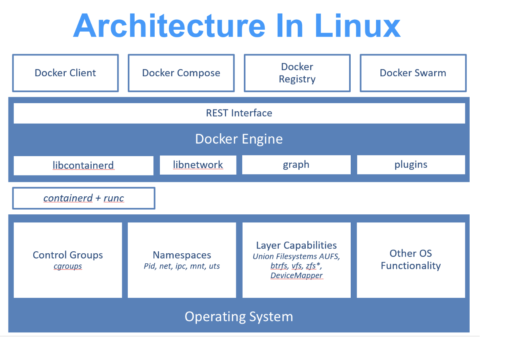
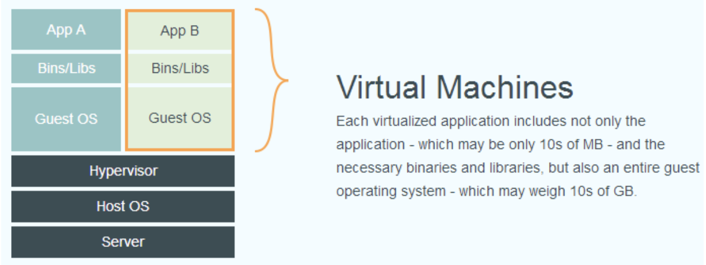
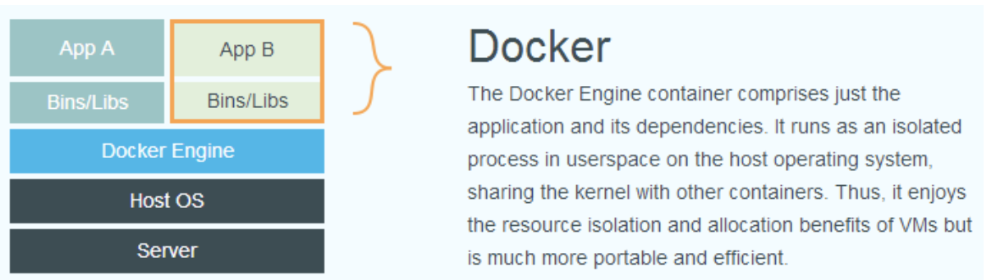
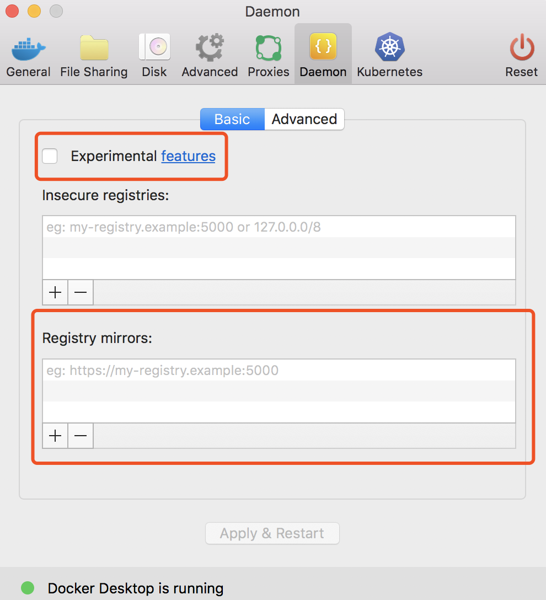

[toc]
### Docker简介
#### Docker是什么？

- go语言开发，基于linux内核技术，对线程封装隔离，属于操作系统层面的虚拟技术。
- 隔离了宿主机和其他的进程，也被成为容器
- 演进至今，基于 runC 和 containered实现
	- runc: linux命令行工具，创建和运行容器
	- containered：守护进程，在容器执行和监督下载镜像中管理容器生命周期





Docker和传统虚拟化技术区别
- 传统虚拟化技术：硬件虚拟化，运行一套完整的操作系统
- Docker：直接运行在主机内核，没有自己的内核和虚拟硬件，更轻巧
#### 为什么用Docker?
Docker和虚拟机的特性对比

|   特性  |    Docker |  虚拟机   |
| --- | --- | --- |
|   启动速度  | 秒级    |   分钟级  |
|   磁盘占用  |  MB   |   GB  |
|    性能 |  接近原生物理机   |    性能损耗大 |
|系统支持量|单机支持上千个容器   | 一般几十个  |
| CI/CD|开发、测试、生产环境一致 | 无成熟体系|
|迁移/扩展|跨平台，可复制|较为复杂|

### 基本概念
Docker由镜像、容器、仓库三个部分组成
#### 镜像
- Docker镜像是特殊的文件系统，提供容器运行需要的程序、库、资源和配置，以及配置参数，不包含动态数据，在构建后就不会发生改变。
- 分层存储：镜像是一个虚拟概念，实际由一组或者说多层文件系统联合构成。
- 镜像构建，会一层一层构建，前一层是后一层的基础。分层存储使得镜像的复制和定制更容易。
 
#### 容器
- 容器和镜像的关系，就像面向对象的‘类’和‘对象’一样。
- 容器的实质是进程。容器进程有属于自己独立的命名空间。
- 容器也是分层存储，运行以镜像为基础层，构建当前容器的存储层，成为'容器存储层'，其生命周期和容器一样。
- 容器不应向其存储层内写入任何数据，要保持无状态化。所有的文件写入操作，应使用 数据卷（Volume）、或者绑定宿主目录。数据卷的生存周期独立于容器，容器消亡，数据卷不会消亡。

#### 仓库
- 镜像集中存储和分发的服务。
- <仓库名>:<标签>对应一个镜像
- Docker Registry公开服务，开放给用户使用、允许用户管理镜像的 Registry 服务。
- 除了使用公开服务外，用户还可以在本地搭建[私有 Docker Registry](https://yeasy.gitbooks.io/docker_practice/content/repository/registry.html)。
### 安装
[ubuntu、macos安装指南](https://yeasy.gitbooks.io/docker_practice/content/install/)

mac系统最低为 macOS Sierra 10.12
- homebrew安装: **brew cask install docker**
- 手动安装：
	- [下载Docker Desktop for Mac](https://download.docker.com/mac/stable/Docker.dmg)
	- 验证：**docker --version**

镜像加速器
国内从 Docker Hub 拉取镜像有时会遇到困难，此时可以配置镜像加速器，由于镜像服务可能出现宕机，建议同时配置多个镜像。
```
使用docker info查看加速器是否生效
$docker info
Registry Mirrors: https://dockerhub.azk8s.cn/
```
- Azure 中国镜像 https://dockerhub.azk8s.cn
- 阿里云加速器(需登录账号获取)
- 七牛云加速器 https://reg-mirror.qiniu.com


	
### 基本使用
#### 镜像使用
1.*获取镜像*: 下载过程中会输出获取镜像的每一层信息 **docker pull image_name:version** 

2.*列出本地已有的镜像*: 展示字段 REPOSITORY(来自那个仓库)、TAG(镜像的标记)、IMAGE ID(唯一ID)、CREATED(创建时间)、VIRTUAL SIZE(镜像大小) **docker images** 
3.*创建镜像*：更新已有的镜像、通过Dockerfile创建、通过本地文件系统创建
- 使用基本镜像启动容器，进入容器 **docker run -it image_id/image_name /bin/bash**，记住容器id，修改好退出容器 **exit**，使用 **docker commit -m "commit info" -a "commitor name" container_id new_image_name** 提交更新后的副本。
- 使用Dockerfile创建镜像，每条指令都创建镜像的一层，具体会后面详解。通过**docker build -t image_name .** 在当前目录下查找Dockerfile，并把目录下的内容打包到镜像中。其中 **-t 标记添加tag**
- 本地系统文件导入 **docker import - image_name**

4.*修改镜像的tag*: **docker tag image_id image_new_tag**
5.*上传镜像*： **docker push image_name**
6.*存出或载入Docker镜像*：
- 导出文件到本地：**docker save -o image.tar image_name**
- 从导出的本地文件中再导入到本地镜像库：**docker load --inpur image.tar**

7.*移除镜像*：**docker rmi image_name/image_id** 注意在镜像删除前要先删除依赖于此镜像的容器 **docker rm -f container**

#### 容器使用
#### 仓库使用
