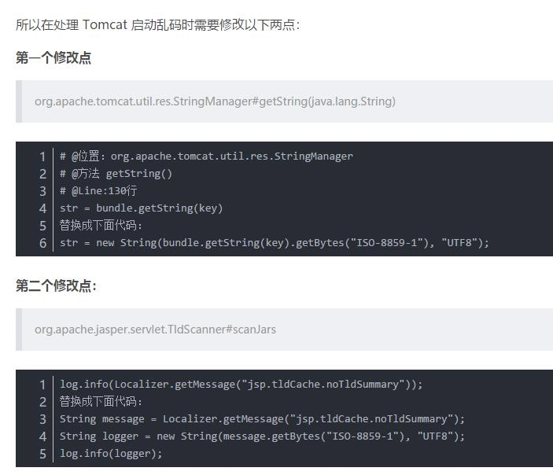

[toc]
##### 问题1.断点卡住了项目报错
```
JSR-330 'javax.inject.Inject' annotation found and supported for autowiring
```

##### 问题2 jar包冲突导致的项目无法启动
```
omitted for conflict with...
```
Maven具有依赖传递性，需要删除低版本的相关pom

##### 问题3.Mac上使用Jenv管理多个JDK版本
>简书链接：https://www.jianshu.com/p/21f9ae99e88b
>
1.查看jenv找到的java版本：jenv versions
```
* system (set by /Users/bxpeng/.jenv/version)
只找到了系统默认的Java，*表示当前选择的版本。下载了其他版本的Java，但是它并不会自动发现
```
2.将Java 7、Java 8加入jenv：jenv add 
```
> jenv add /Library/Java/JavaVirtualMachines/jdk1.7.0_71.jdk/Contents/Home/
1.7 added
1.7.0.71 added
oracle64-1.7.0.71 added
```
3.从jEnv中去掉不需要的Java版本:jenv remove
```
> jenv remove 1.6
JDK 1.6 removed
```
4.选择一个Java版本：jenv local
```
> jenv local 1.8.0.25
> java -version
java version "1.8.0_25"
Java(TM) SE Runtime Environment (build 1.8.0_25-b17)
Java HotSpot(TM) 64-Bit Server VM (build 25.25-b02, mixed mode) 
```
##### 问题4 Tomcat启动乱码


##### 问题5 使用pageHelper插件问题
为什么pageHelper超过最大页数后还会返回数据
```
数据库总数5
情况1：PageHelper.startPage(2, 4) sql打印limit(?,?) 4, 4  
情况2：PageHelper.startPage(2, 6) sql打印limit(?) 6 
```
 问题是，第二中情况应该是limit(?,?) 6, 6)不是
 
原因：这是pageHelper里面自带的一个功能，叫做reasonable分页参数合理化，3.3.0以上版本可用，默认是false。 启用合理化时，如果pageNum<1会查询第一页，如果pageNum>pages会查询最后一页； 禁用合理化时，如果pageNum<1或pageNum>pages会返回空数据。

解决：一般项目里面加入<property name="reasonable" value="false" />，Spring Boot项目里面：pagehelper.reasonable=false

##### 问题6 git fork后同步更新
```
git remote add upstream URL
git fetch upstream
git merge upstream/master
git push origin master:master
```

##### IDEA无法读取到环境变量
https://blog.csdn.net/qq_26788593/article/details/92835245

```
1./Applications > open IntelliJ\ IDEA.app
2.vim ~/.zshrc 
3.添加 source ~/.bash_profile即可
```

##### 使用docker搭建centos7环境

https://blog.csdn.net/cool0725/article/details/101271622