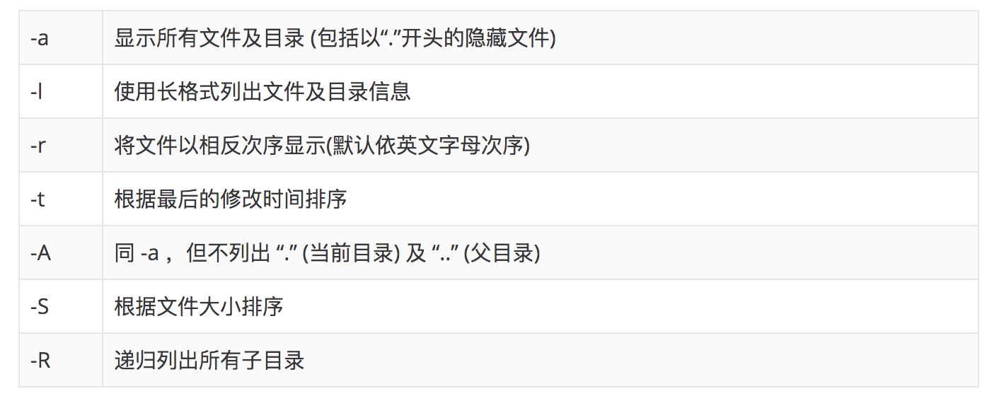
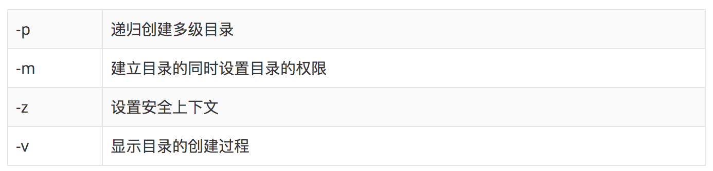
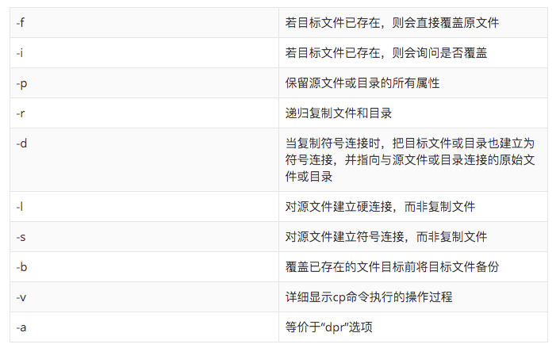
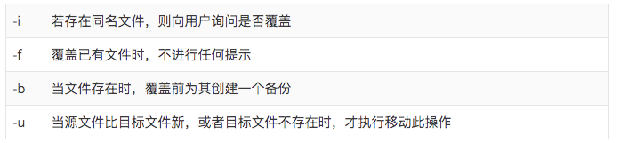
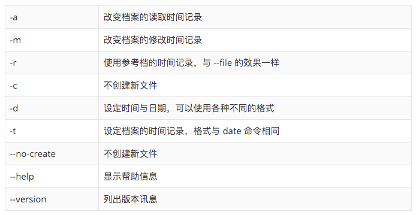
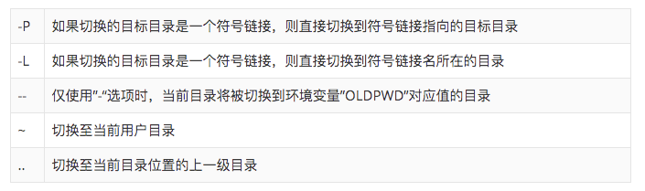
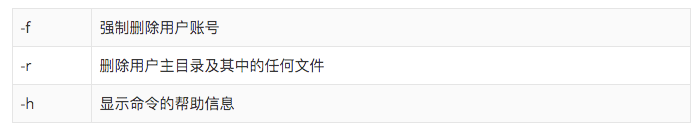
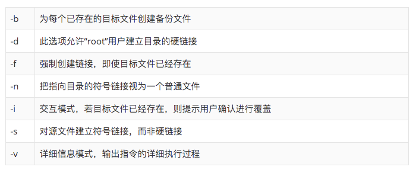
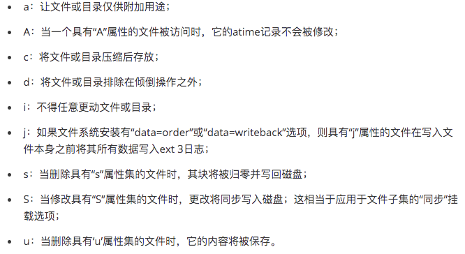
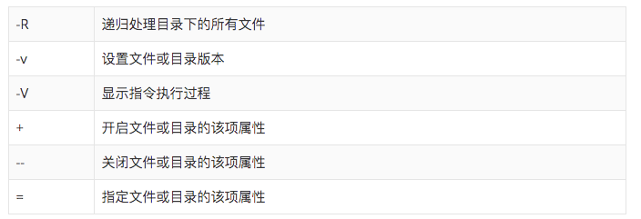

[toc]

所有的命令参数 可以通过：man + [命令] 查看

# 常用且熟悉
## ls命令
显示指定工作目录下的内容及属性信息 list

## mkdir命令 
创建不存在目录，也可同时创建多个目录 make directories

## cp命令
复制文件或目录 copy
 
 ## pwd命令
复制文件或目录 print working directory

 ## mv命令
移动或改名文件 move

 ## touch命令
一是创建新的空文件，二是改变已有文件的时间戳属性

## cd 命令
切换目录，从当前目录切换到指定目录。“~”也表示为用户目录的意思，“.”则是表示目前所在的目录，“..”则表示当前目录位置的上一级目录。

# 不太熟悉
## userdel命令
删除指定的用户及与该用户相关的文件

## ln命令
为文件创建链接。意思是为某一个文件在另外一个位置建立一个同步的链接，有软连接、硬链接。类似windows的快捷方式。

## chattr命令
更改文件属性，“ aAcCdDeijsStTu ” 表示可以赋予文件的新属性，这些属性共有以下几种模式。

