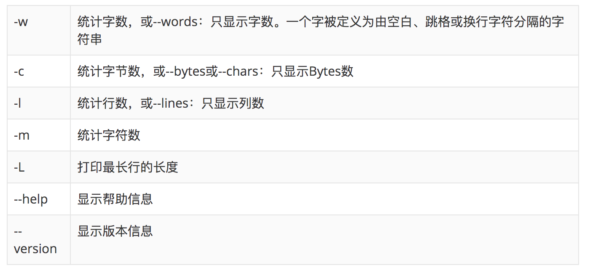
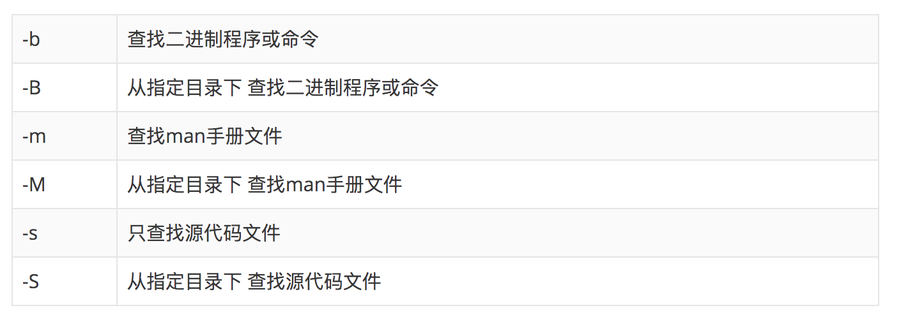
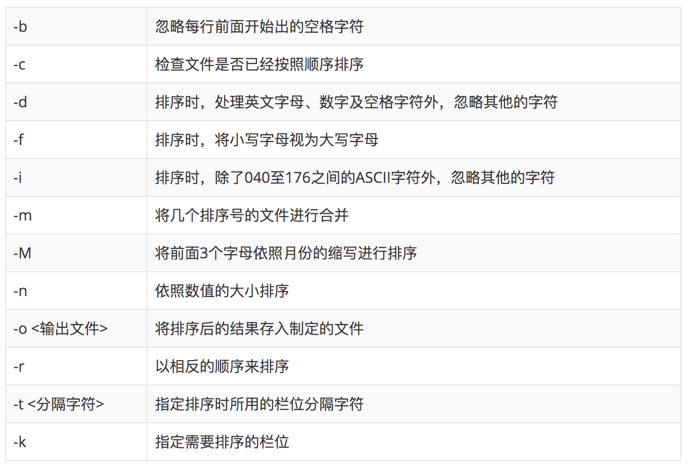
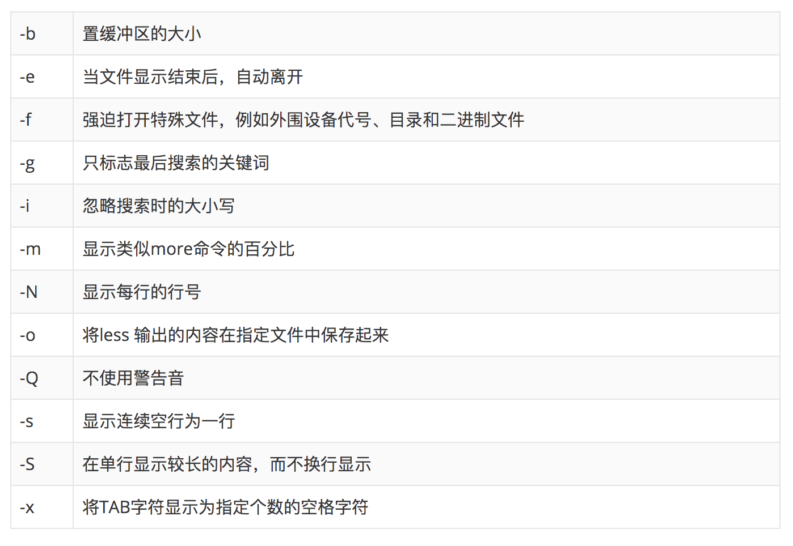
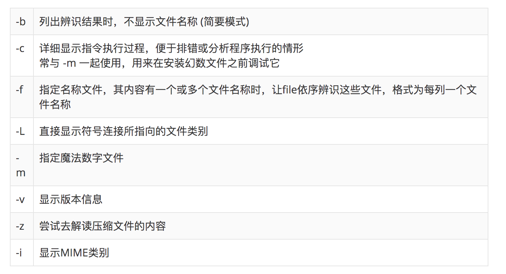
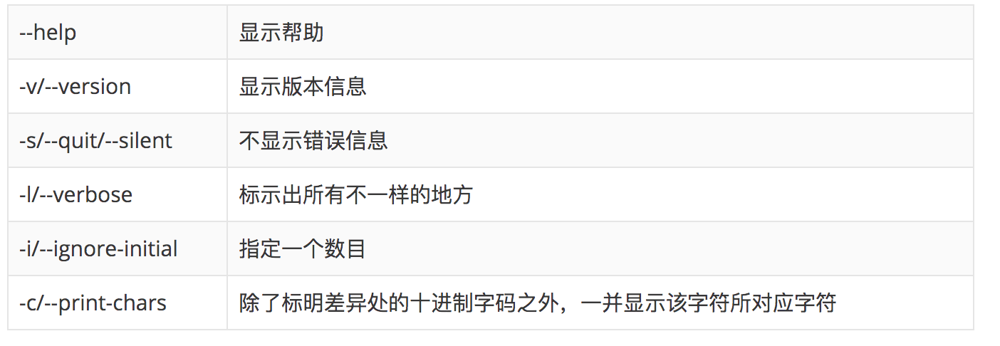

[toc]

所有的命令参数 可以通过：man + [命令] 查看

# 常用
## ls命令
显示指定工作目录下的内容及属性信息 list

## mkdir命令 
创建不存在目录，也可同时创建多个目录 make directories

## cp命令
复制文件或目录 copy
 
 ## pwd命令
复制文件或目录 print working directory

 ## mv命令
移动或改名文件 move

 ## touch命令
一是创建新的空文件，二是改变已有文件的时间戳属性

## cd 命令
切换目录，从当前目录切换到指定目录。“~”也表示为用户目录的意思，“.”则是表示目前所在的目录，“..”则表示当前目录位置的上一级目录。

## locate命令
快速查找文件或目录，是find -name的另一种写法，但是要比后者快得多，因为不搜索具体目录，而是搜索一个含有本地所有文件信息的数据库。
> -d<目录>或--database=<目录>	指定数据库所在的目录
## wc命令
统计文件的字节数、字数、行数

## whereis命令
显示命令及相关文件的路径，定位命令的二进制程序、源代码文件和man手册页等相关文件的路径

## sort命令
排序文件并输出，它将文件进行排序，并将排序结果标准输出。sort命令既可以从特定的文件，也可以从stdin中获取输入.

## less命令
分页显示工具, PageUp键向上翻页，PageDown键向下翻页，要退出less程序，应按Q键。

命令内部操作：
- b 向后翻一页
- d 向后翻半页
- h 显示帮助界面
- Q 退出less 命令
- u 向前滚动半页
- y 向前滚动一行
- 空格键 滚动一页
- 回车键 滚动一行
## file命令
识别文件类型，辨别一些文件的编码格式， 通过查看文件的头部信息来获取文件类型

## cmp命令
比较两个文件是否有差异， 相同则默认不输出任何信息，若两个文件不同，则会输出第一个不同之处的字符和列数编号，结果输出到标准输出

## ln命令
为文件创建链接。意思是为某一个文件在另外一个位置建立一个同步的链接，有软连接、硬链接。类似windows的快捷方式。

