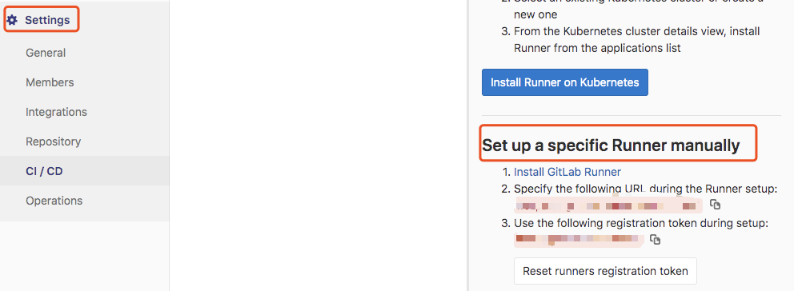

[toc]
### 持续集成
持续集成是一种软件开发实践，即团队开发成员经常集成他们的工作，通常每个成员每天至少集成一次，也就意味着每天可能会发生多次集成。每次集成都通过自动化的构建（包括编译，发布，自动化测试)来验证，从而尽快地发现集成错误。许多团队发现这个过程可以大大减少集成的问题，让团队能够更快的开发内聚的软件。—— Martin Fowler

### CI/CD——持续的软件开发方法
	持续的软件开发方法基于自动执行脚本，以最大限度地减少在开发应用程序时引入错误的可能性。 从新代码的开发到部署，它们需要较少的人为干预甚至根本不需要干预。
它涉及在每次小迭代中不断构建，测试和部署代码更改，从而减少基于有缺陷或失败的先前版本开发新代码的机会。
有三种主要方法，每种方法都根据最适合的策略进行应用
- Continuous Integration 持续集成
- Continuous Delivery 持续交付
- Continuous Deployment 持续部署

### CI/CD
#### 概念
	CI(Continuous Integeration):持续集成，频繁将代码集成到主干时，保证代码质量，让Bug更容易发现和改正。
CD(Continuous Delivery):频繁将系统的新版本交给质量团队或用户，以供评审，保证不管如何更新，能随时交付。
CD(Continuous Deployment):持续部署，代码通过评审以后，自动部署到生产环境，进入生产阶段。

#### 策略
	谈到CI/CD，不免想到Gitlab + Jenkins + Docker等一些列优秀的工具，Jenkins以其丰富的插件及灵活配置已经非常好的满足我们日常工作中的CI/CD需求，来打通了开发到部署到整个生命周期，完成持续集成持续构建。 
在Gitlab 也是具有一套CI/CD到框架，通过简单的注册Gitlab Runner，根据业务测试部署需求撰写 .gitlab-ci.yml文件，即可轻松的实现CI/CD，无需多余的工具介入，方便快捷


### GitLab CI/CD
#### 简介
	Gitlab CI/CD是一个Gitlab自带的对软件进行持续构建、测试、部署以确保软件符合规范，减少软件中程序错误的源代码测试系统。在对源代码进行集成测试时需要在源代码根目录下添加.gitlab-ci.yml文件，该文件指定源代码执行环境(docker镜像，环境变量，缓存等)和执行脚本（构建，测试，部署脚本等）。对每一个commit操作，Gitlab基于.gitlab-ci.yml配置，构建出一个个对源代码测试的Job，这些Job最终运行在Gitlab关联的Gitlab Runner上。
	
流程图


 流程图分析：提交代码到Gitlab时，触发一次Build，对源代码进行构建，然后跑单元测试、集成测试，完成后进行CodeReview,灰度发布，正式部署到线上
相关术语
- Pipeline，多个 Stage 有顺序的排列就是 Pipeline，流水线；
- Job/Build，最小的任务单元，只负责一件事情，要么编译，要么测试等；
- Stage，阶段，每一个 Job 都会有一个阶段，一个阶段可以包含多个 Job。阶段是有先后顺序的。通过 stage 可以间接的控制 Job 执行的先后顺序；
- GitLab Runner，用来执行.gitlab-ci.yml 脚本的工具，是实际处理 Job 的，每个 Runner 可以单独配置，Runner 支持多种类型的 Job，同一时间单个 runner 只能处理一个 Job；

#### pipline
提交或合并代码到指定分支时，触发一次pipline，相当于一次构建任务，可以包含多个流程，如安装依赖、运行测试、编译、部署测试服务器、部署生产服务器等流程。本次使用CI的需求是在开发阶段对代码质量进行把控，集成编译，sonarqube扫描和单元测试
	


#### stages
pipline中的构建流程为stages。每个stages顺序执行，当前一个stage完成下一个stage才会开始，只有当所有的stages完成，一个pipline才会成功，如果任何一个stage失败，后面的stage就不会执行，该pipline构建失败

#### jobs
构建的最小单元，表示某个Stages里面执行的工作，可以在Stages里面定义多个Jobs。相同的stages中的Jobs会并行执行，Jobs都执行成功，该stages才会成功，任何一个失败，该stages失败，该pipline也失败。


### 本次持续集成功能

在开发阶段对代码质量进行把控，需要在代码提交过程，集成编译，sonarqube扫描和单元测试

实现方案：GitlabRunner & CI具备强扩展性。在GitlabRunner上注册对应项目的GitlabUrl，能在代码push和merge request时触发CI流程。

#### GitlabRunner
##### 介绍
GitLab-Runner是配合GitLab-CI进行使用，用来执行软件集成脚本，解析yml文件，执行构建任务，可安装到不同的机器上，在构建任务期间不影响Gitlab的性能，而GitLabCI 最大的作用是管理各个项目的构建状态。
[官网链接](https://docs.gitlab.com/runner/)
#### 类型
Runner可以分布在不同的主机上，同一个主机上也可以有多个Runner ，分为两种类型Shared Runner（共享型）和Specific Runner（指定型）：
- Shared Runner：这种Runner（工人）是所有工程都能够用的。只有系统管理员能够创建Shared Runner。
- Specific Runner：这种Runner（工人）只能为指定的工程服务。拥有该工程访问权限的人都能够为该工程创建Shared Runner。

##### 安装 
[官网安装步骤地址](https://docs.gitlab.com/runner/install/linux-manually.html)
选择在linux下安装(# Linux x86-64)，按照步骤走，没有什么坑
##### 注册
[官网注册步骤地址](https://docs.gitlab.com/runner/register/index.html)

- 需要有维护者权限，找到项目下**setting->CI/CD->Runners->Set up a specific Runner manually(获得URL 和token)**


- 根据注册的步骤走注意**tag**是runner对应的名称，在yml文件中，设置对应的runner时，即为设置tag的值
- 设置excutor为docker，设置一个干净的镜像，该镜像是当yml中没有设置image时的环境

#### yml文件标签介绍
##### .gitlab-ci.yml文件
    从7.12版本开始，GitLab CI使用YAML文件(.gitlab-ci.yml)来管理项目配置。该文件存放于项目仓库的根目录，并且包含了你的项目如何被编译的描述语句。YAML文件使用一系列约束叙述定义了Job启动时所要做的事情。
	.gitlab-ci.yml文件中定义pipline，stages，jobs，以及运行每个Job所执行的脚本。
	
##### .gitlab-ci.yml实例	
- 文件所在位置是项目的根目录。
- 定义一系列带有约束说明的任务，以任务名开始并且至少要包含script部分，允许指定无限量 jobs，每个 jobs 必须有一个唯一的名字。
- 实例：集成的编译、sonarqube、单元测试的yml文件
```.gitlab-ci.yml
#image在docker下安装maven环境，执行job
image: maven:3.6.2

#定义job使用的变量
variables:
  SOFT_VERSION: ${CI_COMMIT_REF_NAME}
  ONLY_BRANCH: 'feature/gitlab-ci-test'
  TARGET_BRANCH: ${MERGE_TARGET_BRANCH}

#执行每个job执行前的操作
before_script:
  - echo "ONLY_BRANCH:------------$ONLY_BRANCH"
  - echo "SOFT_VERSION_EXT:------$SOFT_VERSION_EXT"
  - echo "GITLAB_USER_LOGIN:------$GITLAB_USER_LOGIN"
  - pwd

#定义pipeline
stages:
  - build
  - analysis
  - test

#编译，跳过单元测试(settings.xml文件存放在本地跟目录下，用于在gitlab环境下mvn命令使用)
build:
  stage: build
  script:
    - mvn -DskipTests=true -Dmaven.test.skip=true -s settings.xml compile
  tags:
    - aipark-tag
  only:
    variables:
      - $ONLY_BRANCH == $CI_COMMIT_REF_NAME

#sonarqube扫描，跳过单元测试
sonarqube:
  stage: analysis
  script:
    - mvn -DskipTests=true -Dmaven.test.skip=true -s settings.xml clean package sonar:sonar
  tags:
    - aipark-tag
  only:
    variables:
      - $ONLY_BRANCH == $CI_COMMIT_REF_NAME

#单元测试
unittest:
  stage: test
  script:
    - mvn test -DTests=*Test
  tags:
    - aipark-tag
  only:
    variables:
      - $ONLY_BRANCH == $CI_COMMIT_REF_NAME
```

##### 标签介绍
- image: 使用的docker镜像
- variables: 定义job级别的变量
- before_script/after_script: 重写一组在作业前/后执行的命令
- stages:定义一组job stages
- Jobs
	- stage:定义的job stage
	- script: Runner执行的命令或者脚本
	- tags: 定义tags,指定Runner,同Runner注册时设置的tags对应
	- only:定义一列git分支，并为其创建job
	- 
更多标签见官网：https://docs.gitlab.com/ee/ci/yaml/README.html

### 遇见问题
#### 编译
Q:如何本地调试？
A:本地安装gitlab-runner，注册，安装docker(目前gitlab-runner支持1.30以上的版本，否则会出现client is newer than server)，然后执行gitlab-runner exec docker {job-name}

Q:gitlab-runner环境成功执行mvn命令的条件
A:image: maven:3.6.2、settings.xml文件存放在本地跟目录下、更新远程仓库包(新的)
        
Q:can't find symbol。
A:更新远程仓库的包。
Q:更新远程仓库的包报异常405、500怎么办
A:https://blog.csdn.net/yjclsx/article/details/88231540

Q:本地调试出现 client is newer than server
A:升级本地docker版本，目前gitlab-runner支持1.30以上的版本

#### Sonarqube
Q:安装Sonarqube
A:1.服务器下使用docker安装 docker run -d --name sonarqube -p 9000:9000 -p 9092:9092 sonarqube:lts
2.服务器ip:9000端口，Administration->Marketplace 添加gitlab插件
3.Administration->Configuration->General Settings配置gitlab的userToken和url
        
Q: 为什么放弃使用gitlab-sonar-scanner
A: 最开始使用gitlab-sonar-scanner扫描java代码，出现了参数不支持，由于7.7及以上的版本移除了一些参数，使用lts(6.7)版本尝试解决问题。接着需要配置各种参数如sonar.sources(源代码文件地址)、sonar.java.binaries property(字节码文件地址)、当配置完所有的参数后找不到对应的class包，因为没有mvn对代码打包。所以使用mvn sonar:sonar解决
       
 Q:mvn sonar:sonar步骤
A: 1. settings.xml文件修改
```
<profile>
   <id>sonar</id>
   <activation>
      <activeByDefault>true</activeByDefault>
   </activation>
   <properties>
      <!-- Optional URL to server. Default value is http://localhost:9000 -->
      <sonar.host.url>
         http://10.122.100.7:9000
      </sonar.host.url>
   </properties>
</profile>
```
2.pom文件 
```
<build>
    <pluginManagement>
        <plugins>
            <plugin>
                <groupId>org.sonarsource.scanner.maven</groupId>
                <artifactId>sonar-maven-plugin</artifactId>
                <version>3.3.0.603</version>
            </plugin>
            <plugin>
                <groupId>org.apache.maven.plugins</groupId>
                <artifactId>maven-surefire-plugin</artifactId>
                <version>3.0.0-M3</version>
                <configuration>
                    <skipTests>false</skipTests>
                </configuration>
            </plugin>
        </plugins>
    </pluginManagement>
</build>
```
3.yml命令:不需要配置各类sonar的参数，只需要在sonarqube的Job中，在执行sonar:sonar前对代码完成打包操作
        
后续TODO
- 编译，打包，跑集成测试，sonar扫描，重启，监控git的commit日志，部署
- shell