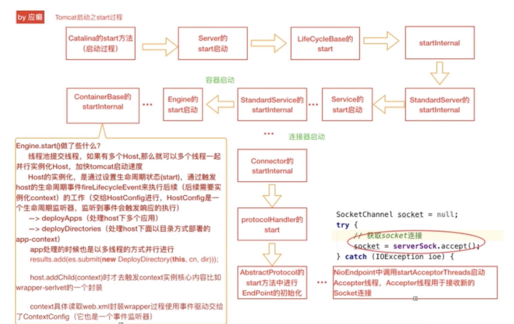
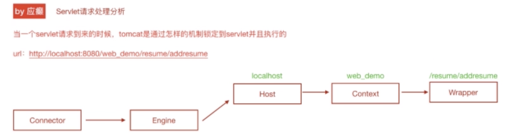
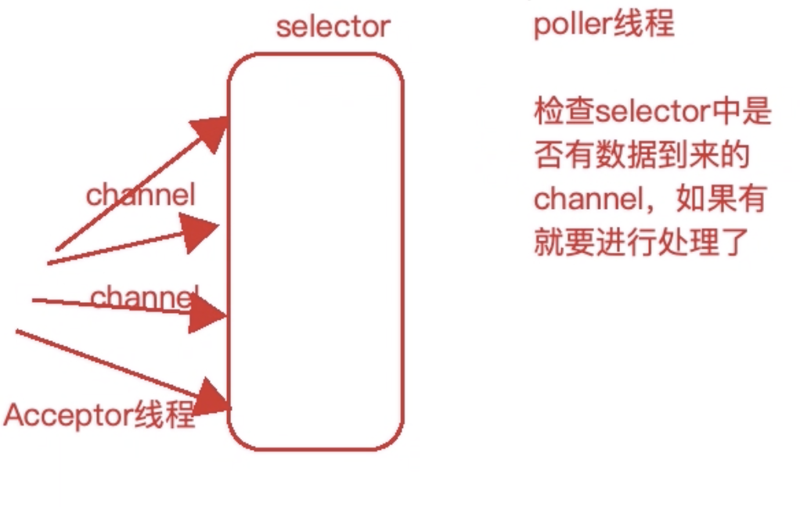
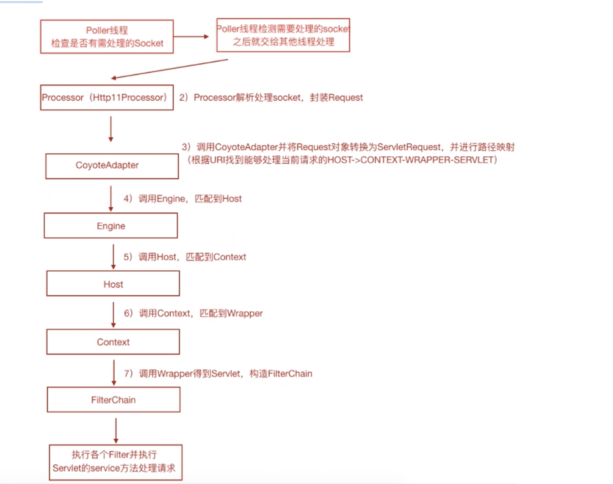
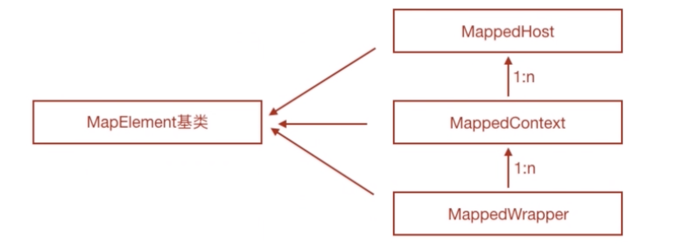

[toc]
## Tomcat源码剖析-Tomcat实例构建脉络追踪
### Tomcat启动过程源码剖析
- 启动过程，如何将架构中的组件实例化?（创建->销毁）
- 对组件如何进行统一生命周期？(抽象出LifeCycle接口)

#### 基础分析
LifeCycle生命周期接口方法

LifeCycle生命周期接口继承体系

Tomcat启动入口分析
> startup.sh -> catalina.sh start -> java xxxx.jar org.apache.catalina.startup.Bootstrap(main) start(参数)

Tomacat启动流程分析
>catalinaDaemon = catalina对象
>daemon = bootstrap对象

### init初始化阶段

### start启动阶段

## Tomcat源码剖析-servlet请求链路
### 一个servlet是如何被Tomcat处理的？
一个servlet请求 -> 最终找到处理当前servlet请求的service实例 -> servlet.service( )
###  servlet请求处理的一般流程分析

### servlet请求处理示意图
NIO

Poller线程是追踪入口

Mapper组件体系结构

Tomcat使用Mapper机制重新封装了Host-Context-Wrapper(servlet)之间的数据和关系
在匹配出当前的那个Host、Context、Wrapper之前就已经被初始化好了。

具体完成初始化的流程：
StandardService -> startInternal -> mapperListener.start()完成对mapper对象的初始化。

## 架构师成长路径
架构师必备能力
1.扎实的技术基础
2.开阔的技术视野
3.拥有业务驱动的思维
4.拥有数据驱动的思维
5.问题定位与处理的能力