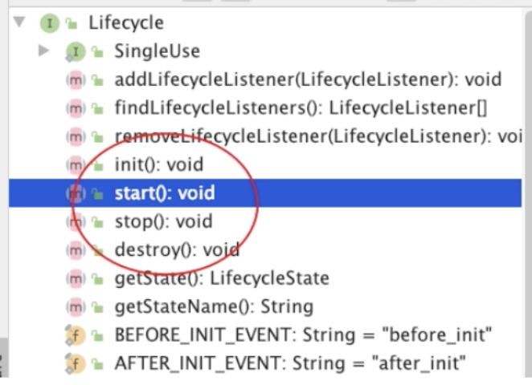
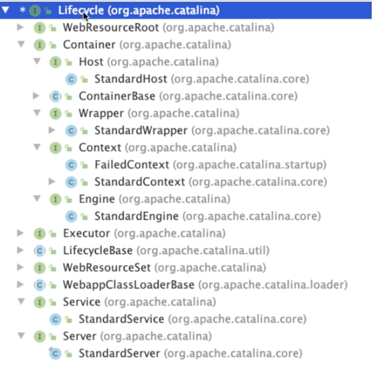
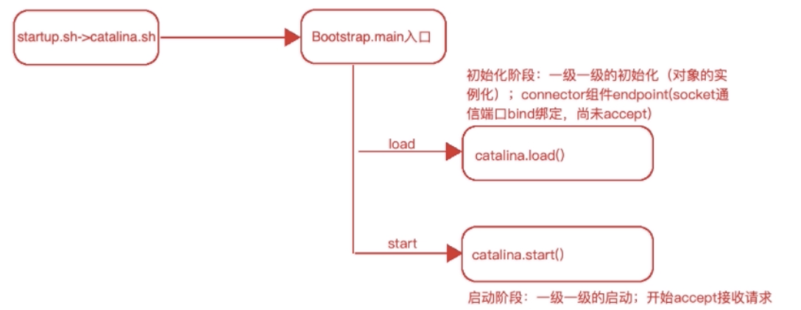
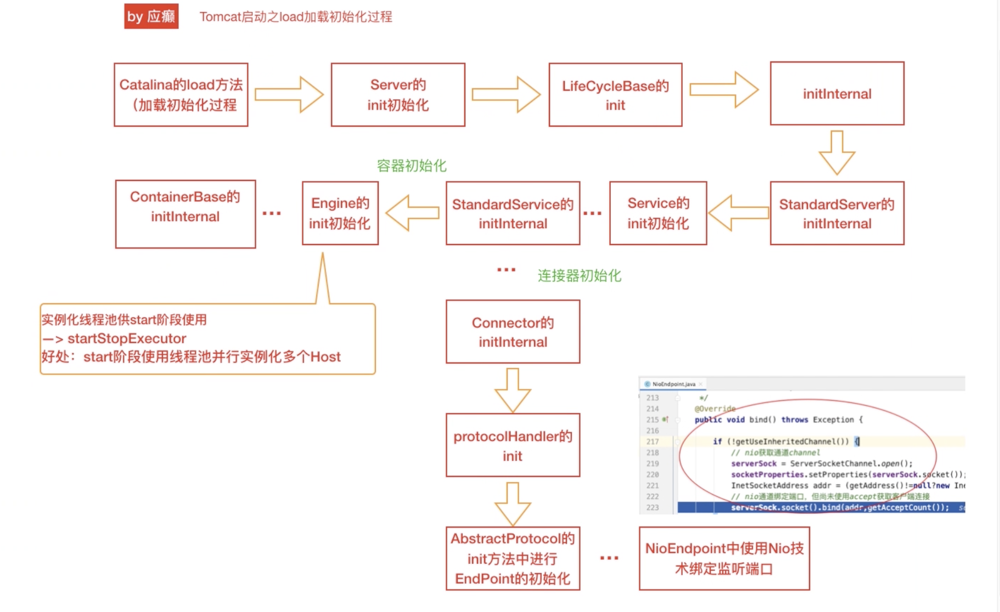

[toc]
## Tomcat源码剖析-Tomcat实例构建脉络追踪
### Tomcat启动过程源码剖析
- 启动过程，如何将架构中的组件实例化?（创建->销毁）
- 对组件如何进行统一生命周期？(抽象出LifeCycle接口)

#### 基础分析
LifeCycle生命周期接口方法

LifeCycle生命周期接口继承体系

Tomcat启动入口分析
> startup.sh -> catalina.sh start -> java xxxx.jar org.apache.catalina.startup.Bootstrap(main) start(参数)

Tomacat启动流程分析
>catalinaDaemon = catalina对象
>daemon = bootstrap对象

### init初始化阶段

