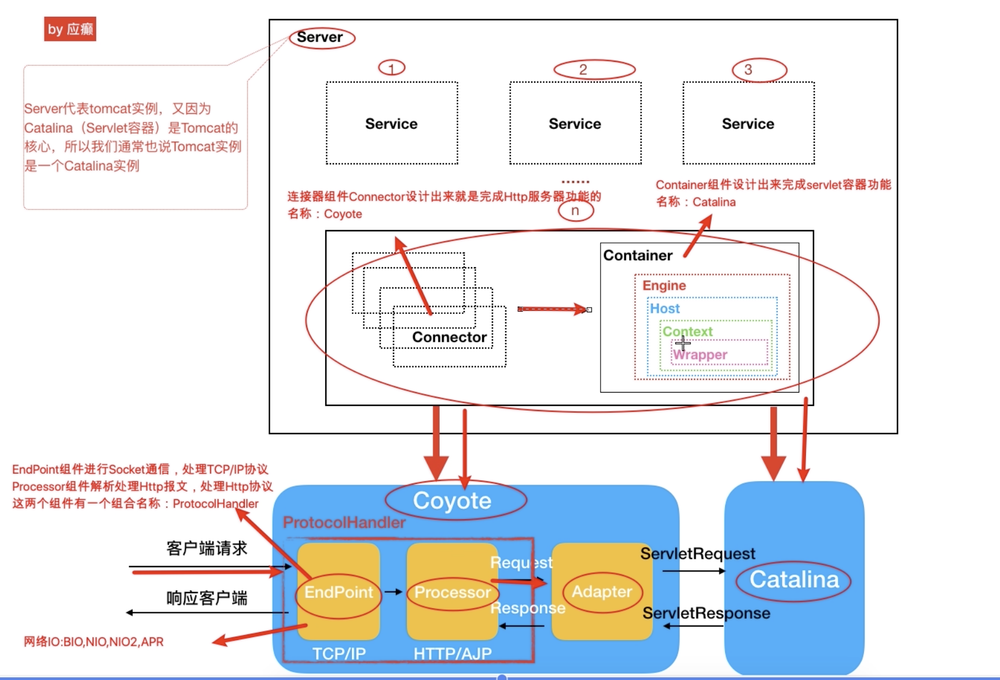

[toc]
## Tomcat源码剖析-揭开tomcat的神秘面纱

tomcat是应用级服务器软件

### 架构设计
架构属于设计层次，源码是对设计的实现。tomcat属于套娃式架构设计
**tomcat功能(需求)**

Tomcat两个功能：
- *HTTP服务器*：Socket通信(TCP/IP)。接受请求，解析HTTP报文，传递参数到Servlet服务器
- *Servlet容器*：有多个Servlet(自带Servlet + 自定义Servlet)，Servlet处理具体业务逻辑

**Tomcat架构(架构是为了完成功能需求所做的设计)**
什么是tomcat架构：为了实现上述功能，Tomcat设计封装了很多组件(Java类)，组件间的关系构成了架构。

**套娃式架构和配置文件对应**
tomacat的组件：server-service-connector/container-engine-host-context-wrapper，组件一层套一层的设计方式(套娃设计)，一个组件包含其他组建，这个组件称为容器。

- Server：Server容器代表一个tomcat实例（或者Catalina实例），可以有一个或多个Service容器。
- Service：提供对外服务，一个可以有多个Connector组件(监听不同的端口请求、解析请求)和一个Servlet容器（具体业务逻辑处理）
- Engine和Host：Engine是核心组件，支持定义多个虚拟机和域名。
- Context：由Servlet规范中指定的web应用程序格式表示。
- Wrapper：一个对应一个Servlet。

**套娃时架构设计优点**
- 一层套一层的方式，组件关系清晰，组件生命周期便于管理
- tomcat这种架构设计和xml配置中的标签对应上了，便于解读xml以及封装对象的过程中容易对应
- 便于子容器继承父容器的一些配置
### 源码剖析经验
优点：提高架构思维，深入认识代码，深入理解一个项目/框架

原则：
-	定焦原则：抓住主线（抓住一个核心的流程去分析，而不是满屋目的看）
-	宏观原则：站在上帝的视角，先脉络后枝叶（主题流程+设计思维，切记试图搞清楚每一行代码）

方法和技巧：
- 断点模式：观察调用栈
- 反调：右键，Find Usages
- 经验之谈：doXXX，service方法往往都是干具体活的
- 见名思意：通过方法名称就能联想到方法的作用
- 多动手实践，灵活使用上述方法技巧

### tomcat源码构建
1.下载tomcat8.5.5.0，官网下载
2.tomcat是java开发的软件，使用的时候需要读取server.xml，以及其他配置文件

具体步骤
1.解压成src文件
2.添加pom.xml文件
3.创建source文件夹
4.conf、webapps两个目录移动到source文件中
5.源码工程导入idea中
6.给tomcat源码程序启动类Boostrap配置VM 参数，SE工程，tomcat源码运行需要加载配置文件

7.运行Bootstrap类的main函数，启动tomcat，启动的时候去加载配置conf目录下的server.xml等配置文件，访问8080端口遇见错误不能编译jsp

原因是Tomcat源码中jsp引擎没有被初始化，从而无法编译jsp。需要通过jasper引擎将jsp转换成servlet进一步编译处理。解决方法，在tomcat源码中ContextConfig中的configureStart方法中添加一行代码。

