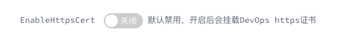
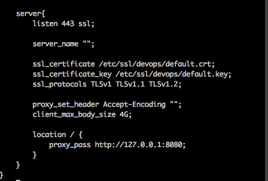

参考资料
- [x] [HTTPS协议](https://blog.csdn.net/qq_36711489/article/details/92074350)
- [ ] [HTTP和HTTPS协议，看一篇就够了](https://blog.csdn.net/xiaoming100001/article/details/81109617)
- [ ] [简书-https协议](https://www.jianshu.com/p/f9b8a3e62af1)
- [ ] [wiki-HTTPS原理剖析](https://wiki.megvii-inc.com/pages/viewpage.action?pageId=126223027)

[toc]
## 概念
HTTPS是在HTTP的基础上添加了SSL层，通过**传输加密和身份认证**保证传输过程中数据的安全性。
## 原理
HTTPS  = HTTP + SSL/TLS
- HTTP，客户端和服务器通过TCP建立连接后，客户端通过HTTP协议发送请求和接收服务端返回的请求。
- SSL(Secure Sockets Layer 安全套接层),及其继任者传输层安全（Transport Layer Security，TLS）是为网络通信提供安全及数据完整性的一种安全协议。TLS与SSL在传输层TCP与应用层HTTP之间对网络连接进行加密。[百度百科]

## 安全机制
- 证书：通过第三方权威证书颁发机构（如VeriSign）验证和担保网站的身份，防止他人伪造网站身份与不知情的用户建立加密连接。
- 密钥交换：通过公钥（非对称）加密在网站服务器和用户之间协商生成一个共同的会话密钥。
- 会话加密：通过机制(2)协商的会话密钥，用对称加密算法对会话的内容进行加密。
- 消息校验：通过消息校验算法来防止加密信息在传输过程中被篡改。

## 缺点
- 安全性范围有限度，不能保证绝对安全
- SSL加密和解密增加了额计算资源消耗
- 同样网络环境下，通信变慢
## 配置
## 方案
 [wiki-devops平台https证书管理](https://wiki.megvii-inc.com/pages/viewpage.action?pageId=34887052)
 
1.使用证书的两种方式：
- 用户手动上传HTTPS的*.crt和*.key文件，可能需要自行生成。
- devops资料显示;
>若集群拓扑结构发生变化，可以手工生成DevOps 默认证书，在DevOps Manager所在节点，输入：sudo devops-manager -replaceBuiltinHttpsCert -genHttpsCert   , 然后到集群页面点击配置同步，重启应用后就会使用新的证书。

2.devops设置开启http

3.重新部署应用
4.修改nginx的配置

5.yml文件修改 enable_https_cert:true

## 步骤

1. 打开前端devops的挂载http，后面通过编排文件添加参数 （enable_https_cert: true）


2.修改前端nginx.config的配置文件
```
# 1.文件在容器对应路径下
ssl_certificate /etc/ssl/devops/https_cert_crt;
ssl_certificate_key /etc/ssl/devops/https_cert_key;
# 2. 监听的端口后面添加ssl
```
3.重新jekins部署前端代码
4.解决不安全链接 
- 描述
```
Failed to construct 'WebSocket': An insecure WebSocket connection may not be initiated from a page loaded over HTTPS.
```
- 方案：
[1.无法通过HTTPS加载的页面启动不安全的WebSocket连接](https://blog.csdn.net/weixin_30693683/article/details/95139180)
[2.NGINX反向代理websocket并启用SSL](https://stackoverflow.com/questions/12102110/nginx-to-reverse-proxy-websockets-and-enable-ssl-wss)
- 步骤：
1.webSocket几个链接
2.nginx 添加location
3.前端ws修改为wss
