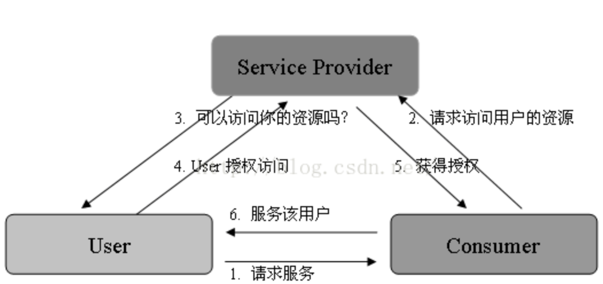
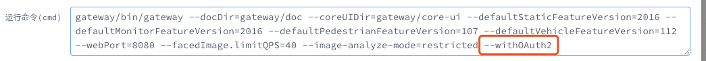
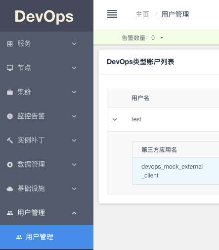
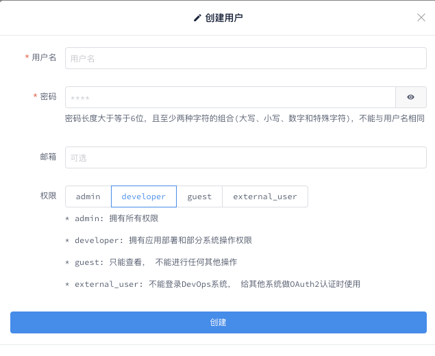
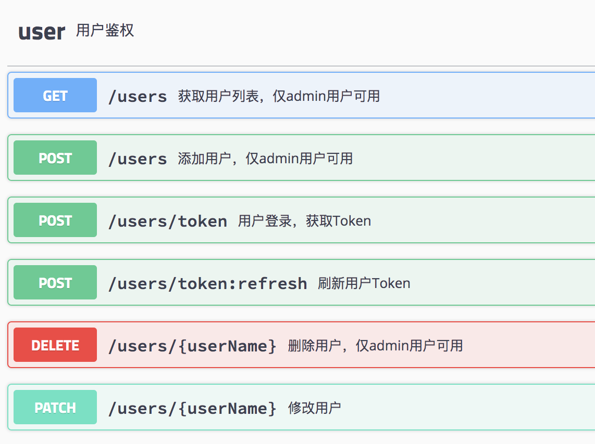

参考博客:
- [x] [0.OAuth2.0官网](https://oauth.net/2/)
- [X] [1.克伟的博客](https://www.cnblogs.com/wangkewei/archive/2011/01/14/1935849.html)
- [x] [2.基于 OAuth 安全协议的 Java 应用编程](https://blog.csdn.net/liuxiao723846/article/details/46890899)
- [x] [3.开源软件](https://www.oschina.net/project/tag/307/oauth)
- [x] [4.eBay OAuth Client Library (Java)](https://www.oschina.net/p/ebay-oauth-java-client)
- [X] [5.赶路人博客OAuth](https://blog.csdn.net/liuxiao723846/article/details/46894827)
- [x] [6.springboot 与oauth2集成](https://blog.csdn.net/chenyongtu110/article/details/82912306)
- [x] [7.spring-security](https://projects.spring.io/spring-security-oauth/docs/oauth2.html)
- [x] [8.OAuth2学习之路](https://my.oschina.net/jast90?q=oauth)
- [ ] [9.阮一峰理解OAuth 2.0](http://www.ruanyifeng.com/blog/2014/05/oauth_2_0.html)
- [ ] [10.[认证 & 授权] 1. OAuth2授权](https://www.cnblogs.com/linianhui/p/oauth2-authorization.html)


[toc]

### what
#### 三个角色
- 服务提供方，用户使用服务提供方来存储受保护的资源，如照片，视频，联系人列表
- 用户，存放在服务提供方的受保护的资源的拥有者
- 客户端，要访问服务提供方资源的第三方应用，通常是网站，如提供照片打印服务的网站。在认证过程之前，客户端要向服务提供者申请客户端标识。
#### 令牌
每一个令牌(Token)授权一个特定的网站（例如，视频编辑网站)在特定的时段（例如，接下来的2小时内）内访问特定的资源（例如仅仅是某一相册中的视频）
#### OAuth
OAuth允许用户提供一个令牌给客户端，使得在客户端不用用户名和密码，在特定时间直接能访问服务端的特定资源。



基础术语
- Consumer Key：消费方对于服务提供方的身份唯一标识。
- Consumer Secret：用来确认消费方对于 Consumer Key 的拥有关系。
- Request Token：获得用户授权的请求令牌，用于交换 Access Token。
- Access Token：用于获得用户在服务提供方的受保护资源。
- Token Secret：用来确认消费方对于令牌（Request Token 和 Access Token）的拥有关系。

认证授权流程
1.消费方向 OAuth 服务提供方请求未授权的 Request Token。
2.OAuth 服务提供方在验证了消费方的合法请求后，向其颁发未经用户授权的 Request Token 及其相对应的 Token Secret。
3.消费方使用得到的 Request Token，通过 URL 引导用户到服务提供方那里，这一步应该是浏览器的行为。接下来，用户可以通过输入在服务提供方的用户名 / 密码信息，授权该请求。一旦授权成功，转到下一步。
4.服务提供方通过 URL 引导用户重新回到消费方那里，这一步也是浏览器的行为。
5.在获得授权的 Request Token 后，消费方使用授权的 Request Token 从服务提供方那里换取 Access Token。
6.OAuth 服务提供方同意消费方的请求，并向其颁发 Access Token 及其对应的 Token Secret。
7.消费方使用上一步返回的 Access Token 访问用户授权的资源。

### why
OAuth 是由 Blaine Cook、Chris Messina、Larry Halff 及 David Recordon 共同发起的，目的在于为 API 访问授权提供一个安全、开放的标准。

特点:
- 安全。OAuth 与别的授权方式不同之处在于：OAuth 的授权不会使消费方（Consumer）触及到用户的帐号信息（如用户名与密码），也是是说，消费方无需使用用户的用户名与密码就可以申请获得该用户资源的授权。
- 开放。任何消费方都可以使用 OAuth 认证服务，任何服务提供方 (Service Provider) 都可以实现自身的 OAuth 认证服务。
- 简单。不管是消费方还是服务提供方，都很容易于理解与使用。

### how

服务提供方需要提供基本的功能：
1.提供用于获取未授权的 Request Token 服务地址，获取用户授权的 Request Token 服务地址，以及使用授权的 Request Token 换取 Access Token 的服务地址。
2.提供基于 Form 的用户认证，以便于用户可以登录服务提供方做出授权。
3.授权的管理，比如用户可以在任何时候撤销已经做出的授权。

消费方需要如下的基本功能：
1.从服务提供方获取 Customer Key/Customer Secret。
2.提供与服务提供方之间基于 HTTP 的通信机制，以换取相关的令牌。

#### 场景解读
问题：系统安全审核反馈对core服务直接通过url访问可以获取数据，属于未授权访问。
分析：
1.对于core侧服务，相当于是服务提供方，园区系统调用core侧服务获取相应的资源属于消费方，令牌如何授权？一种园区开发人员、core侧人员共同当做用户，传递令牌；另一种是园区开发人员去core侧某授权网站获取令牌，有待确认。
2.是否是core侧开启OAuth认证授权服务，通过url无法直接获取资源，用以解决安全审核问题，需要确认。
3.园区开发人员，如何在代码中整合OAuth，在所有调用处能获取到令牌并完成授权服务，需要进一步研究。
4.消费侧需要处理的动作：a.获取令牌 b.调用服务时使用令牌。
5.据了解devops对https和oauth本身都有一些支持，可能需要先去研究一下devops相关的内容。

#### 消费侧行为
1.了解devops如何使用devops获取令牌
2.分析如何在代码中使用url的地方使用令牌，或许需要写一个切面？

#### 服务器侧行为
本次场景的角色是消费者，如果需要搭建OAuth服务，需要参看链接spring boot如何整合OAuth、spring-security、OAuth2学习之路[自行搭建](https://tools.ietf.org/html/rfc6749)一个开发授权服务。

### solution
#### resource
1.Devops平台wiki文档:
[OAuth2 用户认证支持](https://wiki.megvii-inc.com/pages/viewpage.action?pageId=40608932#id-4.3.6.2OAuth2%E7%94%A8%E6%88%B7%E8%AE%A4%E8%AF%81%E6%94%AF%E6%8C%81-5OAuth2%E6%B5%8B%E8%AF%95%E8%BF%87%E7%A8%8B)
2.Core侧的Swagger服务V5:
[Core Service](http://10.122.100.7:8080/doc/v5/#/)

#### step
1.开启OAuth服务：core侧编排文件 运行命令 --withOAuth2


2.创建用户：devops使用内建超级账户登录，在用户管理处创建





3.创建用户后获取token: 


4.使用'token;
```
curl -i -X GET "http://ip:8080/v5/users" -H "accept: application/json"  -H "Authorization: Bearer <token>"
```

5.token有效期为10分钟，使用刷新接口对token进行刷新，重新获取

6.代码修改，目前所有的core侧服务使用Feign的方法调用了接口，倘若需要添加Head的话，能想到的方案是通过切面拦截request，设置header，具体实现方案需要具体看。
