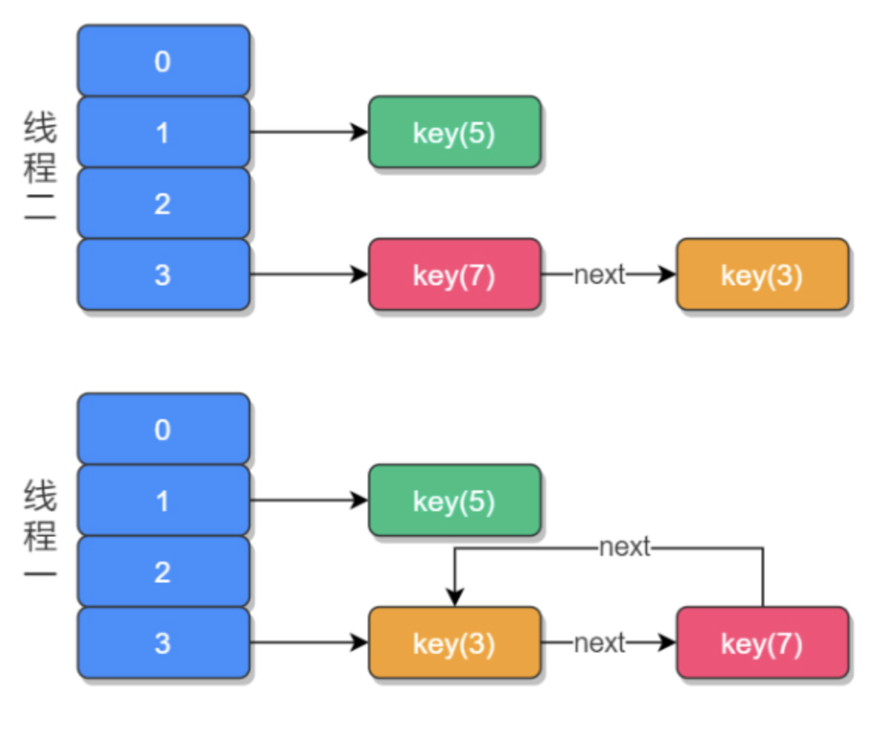
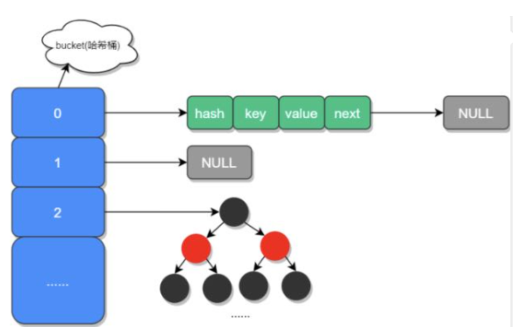
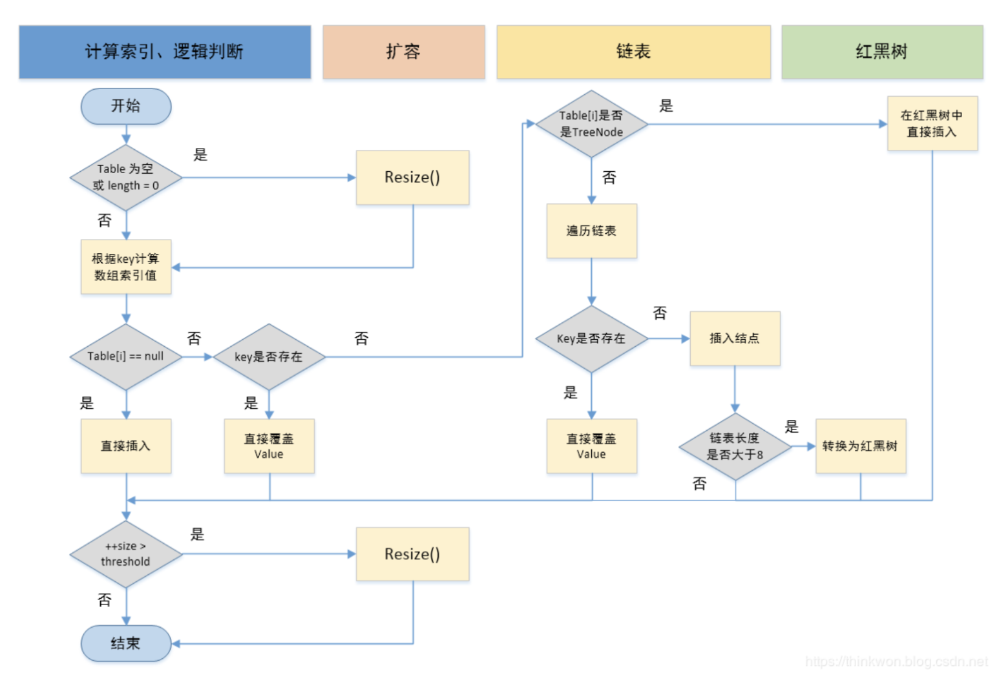
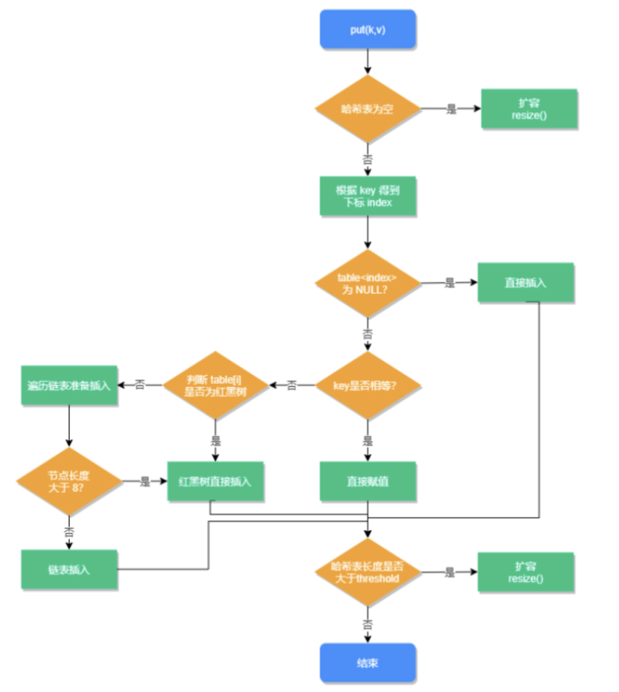
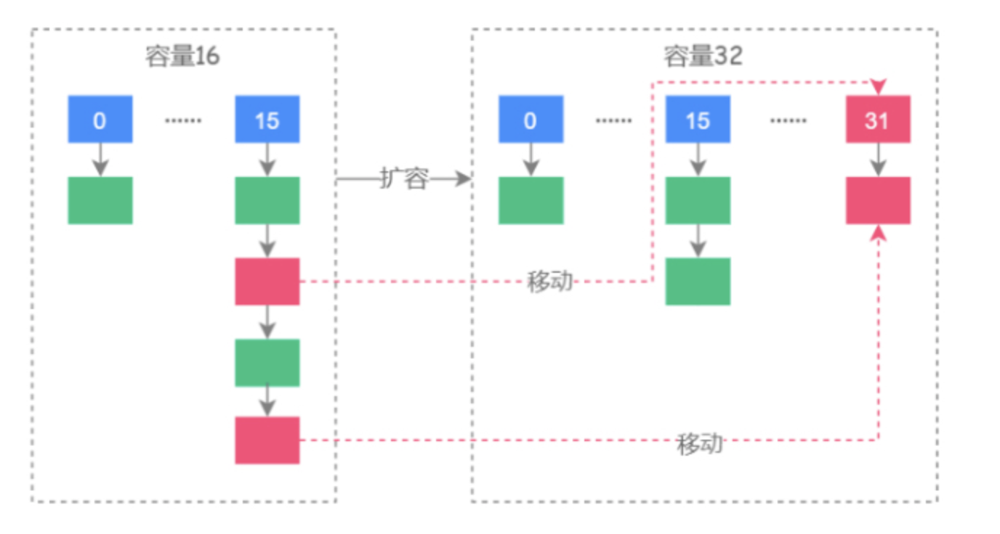

[toc]

## HashMap底层如何实现和在JDK1.8中做了哪些优化

### 1.HashMap组成结构

JDK1.7中HashMap以数组(bucket哈希桶)加链表的形式组成，JDK1.8之后当链表大于8且容量大于64时，链表就会转换为红黑树结构，原因是一旦链表过长会严重影响HashMap的性能，红黑树具有快速增删改查的特点，解决链表过长操作慢的问题。

**Hash，一般翻译为“散列”，也有直接音译为“哈希”的，这就是把任意长度的输入通过散列算法，变换成固定长度的输出，该输出就是散列值（哈希值）**

**当两个不同的输入值，根据同一散列函数计算出相同的散列值的现象，我们就把它叫做碰撞（哈希碰撞）**。

hash函数

```
static final int hash(Object key) {
    int h;
    return (key == null) ? 0 : (h = key.hashCode()) ^ (h >>> 16);// 与自己右移16位进行异或运算（高低位异或）
}
```



数组定义：数组中的元素成为哈希桶，包含四个字段。hash、key、value、next。next表示链表下个节点。

```
public class Node<K,V> implements Map.Entry<K, V> {
	final int hash;
	final K key;
	V value;
	Node<K, V> next;
	
	Node(int hash, K key, V value, Node<K, V> next) {
		this.hash = hash;
		this.key = key;
		this.value = value;
		this.next = next;
	}
	
	public final K getKey() { return key; }
	public final V getValue() { return value; }
	public final String toString() { return key + "=" + value;}
	
	public final int hashCode() {
		return Object.hashCode(key) ^ Object.hashCode(value);
	}
	
	public final V setValue(V newValue) {
		V oldValue = value;
		value = newValue;
		return oldValue;
	}
	
	public final boolean equals(Object o) {
		if(o == this) 
			return true;
		if(o instanceOd Map.Entry) {
			Map.Entry<?, ?> e = (Map.Entry<?, ?>) o;
			if(Object.equals(key, e.getKey()) && Object.equals(value, e.getValue())) {
				return true;
			}
		}
		return false;
	}
}
```


### 2.加载因子为何是0.75

HashMap中的6个属性

```
// HashMap 初始化长度
static final int DEFAULT_INITIAL_CAPACITY = 1 << 4; // aka 16
// HashMap 最大长度
static final int MAXIMUM_CAPACITY = 1 << 30; // 1073741824
// 默认的加载因子 （扩容因子）
static final float DEFAULT_LOAD_FACTOR = 0.75f;
// 当链表长度大于此值且容量大于64是，链表转换成红黑树
static final int TREEIFY_THRESHOLD = 8;
// 当链表长度小于此值，红黑树转换成链表
static final int UNTREEIFY_THRESHOLD = 6;
// 最小树容量
static final int MIN_TREEIFY_CAPACITY = 64;																						
```

- 加载因子：也叫扩容因子，用于判断什么时候进行扩容，假如值为0.5，HashMap初始容量16，当HashMap中有16*0.5=8个元素时，就会扩容
- 为何为0.75，而不是0.5或者1.0。其实是出于容量和性能之间平衡的结果：
  - 设置较大时，扩容门槛大，扩容频率会降低，占用空间会比较小，发生Hash冲突的几率就会提升。就会使链表转换成红黑树来存储元素，对元素的操作时间会增加，运行效率降低。
  - 加载因子设置较小，扩容门槛低，会占用更多空间，元素存储就会比较稀疏，发生Hash冲突可能性小，操作性能高，可是对空间的利用率会降低。

### 3.当哈希冲突时，HashMap如何查找并确认元素

看看查询的源码可知，当hash冲突，需要通过key值看是否相等，才能确认此元素是不是想要的元素

```
 public V get(Object key) {
 		Node<K,V> e;
 		// 对key进行hash操作
		return (e = getNode(hash(key), key)) == null ? null : e.value;
}
final Node<K,V> getNode(int hash, Object key) {
    Node<K,V>[] tab; Node<K,V> first, e; int n; K k;
    // 非空判断
    if ((tab = table) != null && (n = tab.length) > 0 &&
        (first = tab[(n - 1) & hash]) != null) {
        // 判断第一个元素是否是要查询的元素
        if (first.hash == hash && // always check first node
            ((k = first.key) == key || (key != null && key.equals(k))))
            return first;
        // 下一个节点非空判断
        if ((e = first.next) != null) {
        		// 如果第一个节点是树结构，则使用 getTreeNode 直接获取相应的数据
            if (first instanceof TreeNode)
                return ((TreeNode<K,V>)first).getTreeNode(hash, key);
            do { // 非树结构，循环节点判断
                // hash想的且key相同，返回此节点
                if (e.hash == hash &&
                    ((k = e.key) == key || (key != null && key.equals(k))))
                    return e;
            } while ((e = e.next) != null);
        }
    }
    return null;
}
 
    
```


### 4.HashMap源码中有哪些重要方法

#### (1) 新增方法


```
public V put(K key, V value) {
    return putVal(hash(key), key, value, false, true);
}

static final int hash(Object key) {
    int h;
    return (key == null) ? 0 : (h = key.hashCode()) ^ (h >>> 16);
}

//实现Map.put和相关方法
final V putVal(int hash, K key, V value, boolean onlyIfAbsent,
                   boolean evict) {
    Node<K,V>[] tab; Node<K,V> p; int n, i;
    // 步骤①：tab为空则创建 
    // table未初始化或者长度为0，进行扩容
    if ((tab = table) == null || (n = tab.length) == 0)
        n = (tab = resize()).length;
    // 步骤②：计算index，并对null做处理  
    // (n - 1) & hash 确定元素存放在哪个桶中，桶为空，新生成结点放入桶中(此时，这个结点是放在数组中)
    if ((p = tab[i = (n - 1) & hash]) == null)
        tab[i] = newNode(hash, key, value, null);
    // 桶中已经存在元素
    else {
        Node<K,V> e; K k;
        // 步骤③：节点key存在，直接覆盖value 
        // 比较桶中第一个元素(数组中的结点)的hash值相等，key相等
        if (p.hash == hash &&
            ((k = p.key) == key || (key != null && key.equals(k))))
                // 将第一个元素赋值给e，用e来记录
                e = p;
        // 步骤④：判断该链为红黑树 
        // hash值不相等，即key不相等；为红黑树结点
        // 如果当前元素类型为TreeNode，表示为红黑树，putTreeVal返回待存放的node, e可能为null
        else if (p instanceof TreeNode)
            // 放入树中
            e = ((TreeNode<K,V>)p).putTreeVal(this, tab, hash, key, value);
        // 步骤⑤：该链为链表 
        // 为链表结点
        else {
            // 在链表最末插入结点
            for (int binCount = 0; ; ++binCount) {
                // 到达链表的尾部
                
                //判断该链表尾部指针是不是空的
                if ((e = p.next) == null) {
                    // 在尾部插入新结点
                    p.next = newNode(hash, key, value, null);
                    //判断链表的长度是否达到转化红黑树的临界值，临界值为8
                    if (binCount >= TREEIFY_THRESHOLD - 1) // -1 for 1st
                        //链表结构转树形结构
                        treeifyBin(tab, hash);
                    // 跳出循环
                    break;
                }
                // 判断链表中结点的key值与插入的元素的key值是否相等
                if (e.hash == hash &&
                    ((k = e.key) == key || (key != null && key.equals(k))))
                    // 相等，跳出循环
                    break;
                // 用于遍历桶中的链表，与前面的e = p.next组合，可以遍历链表
                p = e;
            }
        }
        //判断当前的key已经存在的情况下，再来一个相同的hash值、key值时，返回新来的value这个值
        if (e != null) { 
            // 记录e的value
            V oldValue = e.value;
            // onlyIfAbsent为false或者旧值为null
            if (!onlyIfAbsent || oldValue == null)
                //用新值替换旧值
                e.value = value;
            // 访问后回调
            afterNodeAccess(e);
            // 返回旧值
            return oldValue;
        }
    }
    // 结构性修改
    ++modCount;
    // 步骤⑥：超过最大容量就扩容 
    // 实际大小大于阈值则扩容
    if (++size > threshold)
        resize();
    // 插入后回调
    afterNodeInsertion(evict);
    return null;
}

```


```
    public V put(K key, V value) {
       // 对key进行hash操作
       return putVal(hash(key), key, value, false, true);
    }

    /**
    ***onlyIfAbsent:if true, don't change existing value
    ***evict:if false, the table is in creation mode
    **/
    final V putVal(int hash, K key, V value, boolean onlyIfAbsent,
                   boolean evict) {
        Node<K, V>[] tab;
        Node<K, V> p;
        int n, i;
        // hash表为空则创建表
        if ((tab = table) == null || (n = tab.length) == 0)
            n = (tab = resize()).length;
        // 根据key的hash值计算要插入的数组索引i
        if ((p = tab[i = (n - 1) & hash]) == null)
            tab[i] = newNode(hash, key, value, null);
        else {
            Node<K, V> e;K k;
            // 如果key已经存在，直接覆盖value
            if (p.hash == hash &&
                    ((k = p.key) == key || (key != null && key.equals(k))))
                e = p;
            // 如果key不存在，判断是否为红黑树    
            else if (p instanceof TreeNode)
                // 红黑树直接插入键值对
                e = ((TreeNode<K, V>) p).putTreeVal(this, tab, hash, key, value);
            else {
                // 为链表结构，循环准备插入
                for (int binCount = 0; ; ++binCount) {
                    // 下一个元素为空
                    if ((e = p.next) == null) {
                        p.next = newNode(hash, key, value, null);
                        // 临界值，转换成红黑树进行处理
                        if (binCount >= TREEIFY_THRESHOLD - 1) // -1 for 1st
                            treeifyBin(tab, hash);
                        break;
                    }
                    // key已经存在直接覆盖value
                    if (e.hash == hash &&
                            ((k = e.key) == key || (key != null && key.equals(k))))
                        break;
                    p = e;
                }
            }
            if (e != null) { // existing mapping for key
                V oldValue = e.value;
                if (!onlyIfAbsent || oldValue == null)
                    e.value = value;
                afterNodeAccess(e);
                return oldValue;
            }
        }
        ++modCount;
        // 超过最大容量，进行扩容操作
        if (++size > threshold)
            resize();
        afterNodeInsertion(evict);
        return null;
    }
```


#### (2)扩容方法



```
  final Node<K,V>[] resize() {
  			// 扩容前的数组
        Node<K,V>[] oldTab = table;
        // 扩容前的数组和阈值
        int oldCap = (oldTab == null) ? 0 : oldTab.length;
        int oldThr = threshold;
        // 预定义新数组的大小和阈值
        int newCap, newThr = 0;
        if (oldCap > 0) {
        		// 超过最大值就不再扩容了
            if (oldCap >= MAXIMUM_CAPACITY) {
                threshold = Integer.MAX_VALUE;
                return oldTab;
            }
            // 扩大容量为当前容量的两倍，但不能超哥最大值
            else if ((newCap = oldCap << 1) < MAXIMUM_CAPACITY &&
                     oldCap >= DEFAULT_INITIAL_CAPACITY)
                newThr = oldThr << 1; // double threshold
        }
        // 当前数组没有数据，使用初始化的值
        else if (oldThr > 0) // initial capacity was placed in threshold
            newCap = oldThr;
        else {               // zero initial threshold signifies using defaults
        		// 如果初始化的值为0，使用默认的初始化容量
            newCap = DEFAULT_INITIAL_CAPACITY;
            newThr = (int)(DEFAULT_LOAD_FACTOR * DEFAULT_INITIAL_CAPACITY);
        }
        // 如果新的容量等于 0
        if (newThr == 0) {
            float ft = (float)newCap * loadFactor;
            newThr = (newCap < MAXIMUM_CAPACITY && ft < (float)MAXIMUM_CAPACITY ?
                      (int)ft : Integer.MAX_VALUE);
        }
        threshold = newThr;
        @SuppressWarnings({"rawtypes","unchecked"})
            Node<K,V>[] newTab = (Node<K,V>[])new Node[newCap];
        // 开始扩容，将新的容量赋值给table
        table = newTab;
        // 原数据不为空，将原数据复制到新table中
        if (oldTab != null) {
        		// 根据容量循环数组，复制非空元素到新table
            for (int j = 0; j < oldCap; ++j) {
                Node<K,V> e;
                if ((e = oldTab[j]) != null) {
                    oldTab[j] = null;
                    // 如果链表只有一个，则进行直接赋值
                    if (e.next == null)
                        newTab[e.hash & (newCap - 1)] = e;
                    else if (e instanceof TreeNode)
                    		// 红黑树相关的操作
                        ((TreeNode<K,V>)e).split(this, newTab, j, oldCap);
                    else { // preserve order
                    		// 链表赋值，JDK1.8扩容优化部分
                        Node<K,V> loHead = null, loTail = null;
                        Node<K,V> hiHead = null, hiTail = null;
                        Node<K,V> next;
                        do {
                            next = e.next;
                            // 原索引
                            if ((e.hash & oldCap) == 0) {
                                if (loTail == null)
                                    loHead = e;
                                else
                                    loTail.next = e;
                                loTail = e;
                            }
                            // 原索引 + oldCap
                            else {
                                if (hiTail == null)
                                    hiHead = e;
                                else
                                    hiTail.next = e;
                                hiTail = e;
                            }
                        } while ((e = next) != null);
                        // 将原索引放到哈希桶中
                        if (loTail != null) {
                            loTail.next = null;
                            newTab[j] = loHead;
                        }
                        // 将原索引 + oldCap放到哈希桶中
                        if (hiTail != null) {
                            hiTail.next = null;
                            newTab[j + oldCap] = hiHead;
                        }
                    }
                }
            }
        }
        return newTab;
    }
```

### 5.JDK1.8HashMap扩容做了哪些优化



JDK1.8没有重新计算每个元素的哈希值，而是通过高位运算(hash&oldCap)确定元素是否需要移动，若结果高一位为0位置不变化，高一位为1，位置改变为原下标位置+原数组长度。

```
final Node<K,V>[] resize() {
    Node<K,V>[] oldTab = table;//oldTab指向hash桶数组
    int oldCap = (oldTab == null) ? 0 : oldTab.length;
    int oldThr = threshold;
    int newCap, newThr = 0;
    if (oldCap > 0) {//如果oldCap不为空的话，就是hash桶数组不为空
        if (oldCap >= MAXIMUM_CAPACITY) {//如果大于最大容量了，就赋值为整数最大的阀值
            threshold = Integer.MAX_VALUE;
            return oldTab;//返回
        }//如果当前hash桶数组的长度在扩容后仍然小于最大容量 并且oldCap大于默认值16
        else if ((newCap = oldCap << 1) < MAXIMUM_CAPACITY &&
                 oldCap >= DEFAULT_INITIAL_CAPACITY)
            newThr = oldThr << 1; // double threshold 双倍扩容阀值threshold
    }
    // 旧的容量为0，但threshold大于零，代表有参构造有cap传入，threshold已经被初始化成最小2的n次幂
    // 直接将该值赋给新的容量
    else if (oldThr > 0) // initial capacity was placed in threshold
        newCap = oldThr;
    // 无参构造创建的map，给出默认容量和threshold 16, 16*0.75
    else {               // zero initial threshold signifies using defaults
        newCap = DEFAULT_INITIAL_CAPACITY;
        newThr = (int)(DEFAULT_LOAD_FACTOR * DEFAULT_INITIAL_CAPACITY);
    }
    // 新的threshold = 新的cap * 0.75
    if (newThr == 0) {
        float ft = (float)newCap * loadFactor;
        newThr = (newCap < MAXIMUM_CAPACITY && ft < (float)MAXIMUM_CAPACITY ?
                  (int)ft : Integer.MAX_VALUE);
    }
    threshold = newThr;
    // 计算出新的数组长度后赋给当前成员变量table
    @SuppressWarnings({"rawtypes","unchecked"})
        Node<K,V>[] newTab = (Node<K,V>[])new Node[newCap];//新建hash桶数组
    table = newTab;//将新数组的值复制给旧的hash桶数组
    // 如果原先的数组没有初始化，那么resize的初始化工作到此结束，否则进入扩容元素重排逻辑，使其均匀的分散
    if (oldTab != null) {
        // 遍历新数组的所有桶下标
        for (int j = 0; j < oldCap; ++j) {
            Node<K,V> e;
            if ((e = oldTab[j]) != null) {
                // 旧数组的桶下标赋给临时变量e，并且解除旧数组中的引用，否则就数组无法被GC回收
                oldTab[j] = null;
                // 如果e.next==null，代表桶中就一个元素，不存在链表或者红黑树
                if (e.next == null)
                    // 用同样的hash映射算法把该元素加入新的数组
                    newTab[e.hash & (newCap - 1)] = e;
                // 如果e是TreeNode并且e.next!=null，那么处理树中元素的重排
                else if (e instanceof TreeNode)
                    ((TreeNode<K,V>)e).split(this, newTab, j, oldCap);
                // e是链表的头并且e.next!=null，那么处理链表中元素重排
                else { // preserve order
                    // loHead,loTail 代表扩容后不用变换下标，见注1
                    Node<K,V> loHead = null, loTail = null;
                    // hiHead,hiTail 代表扩容后变换下标，见注1
                    Node<K,V> hiHead = null, hiTail = null;
                    Node<K,V> next;
                    // 遍历链表
                    do {             
                        next = e.next;
                        if ((e.hash & oldCap) == 0) {
                            if (loTail == null)
                                // 初始化head指向链表当前元素e，e不一定是链表的第一个元素，初始化后loHead
                                // 代表下标保持不变的链表的头元素
                                loHead = e;
                            else                                
                                // loTail.next指向当前e
                                loTail.next = e;
                            // loTail指向当前的元素e
                            // 初始化后，loTail和loHead指向相同的内存，所以当loTail.next指向下一个元素时，
                            // 底层数组中的元素的next引用也相应发生变化，造成lowHead.next.next.....
                            // 跟随loTail同步，使得lowHead可以链接到所有属于该链表的元素。
                            loTail = e;                           
                        }
                        else {
                            if (hiTail == null)
                                // 初始化head指向链表当前元素e, 初始化后hiHead代表下标更改的链表头元素
                                hiHead = e;
                            else
                                hiTail.next = e;
                            hiTail = e;
                        }
                    } while ((e = next) != null);
                    // 遍历结束, 将tail指向null，并把链表头放入新数组的相应下标，形成新的映射。
                    if (loTail != null) {
                        loTail.next = null;
                        newTab[j] = loHead;
                    }
                    if (hiTail != null) {
                        hiTail.next = null;
                        newTab[j + oldCap] = hiHead;
                    }
                }
            }
        }
    }
    return newTab;
}

```


### 6.HashMap如何导致死循环的

HashMap本身是非线程安全的。JDK1.7中链表插入方式为首部倒叙插入，JDK1.8改善为尾部正序插入。