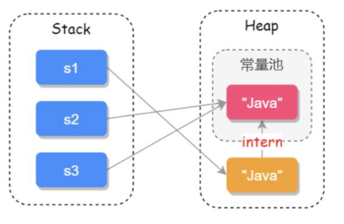

[toc]

## String的特点和有哪些重要方法

### 1.如何实现和重要方法

- String 内部实际存储结构为char数组

```java
public final class String implements java.io.Serializable, Comparable<String>, CharSequence{
  // 用于存储字符串的值
  private final char value[];
  // 缓存字符串的hash code
  private int hash;//default to 0
  // ...其他内容
}


```

- 四个重写的构造方法:分别以String、char[ ]、StringBuffer、StringBuilder为参数

  ```
  public String(String original) {
  	this.value = original.value;
  	this.hash = original.hahs;
  }
  public String(char value[]) {
  	this.value = Arrays.copyOf(value, value.length);
  }
  public String(StringBuffer buffer) {
  	synchronized(buffer) {
  		this.value = Arrays.copyOf(buffer.getValue(), buffer.length());
  	}
  } 
  public String(StringBuilder builder) {
  	this.value = Arrays.copyOf(builder.getValue(), builder.length());
  }
  ```

- equals() 、equalsIgnoreCase()

  ```java
  public boolean equals(Obejct anObject) {
    if (this == anObject) {
      return true;
    }
    if (anObject instanceOf String) {
      String anotherString = (String)anObject;
      int n = value.length;
      if (n == anotherString.value.length) {
        char v1[] = value;
        char v2[] = anotherString.value;
        int i = 0;
        while(n-- != 0) {
          if(v1[i] != v2[i]) {
            return false;
          }
          i++;
        }
         return true;
      } 
    }
    return false;
  }
  ```

- compareTo()、compareToIgnoreCase()

  ```
  public int compareTo(String anotherString) {
  	int len1 = value.length;
  	int len2 = anotherString.value.length;
  	int lim = Math.min(len1, len2);
  	char v1[] = value;
  	char v2[] = another.value;
  	int k = 0;
  	while (k < lim) {
  		char c1 = v1[k];
  		char c2 = v2[k];
  		if (c1 != c2) {
  			return c1 - c2;
  		}
  		k++;
  	}
  	return len1 - len2;
  }
  ```

- equals()接受Object类型参数，返回boolean，compareTo接受String类型参数，返回int

- 其他10个重要方法：indexOf()、lastIndexOf()、contains()、toLowerCase()、toUpperCase()、length()、trim()去掉字符串首尾空格、replace()、split()、join()将字符串数组转为字符串、charAt()返回指定索引处的字符、substring()截取字符串

### 2.知识扩展

#### ()== 和equals的区别

> Object中的equles()方法源码：
>
> ```
> public boolean equals(Object obj) {
> 	return(this == obj);
> }
> ```
>
> == 对于基本数据类型是比较值是否相等，而对于引用类型比较的是引用地址是否相等。
>
> String是引用类型，重载equals方法，用于比较字符串的值是否相等。

#### (2) final修饰的好处

> 字符串设置为final不可变，才能实现字符串常量池。一方面字符串有系列校验，如果校验后值发生改变可能产生系统级别的问题。另一方面传参不需要考虑字符串修改问题，使得原字符串得以缓存。总结而言，好处一是安全，二是高效。
>
> 不变性：String 是只读字符串，是一个典型的 immutable 对象，对它进行任何操作，其实都是创建一个新的对象，再把引用指向该对象。不变模式的主要作用在于当一个对象需要被多线程共享并频繁访问时，可以保证数据的一致性。
>
> 2.常量池优化：String 对象创建之后，会在字符串常量池中进行缓存，如果下次创建同样的对象时，会直接返回缓存的引用。
>
> 3.final：使用 final 来定义 String 类，表示 String 类不能被继承，提高了系统的安全性。
>

#### (3) String、StringBuffer、StringBuilder区别

- 可变性：String定义的字符数组定义为final,类型为不可变。而StringBuffer和StringBuilder继承AbstractStringBuilder，对象可变。

- 线程安全性：String类型，可理解为常量，线程安全。StringBuffer对方法加了同步锁，或调用方法时加了同步锁，线程安全。而StringBuilder没有对方法加同步锁，所以是非线程安全的。

- 性能：String类型改变，会生成新的String对象，将指正指向该对象，性能低。StringBuffer和StringBuilder在字符串发生变动时，对同一个对象进行操作，性能高，StringBuilder没有使用synchronized修饰，性能高于StringBuilder，可是有多线程下不安全的风险。

  ```
  @Override
  public synchronized StringBuffer append (Object object) {
  	toStringCache = null;
  	super.append(String.valueOf(obj));
  	return this;
  }
  @Override
  public synchronized StringBuffer append (String str) {
  	toDStringCache = null;
  	super.append(Str);
  	return this;
  }
  ```

#### (4) String和JVM

> 1.String创建的几种方式，查看他们在JVM存储的位置
>
> ```
> String str1 = new String("hello world");
> String str2 = str1.intern();
> String str3 = "hello world";
> ```
>


> 2.字符串拼接：
>
> ```
> // str1 == str2 为true
> String str1 = "ja" + "va";
> String str2 = "java";
> ```
>
> 这是编译器对字符创的优化的结果，将 "ja" + "va"，直接便以为“java".