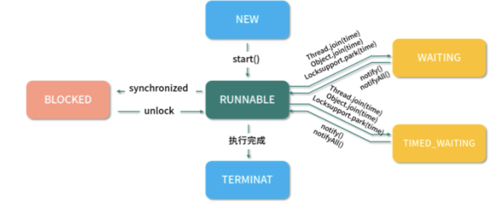
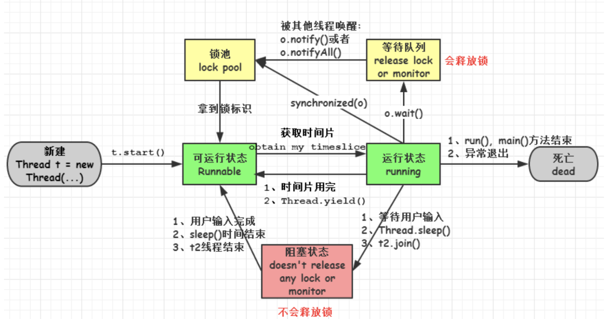
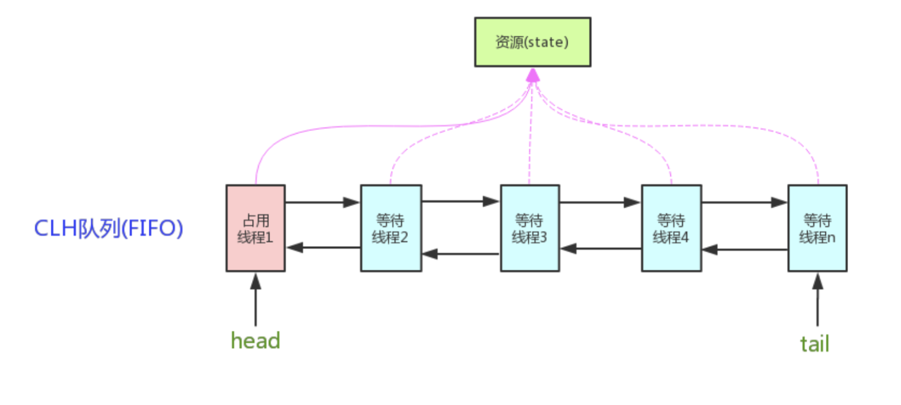

[toc]

## 线程状态有哪些，是如何工作的

### 1.线程(Thread)

> 并发编程基础，程序执行最小单元
>
> 一个进程，包含多个线程，多线程可共享一块内存空间和一组系统资源
>
> 线程切换更节省资源，更轻量化，为轻量级进程

- 6种状态

  ```
  public enum State {
  	// 新建状态，线程被创建出来，但尚未启动时的线程状态
  	NEW,
  	// 就绪状态，表示可以运行的线程状态。可能正在执行，或者在排队等待CPU资源
  	RUNNABLE,
  	// 阻塞状态，等待锁。等待监视器锁，等待执行synchronized代码块和synchronized方法
  	BLOCKED,
  	// 等待状态，处于等待状态的线程在等待另一个线程执行某个特定动作。如一个线程调用Object.wait()那就在等待另一个线程调用Object.notify()或Object.notityAll()方法。
  	WAITING,
  	// 计时等待状态，和等待状态类似，只是多了超时时间，如Object.wait(long timeout) 和Thread.join(long timeout)
  	TIMED_WEITING,
  	// 终止状态， 标识线程已经执行完成
  	TERMINATED
  }
  ```

  

- 执行流程


  
- 生命周期



### 2.BLOACKED和WAITING的区别

- 状态形成的调用方法不同，BLOCKED可以理解为当前线程还处于活跃状态，只是在阻塞等待获取锁资源。
- WAITING是自身调用Object.wait()、Thread.join()、LockSupport.park()进入等待，只能等待其他线程执行某个特定动作唤醒。

### 3.start()和run()的区别

- start()属于Thread自身的方法，使用synchronized来保证线程安全，源码：

  ```
  public synchronized void start() {
  	// 状态验证，不为NEW状态抛异常
  	if(threadStatus != 0) {
  		threw new IllegalThreadStateException();
  	}
  	// 通知线程组，此线程即将启动
  	group.add(this);
  	boolean started = false;
  	try {
  		start0();
  		started = true;
  	} finally {
  		try {
  			if(!started) {
  				group.threadStartFailed(this);
  			}
  		} catch (Throwable ingore) {
  			// 不处理任何异常，如何 start0抛出异常，它将被传递到调用堆栈上
  		} 
  	}
  }
  ```

- run()方法为Runneable的抽象方法，由调用类重写，是线程要执行的业务方法

  ```
  public class Thread implements Runnable {
  	private Runnable target;
  	@Override
  	public void run() {
  		if(target != null) {
  			target.run();
  		}
  	}
  }
  @FunctionalInterface
  public interface Runnable {
  	public abstract void run();
  }
  ```

- start()开启多线程，每个线程调用一次(多次调用抛出IllegalStateException)，是线程状态从NEW转换成RUNNABLE。run()方法为普通方法，可多次调用。

### 4.线程优先级 Thread.setPriority()

- 优先级可以理解为抢占CPU时间片的概率，优先级越高概率越大，不保证一定被先执行。三个相关属性：

```
// 线程最小优先级
public final static int MIN_PRIORITY = 1;
// 线程默认优先级
public final static int NORM_PRIORITY = 5;
// 线程最大优先级
public final static int MAX_PRIORITY = 10;
```

- setPriority(),修改当前线程优先级源码：

  ```
   public final void setPriority(int newPriority) {
          ThreadGroup g;
          checkAccess();
          // 验证优先级的合理性
          if (newPriority > MAX_PRIORITY || newPriority < MIN_PRIORITY) {
              throw new IllegalArgumentException();
          }
          if((g = getThreadGroup()) != null) {
          		// 优先级超过线程组的最高优先级，将优先级设置为线程的最高优先级
              if (newPriority > g.getMaxPriority()) {
                  newPriority = g.getMaxPriority();
              }
              setPriority0(priority = newPriority);
          }
      }
  ```

  

### 5.线程常用方法

(1) join()：底层通过wait()实现

> 当线程调用otherThread.join()，这时出让执行权给other线程，当其执行完或超过时间后再继续执行当前线程。
>
> ```
> public final synchronized void join(long millis) throws InterruptedException {
>         long base = System.currentTimeMillis();
>         long now = 0;
> 				// 超时时间不能小于0
>         if (millis < 0) {
>             throw new IllegalArgumentException("timeout value is negative");
>         }
> 				// 超时时间等于0表示无限等待，直到线程执行完成为止
>         if (millis == 0) {
>         		// 判断子线程(其他线程)为活跃线程，则一直等待
>             while (isAlive()) {
>                 wait(0);
>             }
>         } else {
>         		// 循环判断子线程状态状态，wait(超时时间)
>             while (isAlive()) {
>                 long delay = millis - now;
>                 if (delay <= 0) {
>                     break;
>                 }
>                 wait(delay);
>                 now = System.currentTimeMillis() - base;
>             }
>         }
>     }
> ```
>
> 

(2) yield()：本地方法，由C或C++实现。表示给线程调度器一个当前线程愿意出让CPU使用权的暗示，但可能会被忽略掉。

```
public static nattive void yield();
```

## 并发编程基础知识

### 1.双重校验实现单例

```
public class Singleton {
  // volatile 可以禁止 JVM 的指令重排, 保证在多线程环境下也能正常运行
	private valitile static Singleton uniqueSingleton = null;
	
	private Singleton() {
	}
	
	public static Singleton getUniqueSingleton() {
		//先判断对象是否已经实例过，没有实例化过才进入加锁代码
		if(uniqueSingleton == null) {
		  //类对象加锁
			synchronized(Singleton.class) {
				if(uniqueSingleton == null) {
				  // 1.为uniqueSingleton分配内存空间，2.初始化uniqueSingleton，3.将 uniqueInstance 指向分配的内存地址
					uniqueSingleton = new Singleton();
				}
			}
		}
		return uniqueSingleton;
	}
}
```

### 2.synchronized底层实现

有ACC_SYNCHRONIZED这么一个标志，该标记表明线程进入该方法时，需要monitorenter，退出该方法时需要monitorexit

**可重入原理**：自己可以再次获取自己的内部锁。获取锁后底层维护计数器，每次获取锁加一，释放锁减一。当计数器为0时表示锁未被持有

**自旋**：由于线程阻塞涉及从用户态和内核态进行切换，为了让等待锁的线程不被阻塞，在 synchronized 的边界做忙循环，叫自旋。自旋多次还没有获得锁，再阻塞。

**synchronized锁升级**：偏向锁->轻量级锁->重量级锁，减低了锁带来的性能消耗。

**synchronized、volatile、CAS 比较**：

（1）synchronized 是悲观锁，属于抢占式，会引起其他线程阻塞。

（2）volatile 提供多线程共享变量可见性和禁止指令重排序优化。

（3）CAS 是基于冲突检测的乐观锁（非阻塞）

### 3.Lock优势

synchronized的扩展版，支持公平和非公平锁，而synchronized只支持非公平。Lock提供无条件的、可轮询的(tryLock 方法)、定时的(tryLock 带参方法)、可中断的(lockInterruptibly)、可多条件队列的(newCondition 方法)锁操作

乐观锁和悲观锁：

- 悲观锁：总是假设最坏的情况，每次去拿数据的时候都认为别人会修改，所以每次在拿数据的时候都会上锁，这样别人想拿这个数据就会阻塞直到它拿到锁
- 乐观锁：顾名思义，就是很乐观，每次去拿数据的时候都认为别人不会修改，所以不会上锁，但是在更新的时候会判断一下在此期间别人有没有去更新这个数据，可以使用版本号等机制

### 4.AQS

AbstractQueuedSynchronizer，构建锁和同步器的框架，原理:**如果被请求的共享资源空闲，则将当前请求资源的线程设置为有效的工作线程，并且将共享资源设置为锁定状态。如果被请求的共享资源被占用，那么就需要一套线程阻塞等待以及被唤醒时锁分配的机制，这个机制AQS是用CLH队列锁实现的，即将暂时获取不到锁的线程加入到队列中**



AQS使用一个int成员变量表示同步状态，通过内置FIFO队列完成获取资源线程的排队工作。

```
private volatile int state;//共享变量，使用volatile修饰保证线程可见性
//返回同步状态的当前值
protected final int getState() {  
     return state;
}
 // 设置同步状态的值
protected final void setState(int newState) { 
     state = newState;
}
//原子地（CAS操作）将同步状态值设置为给定值update如果当前同步状态的值等于expect（期望值）
protected final boolean compareAndSetState(int expect, int update) {
     return unsafe.compareAndSwapInt(this, stateOffset, expect, update);
}
```

