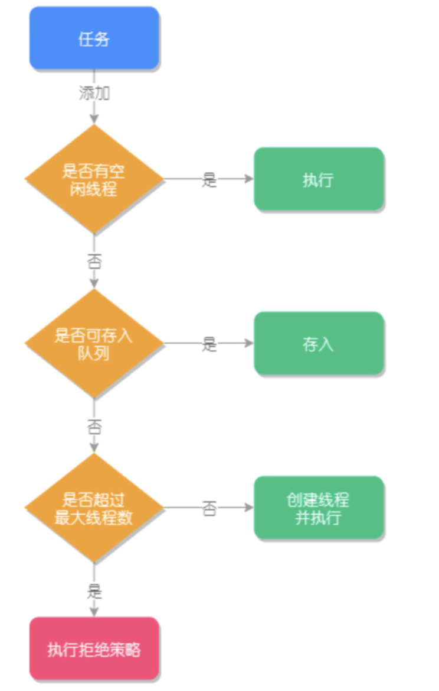

[toc]

# 详解ThreadPoolExecutor的参数含义及源码执行流程

## 1.什么是线程池

线程池是为了避免频繁创建和销毁线程带来的性能损耗，而建立的池化技术。把创建的线程放入池中，待任务来临时就可以重用已有的线程，无需等待创建的过程，提高程序响应速度。

## 2.使用Executors的弊端

使用Executors，对线程池运行规则不明确，存在资源耗尽的风险。

- FixedThreadPool和SingleThreadPool:允许**请求队列**的长度为Integer.MAX_VALUE，可能会**推挤**大量的请求，导致OOM
- CachedThreadPool和ScheduledThreadPool：允许**创建的线程数量**为Integer.MAX_VALUE，可能会创建大量线程，从而导致OOM

## 3.ThreadPoolExecutor核心参数和工作原理

ThreadPoolExecutor构造方法:

```java
/**
*** desc: 1.基础构造方法
**/
public ThreadPoolExecutor(int corePoolSize,
  											  int maximumPoolSize,
                          long keepAliveTime,
                          TimeUnit unit,
                          BlockingQueue<Runnable> workQueue) {
        // Executors.defaultThreadFactory()为默认的线程创建工厂，defaultHandler为莫仍拒绝策略
        this(corePoolSize, maximumPoolSize, keepAliveTime, unit, workQueue,
             Executors.defaultThreadFactory(), defaultHandler);
}

/**
*** desc:2.由上述构造方法调用的构造方法
*** 第1个参数 corePoolSize: 线程池常驻核心线程数，为0表示无任务，销毁线程池；设置则过小，线程频繁创建销* 毁，设置过大，会浪费系统资源，需要根据业务调整此值
*** 第2个参数 maximumPoolSize: 线程池在任务最多时，最大可以创建的线程数，必须大于0，也必须大于corePoolSize，在任务比较多，任务队列已满，才会用到。
*** 第3个参数，keepAliveTime: 表示线程存活时间，当线程池空闲并超过此时间，多余线程就会被销毁值corePoolSize。
*** 第4个参数，unit: 表示存活时间的单位
*** 第5个参数，workQueue: 表示线程池执行的任务队列，当线程池所有线程都在处理任务是，新任务会缓存在此任务队列中等待执行。
*** 第6个参数，threadFactory: 表示线程创建工厂。通常不指定，使用默认的线程创建工作的方法来创建线程，也可以自定义线程工厂，通过实现TreadFacotry接口完成，自定义线程名称和线程执行优先级。
*** 第7个参数，RejectedExecutionHandler，表示线程池的拒绝策略。当缓存队列已满，且不能创建新的线程执行此任务时，就会用到拒绝策略，属于一种限流保护机制。
**/
public ThreadPoolExecutor(int corePoolSize,
                           int maximumPoolSize,
                           long keepAliveTime,
                           TimeUnit unit,
                           BlockingQueue<Runnable> workQueue,
                           ThreadFactory threadFactory,
                           RejectedExecutionHandler handler) {
        if (corePoolSize < 0 ||
            // maximumPoolSize必须大于0，且必须大于corePoolSize
            maximumPoolSize <= 0 ||
            maximumPoolSize < corePoolSize ||
            keepAliveTime < 0)
            throw new IllegalArgumentException();
        if (workQueue == null || threadFactory == null || handler == null)
            throw new NullPointerException();
        this.acc = System.getSecurityManager() == null ?
                null :
                AccessController.getContext();
        this.corePoolSize = corePoolSize;
        this.maximumPoolSize = maximumPoolSize;
        this.workQueue = workQueue;
        this.keepAliveTime = unit.toNanos(keepAliveTime);
        this.threadFactory = threadFactory;
        this.handler = handler;
 }

/**
*** 3.默认的线程创建工厂，实现了ThreadFactory接口
**/
public static ThreadFactory defaultThreadFactory() {
        return new DefaultThreadFactory();
}

static class DefaultThreadFactory implements ThreadFactory {
        private static final AtomicInteger poolNumber = new AtomicInteger(1);
        private final ThreadGroup group;
        private final AtomicInteger threadNumber = new AtomicInteger(1);
        private final String namePrefix;

        DefaultThreadFactory() {
            SecurityManager s = System.getSecurityManager();
            group = (s != null) ? s.getThreadGroup() :
                                  Thread.currentThread().getThreadGroup();
            namePrefix = "pool-" +
                          poolNumber.getAndIncrement() +
                         "-thread-";
        }
				// 创建线程
        public Thread newThread(Runnable r) {
            Thread t = new Thread(group, r,
                                  namePrefix + threadNumber.getAndIncrement(),
                                  0);
            if (t.isDaemon())
                t.setDaemon(false); // 创建一个非守护线程
            if (t.getPriority() != Thread.NORM_PRIORITY)
                t.setPriority(Thread.NORM_PRIORITY); // 线程优先级设置为默认值
            return t;
        }
}
```


## 4.线程池任务执行的主要流程



执行方法execute()源码

```java
 /**
 *** addWorker(Runnable firstTask, boolean core)方法的参数说明
 *** firstTast,线程应首先运行的任务
 *** core,判断是否可以创建线程的阈值，如果等于true则表示使用corePoolSize作为阈值，false使用
 *** maximumPoolSize作为阈值
 **/
 public void execute(Runnable command) {
        if (command == null)
            throw new NullPointerException();
        int c = ctl.get();
        // 当前工作的线程数小于核心线程数
        if (workerCountOf(c) < corePoolSize) {
        		// 创建新的线程执行此任务
            if (addWorker(command, true))
                return;
            c = ctl.get();
        }
        // 检查线程池是否处于运行状态，如果是则把任务添加到队列
        if (isRunning(c) && workQueue.offer(command)) {
            int recheck = ctl.get();
            // 再次检查线程池是否处于运行状态，防止第一次校验通过后线程池关闭
            // 如果是非运行状态，将刚加入队列的任务异常
            if (! isRunning(recheck) && remove(command))
                reject(command);
            // 如果线程池的线程数为0 （corePoolSize设置为0）
            else if (workerCountOf(recheck) == 0)
                addWorker(null, false); //新建线程执行任务
        }
        // 核心线程都在忙且队列都爆满，尝试新启动一个线程执行失败
        else if (!addWorker(command, false))
            reject(command);
   }
    
```


## 5.ThreadPoolExecutor执行方法有几种，区别是什么

execute()和submit()都是用来执行线程池任务的，最主要区别是submit()方法可以配合Future接受线程池执行的返回值，而execute()方法不能接受返回值。

## 6.什么是线程的拒绝策略，拒绝策略的分类有哪些

线程池中的任务队列被存满，再有任务添加时，判断线程池舒是否大于等于线程池的最大值，如果是触发拒绝策略。

- AbortPolicy：终止策略，线程池会抛出异常并终止执行，是默认的拒绝策略
- CallerRunsPolicy: 把任务交个当前线程来执行
- DiscardPolicy: 忽略此任务
- DiscardOldesPolicy：忽略最早的任务

## 7.如何自定义拒绝策略

新建一个RejectedExecutionHandler对象，重写rejectedExecution()方法即可

```java
ThreadPoolExecutor executor = new ThreadPoolExecutor(1, 3, 10, TimeUnit.SECONDS, new 		LinkedBlockingQueue<>(2), new RejectedExecutionHandler() { // 添加自定义拒绝策略
  	@Override
  	public void rejectedExecution(Runnable r, ThreadPoolExecutor executor) {
      // 业务处理方法
			System.out.println("执行自定义拒绝策略");
    }
});
```

## 8.ThreadPoolExecutor能不能实现扩展，如何实现扩展

扩展通过重写beforeExecute()和afterExecute()方法实现，用于添加日志或者实现数据统计，比如统计线程的执行时间。

```java
/**
  * 线程池扩展
**/ 
static class MythreadPoolExecutor extends ThreadPoolExecutor {
	// 保存线程执行开始时间
	private final ThreadLocal<Long> localTime = new ThreadLocal<>();
	public MyThreadPoolExecutor(int corePoolSize, int maximumPoolSize, long keepAliveTime, TimeUnit unit, BlockingQueue<Runnable> workQueue) {
		super(corePoolSize, maximumPoolSize, keepAliveTime,unit, workQueue);
	}
	
	/**
	*** 开始执行之前
	*** @param t 线程
	*** @param r 任务
	**/
	@Override
	protected void beforeExecute (Thread t, Runnalbe r) {
		Long sTime = System.naoTime();// 开始时间
		localTime.set(sTime);
		System.out.println(String.format("%s | before |time=%s", t.getName(), sTime));
		super.beforeExecute(t, r);
	}
  
  
	/**
	*** 执行完成之后
	*** @param r 任务
	*** @param t 抛出异常
	**/
	@Override
	protected void afterExecute (Runnalbe r, Throwable t) {
		Long sTime = System.naoTime();// 结束时间
		LongtotalTime=eTime-localTime.get();//执行总时间
		System.out.println(String.format("%s|after|time=%s|耗时：%s毫秒",Thread.currentThread().getName(),eTime,(totalTime/1000000.0)));
		super.afterExecute(r，t);
	}
}
```


