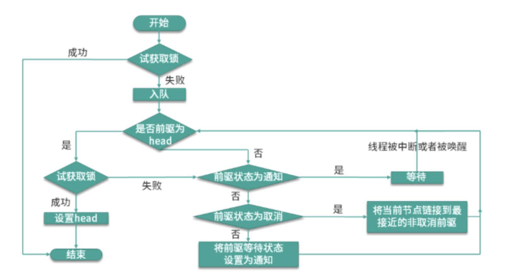

[toc]

# synchronized和ReentrantLock的实现原理，区别

## 1.synchronized和ReentrantLock如何实现

Synchronized

- synchronized属于独占式悲观锁，通过JVM隐式实现，只允许同时刻只一个线程操作资源。
- 每个对象都隐式包含一个monitor对象，加锁的过程是竞争monitor的过程。线程执行字节码monitorenter指令后持有该对象，执行monitorexit时释放对象，线程没有拿到该对象则阻塞。

ReentrantLock

- 基于AQS(Abstract  Queu Synchronizer, 队列同步器)实现，通过非公平锁实现。
- 内部有一个state状态字段用于表示锁是否被占用，state为0未被占用，state为1被占用

区别：

- 实现方式：ReenTrantLock是java语言提供API,synchronized是JVM隐式实现
- 锁属性配置: ReenTrantLock可设置为公平锁，synchronized只能是非公平锁
- 修饰范围：ReenTranctLock只能修饰代码块，而synchronized可以用于修饰方法，代码块
- 使用：ReenTranctLock需要手动加锁和释放锁，如果忘记释放会造成资源被永久占用。synchronized无需手动释放锁
- 获取锁的状态: ReenTranctLock知道是否成功获取锁，synchronized却不行

## 2.ReenTrantLock的具体实现细节

### （1） 构造函数，通过不同构造函数创建公平或者非公平锁

**源码**

```
public ReenTrantLock() {
	sync = new NonfairSync();//非公平锁
}
public ReenTrantLock(boolean fair) {
	sync = fair ? new FairSync() : new NonFairSync();
}
```

**公平锁和非公平锁**

- 公平锁：线程需要按照请求顺序获取锁
- 非公平锁：线程发送请求时，锁的状态恰好变成可用，那么此线程就可以跳过队列中排队的线程直接拥有该锁
- 性能对比: 公平锁有挂起和恢复所有存在一定的开销，性能不如非公平锁。ReenTrantLock和synchronized默认都是非公平锁

### （2）ReenTrantLock获取锁和释放锁

**源码**

```
Lock lock = new ReenTrantLock();
try {
	// 加锁
	lock.lock();
	// ...业务处理
} finally {
	// 释放锁
	lock.unlock();
}
```

**lock() 方法获取锁**

使用抽象方法syn.lock()，由子类NonfairSync或者FairSync具体实现

```java
/**
*** NonefailSync 中的lock()源码
**/
final void lock() {
    // compareAndSetState方法尝试将state值由0置换为1
  	if(compareAndSetState(0,1)) {
      // 设置成功则没有线程持有该锁，将当前线程设置为此锁的持有者，不用排队直接暂用锁
      setExcluesiceOwnerThread(Thread.currentThread());
    } else{
      // 设置失败通过acquire去排队
      acquire(1);
    }
}
/**
*** FairSync的lock源码如下
**/
final void lock() {
  	acquire(1);
}
```



acquire源码

```java
public final void acquire(int arg) {
  //尝试获取锁，获取失败，addWaiterf方法把现场包装成Node对象放入队列
	if(!tryAcquire(arg) && acquireQueued(addWaiter(Node.EXCLUESIVE, arg)) {
				selfInterrupt();
	}
}
/**
*** tryAcquire方法尝试获取锁，失败则加入阻塞队列
**/
protected final boolean tryAcquire(int acquires) {
  final Thread current = Thread.currentThread();
  int c = getState();
  if(c == 0) {
    // 公平锁比非公平锁多一行代码 !hashQueuedPredecessors(),用于查看队列中是否有比它等待时间更久的线程
    if(!hashQueuedPredecedssors() && 
       compareAndSetState(0, acquires)) {// 尝试获取锁
      setExclusiveOwnerThread(current);//获取成功标记被抢占
      return true;
    }
  } else if (current == getExclusiveOwnerThread()) {
    //当前线程持有锁
    int nextc = c + acquires;
    if(nextc < 0) {
      throw new Error("Maximum lock count exceeded");
    }
    setState(nextc);// set state = state + 1
    return true;
  }
  return false;
}
	/**
	*** acquireQueued方法尝试获取锁，获取失败节点被挂起
	**/
   final boolean acquireQueued(final Node node, int arg) {
        boolean failed = true; // 获取锁是否成功的状态标识
        try {
            boolean interrupted = false; // 线程是否被中断
            for (;;) {
                // 获取前一个节点
                final Node p = node.predecessor();
                // 前一个节点为头结点，当前节点尝试获取锁
                if (p == head && tryAcquire(arg)) {
                    setHead(node); // 获取成功，当前节点设置为head节点
                    p.next = null; // 原head节点出队，等待被GC help GC
                    failed = false;// 获取成功
                    return interrupted;
                }
                // 判断获取锁失败后是否可以挂起
                if (shouldParkAfterFailedAcquire(p, node) &&
                    parkAndCheckInterrupt())
                    // 线程若被中断，返回true
                    interrupted = true;
            }
        } finally {
            if (failed)
                cancelAcquire(node);
        }
    }     
    /**
    *** shouldParkAfterFailedAcquire: 判断线程是否可以被挂起
    *** 线程被挂起的前提条件是：前驱节点的状态为SIGNAL,含义是后继节点处于等待状态，当前节点释放锁会唤醒后继		 *** 节点，当前去节点状态>0,表示前驱节点取消了，需要一直往前找，知道找到正常节点，把它作为自己的前驱节点
    **/ 
    private static boolean shouldParkAfterFailedAcquire(Node pred, Node node) {
        // 获取前驱节点的状态
        int ws = pred.waitStatus;
        // 前驱节点的状态为SIGNAL,当前线程可以被挂起 (阻塞)
        if (ws == Node.SIGNAL)
            return true;
        if (ws > 0) {
            do {
		            // 若前驱节点状态为CANCELLED，那就一直往前找，直到找到一个正常等待的状态为止
                node.prev = pred = pred.prev;
            } while (pred.waitStatus > 0);
            // 并将当前节点排在它后边
            pred.next = node;
        } else {
            // 前驱节点状态修改为CANCELLED
            compareAndSetWaitStatus(pred, ws, Node.SIGNAL);
        }
        return false;
    }
```


**unlock()方法释放锁**

sync.release()释放锁

```java
public void unlock() {
	sync.release(1);
}
public final boolean release(int arg) {
   // 尝试释放锁，true为释放成功
   if (tryRelease(arg)) {
       Node h = head;
       // 释放成功后查看头节点状态是否为SIGNAL,如果是则唤醒头结点的下个节点关联的线程
       if (h != null && h.waitStatus != 0) {
      	 unparkSuccessor(h);
       }   
       return true;
   }
   return false;
}
```

tryRelease源码

```java
		    /**
		    *** 尝试释放当前线程占有的锁
		    **/
  	    protected final boolean tryRelease(int releases) {
            int c = getState() - releases; // 释放锁后的状态，0 表示释放锁成功
            // 如果拥有锁的线程不是当前线程的话抛出异常
            if (Thread.currentThread() != getExclusiveOwnerThread())
                throw new IllegalMonitorStateException();
            boolean free = false;
            if (c == 0) { // 锁释放成功
                free = true;
                setExclusiveOwnerThread(null); // 清空独占线程
            }
            setState(c);// 更新state值，0表示为释放锁成功
            return free;
        }
```


## 3.JDK1.6时锁做了哪些优化

### （1）自适应自选锁

​	自旋的时间不再是固定时间，同一个锁对象，通过自旋等待成功获取锁，那么虚拟机就认为它下次也很有可能成功，自旋等待时间则会变长；反之，若自旋很少成功，获取该锁是，可能直接忽略自旋过程，避免浪费CPU资源。

### （2）锁升级

​	从偏向锁到轻量级锁再到重量级锁升级的过程，又称锁膨胀。

**偏向锁**

- 无竞争状态下锁的状态，偏向第一个获取它的对象。
- 对象头标志”01“表示偏向锁模式，对象头也记录仪线程ID,这样持有偏向锁的线程再进入不再进行同步操作。
- 直到其他线程尝试获取锁，此模式才会结束。
- 能提高带有同步但无竞争的程序行呢

**轻量锁**

- 通过比较并交换CAS来实现，对比并交换线程和锁对象Mark word(对象头中的一个区域)，如果更新成功表示当前线程成功拥有此锁。
- 更新失败会检查当前锁对象是否指向当前线程的栈帧。如果指向，说明线程已拥有该锁，否则，其他锁被其他线程占用。
- 当两个以上的线程争抢此锁时，轻量级锁就膨胀为重量级锁。

**重量锁**

synchronized通过操作系统的互斥量(mutex lock)实现，需要在用户态和核心态之间做转换，有很大的性能消耗。