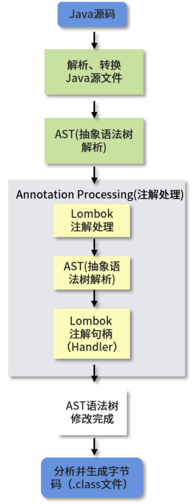

[toc]
## 动态代理

> 程序在运行期间动态构建代理对象、动态调用代理方法的机制，可以使用反射或者ASM(字节码操作框架)实现。

### JDK动态代理和CGLib动态代理

#### 源码

JDK动态代理：使用InvocationHandler代理器统一管理被代理的对象，触发invoke()方法触发代理的执行方法

```
public interface InvocationHandler {
	public Object invoke(Object object, Method method, Object[] args) throws Throwable;
}
```

实现JDK动态代理：实现InvocationHandler接口,重写invoke方法

```
public class ProxyClass {
	static interface Car {
		void running();
	}
	static class Bus interface Car {
		@Override
		public void running(){
			System.out.println("The bus is running.");
		}
	}
	static class Taxi interface Car {
		@Override
		public void running(){
			System.out.println("The Taxi is running.");
		}
	}
	/**
	*** JDK Proxy
	***/
	static class JDKProxy implements InvocationHandler {
		private Object target;
		// 获取到代理对象
		public Object getInstance(Object object) {
			this.target = target;
			return Proxy.newProxyInstance(target.class.getClassLoader, target.class.getInterface, this);
		}
		/**
		***执行代理方法
		** object : 代理对象
		** method : 代理方法
		** args : 代理方法的参数
		**/
		@Override
		public Object invoke(Object object, Method method, Object[] args) thorows InvocationTargetException, IllegalAccessException{
			System.out.println("动态代理之前的业务处理。");
			// 代理对象执行代理方法，使用反射的invoke
			Object result = method.invoke(target, args);
			return result;
		}
	}
	//执行jdk动态代理
	public static void main(String[] args) {
		JDKProxy proxy = new JDKProxy();
		Car carInstance = (Car)proxy.getInstance(new Taxi());
		carInstance.running();
	} 
}

reuslt:
动态代理之前的业务处理。
The Taxi is running.
```

CGLib的实现方式，实现代理器接口，调用某个方法。初始化被代理类的方式是同时Enhancer对象把代理对象设置为被代理的子类来实现动态代理。

```
1.现在pom中引入配置：
<!-- https://mvnrepository.com/artifact/cglib/cglib -->
<dependency>
    <groupId>cglib</groupId>
    <artifactId>cglib</artifactId>
    <version>3.3.0</version>
</dependency>
2.CGLib实现代码
public Class CGLibExample {
	static Class car{
		public void running(){
			System.out.println("The car is running.");
		}
  }
  /**
  *** CGLib代理类
  **/
  static Class CGLibProxy implements MethosInterceptor {
  	Private Object object;
  	pulic object getInstance(Objcet target) {
  		this.target = target;
  		Enhancer enhancer = new Enhancer();
  		// 将父类设置为被代理的实例类
  		enhancer.setSuperClass(this.target.getClass());
  		// 回调方法
  		enhancer.setCallBack(this);
  		// 创建代理对象
  		return enhancer.create();
  	}
  }
  @Override
  public Object intercept(Object o, Mehod method, Object[] objects, MethodProxy methodProxy) throws Throwable {
  	System.out.println("方法调用前业务处理。");
  	Object result = methodProxy.invokeSuper(o, objects);//执行方法
  	return result;
  }
  
  //执行cglib动态代理
	public static void main(String[] args) {
		CGLibProxy proxy = new CGLibProxy();
		Car car = (Car)proxy.getInstance(new Car());
		car.running();
	} 
}

resutl:

```

#### 区别

> JDK动态代理：Java语言自带，无需引入第三方类; 提供稳定支持，随JDK版本升级和更新；通过拦截器和反射实现 ；只能代理继承接口的类
>
> CGLib动态代理: 需要引入第三方工具；基于ASM实现，性能比较高；无需通过接口实现，通过实现子类的方式完成调用。

### Lombok原理

Lombok注解实现Setter, Getter, toString, equals, hashCode方法。

原理：实现和反射无关，反射是程序运行期间的一种自省能力，而Lombok的实现在编译期间就生成了对应的字节码。基于 Java 1.6 实现的 JSR 269: Pluggable Annotation Processing API 来实现的，也就是通过**编译期自定义注解处理器**来实现的，执行步骤 : Java源码被抽象成语法树(AST)，Lombok根据自己的注解处理器动态修改AST，执行后形成最终的字节码(.class)文件。



### 动态代理知识扩充

#### 动态代理和静态代理区别

静态代理：事先写好代理类，可以手工编写可以使用工具。缺点是对每一个业务类都要对应一个业务类。

#### 动态代理使用场景

> 常见场景：RPC 框架的封装、AOP（面向切面编程）的实现、JDBC 的连接

#### Spring中的动态代理如何实现

> Spring框架使用了两种动态代理，JDK Proxy 和 CGLib，当 Bean 实现了接口时，Spring 就会使用 JDK Proxy，在没有实现接口时就会使用 CGLib。也可以在spring中配置添加 <aop:aspectj-autoproxy proxy-target-class="true"/>，强制使用CGLib。

