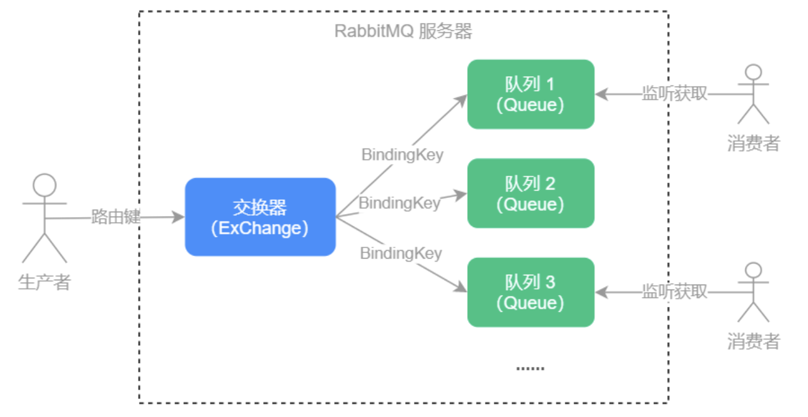

[toc]
## 消息队列使用场景
1.商品秒杀: 爆发式用户请求，导致服务响应时间长出现假死或者严重导致宕机。通过消息队列，将请求写入消息队列中再排队处理。超过消息队列长度的部分进行抛弃提示用户重新请求。
2.系统解耦：业务功能模块化，实现解耦。使用消息队列订阅相关的独立功能。
3.日志记录：请求处理和添加日志的操作是放在一起处理的，请求放入消息队列单独处理日志记录。
## RabbitMQ
使用标准AMQP(Advenced Message Queue Protocol 高级消息队列协议)的消息中间件。
### 三个角色
生产者: 消息创建者，创建和推送消息到消息服务器。
消费者：消息接收方，处理数据和确认消息。
代理：RabbitMQ本身，消息暂存和传递的角色。类似“快递”。

### 优点
1.支持持久化：磁盘保存，数据不丢失
2.支持分布式集群：启动节点，使用--link把节点加入集群
3.支持高并发：Erlangh语言，自带高并发，高可用特性。
4.支持多种语言：Java、Go、Python
5.支持消息确认：消息确任(ack)保证消息被正常消费
6.支持消息插件：网页控制台消息管理插件、消息延迟插件
### 模式
1.direct模式：一对一模式，一个消息知识发送给一个消费者
2.header模式：和direct使用完全一致，允许匹配header而非RoutingKey，但性能差，几乎不使用。
3.fanout：多播模式，把消息分发给所有的订阅者。
4.topic：主题订阅模式，允许使用通配符匹配到多个消息
## 自定义消息队列
Queue分三类：
- 双端队列
- 阻塞队列
- 非阻塞队列

### 普通消息队列
```
```
### 延迟消息队列