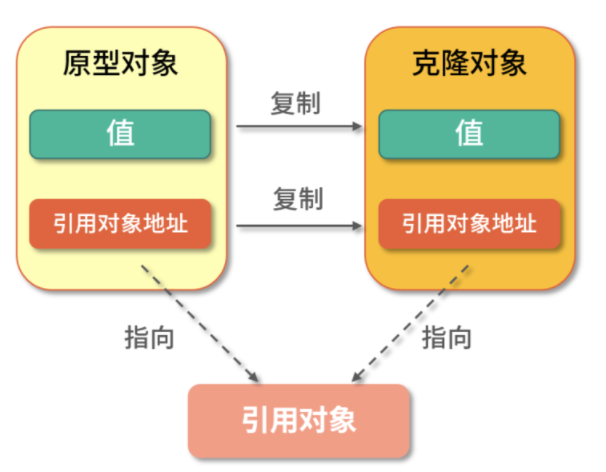
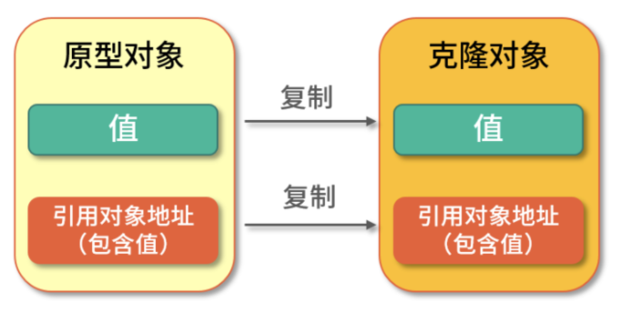

[toc]

## 克隆：快速构建对象的副本

### 浅克隆&深克隆

> 浅克隆：值类型复制到新对象，引用类型的引用地址复制到新对象。对象和克隆对象共用引用对象的地址。



> 深克隆：值类型和引用类型的对象，全部复制到新对象。


### 克隆的实现

实现Cloneable接口，重写Object.clone()方法

### 克隆的约定

> 克隆对象和原对象不是一个对象：x.clone()  !=  x       result: true
>
> 克隆对象和原对象是同一个类型：x.clone().getClass() ==  x.getClass()  result: true
>
> 克隆对象和原对象值相等：x.clone().equals(x)   result: true

### Arrays.copyOf是深克隆还是浅克隆

```
int[] nums1 = {1,2,3,4};
int[] nums2 = Arrays.copyOf(nums1,nums1.length);
nums2[0] = 0;
System.out.println("nums1:" + Arrays.toString(nums1));
System.out.println("nums2:" + Arrays.toString(nums2));
```

jdk1.8 执行结果显示是深克隆(jdk1.8之前是浅克隆)：

```
nums1:[1, 2, 3, 4]
nums2:[0, 2, 3, 4]
```

### 深克隆的5中实现方式

1.所有对象都实现Clonable接口和Object.clone()方法

```
public Class CloneExample {
	public static void main(String[] args) {
		Address address = new Address(1, "北京");
		People people1 = new People("JaJa", address);
		People people2 = people1.clone();
		people.getAddress().setCity("上海")；
		System.out.println("p1:" + people1.getAddress.getCity());
		System.out.println("p2:" + people2.getAddress.getCity());
	}
	static Class People implement Cloneable {
		private String name;
		private Address address;
		@Override
		protected People clone throws CloneNotSupportedException {
			People people = (People) super.clone();
			people.setAddress(this.addredd.clone()); //引用类型克隆复制
			return people;
		}
	}
	static Class Address implement Cloneable {
		private int id;
		private String city;
		@Override
		protected Address clone() throws CloneNotSupportedException {
			return (Address)super.clone();
		}
	}
}

```

2.构造方法实现深克隆

```
public Class CloneExample {
	public static void main(String[] args) {
		Address address = new Address(1, "北京");
		People people1 = new People("JaJa", address);
		People people2 = new People(people1.getName(), 
			new Address(people1.getAddress().getId(), people1.getAddress().getCity());
		people.getAddress().setCity("上海")；
		System.out.println("p1:" + people1.getAddress.getCity());
		System.out.println("p2:" + people2.getAddress.getCity());
	}
}
```

3.字节流实现

由于通过字节流的序列化，需要实现Serializable接口

```
public Class CloneExample {
	public static void main(String[] args) {
		Address address = new Address(1, "北京");
		People people1 = new People("JaJa", address);
		People people2 = (People)StreamClone.clone(people1);
		people.getAddress().setCity("上海")；
		System.out.println("p1:" + people1.getAddress.getCity());
		System.out.println("p2:" + people2.getAddress.getCity());
	}
	static Class StreamClone {
		public static <T extends Serializable> T clone(People obj) {
			T cloneObj = null;
			try {
				// 写入字节流
				ByteArrayOutputStream bo = new ByteArrayOutputStream();
				ObjectOutputStream oos = new ObjectOutputStream(bo);
				oos.writeObject(obj);
				oos.close();
				// 分配内存，写入原始对象，生成新对象
				ByteArrasyInputStream bi = new ByteArrayInputStream(bo.toByteArray());//获取输出字节流
				ObjectInputStream oi = new ObjectInputStream(bi);
				// 返回新对象
				cloneObj = (T)oi.readObject();
				oi.close();
			} catch(Excepiont e) {
				e.printStackTrace();
			}
			return cloneObj;
		}
	}
	static Class People implement Serializable {
		private String name;
		private Address address;
	}
	static Class Address implement Serializable {
		private int id;
		private String city;
	}
}
```


4.通过第三方工具实现，Apache Common Lang，需要实现Serializable接口

```
public Class CloneExample {
	public static void main(String[] args) {
		Address address = new Address(1, "北京");
		People people1 = new People("JaJa", address);
		People people2 = (People)SerializationUtils.clone(people1);
		people.getAddress().setCity("上海")；
		System.out.println("p1:" + people1.getAddress.getCity());
		System.out.println("p2:" + people2.getAddress.getCity());
	}
}
```

5.json方式，需要实现Serializable接口

```
public Class CloneExample {
	public static void main(String[] args) {
		Address address = new Address(1, "北京");
		People people1 = new People("JaJa", address);
		// 使用Google提供是Gson工具
		Gson gson = ne Gson();
		People people2 = gson.fromJson(gson.toJson(people1), People.class);
		people.getAddress().setCity("上海")；
		System.out.println("p1:" + people1.getAddress.getCity());
		System.out.println("p2:" + people2.getAddress.getCity());
	}
}
```


### 克隆设计理念

- Cloneable接口jdk1.0用于标识克隆。做标识的四种方法（关键字、注解、接口、基类），最优选择接口
- Object.clone()，是应为克隆最好有JVM的直接支持，通过native方法实现，需要把API暴露出来，放在所有对象基类，就会很方便调用。

