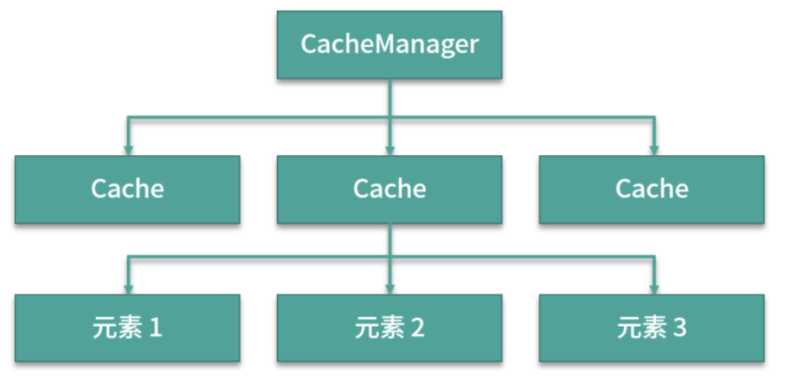

[toc]
## 缓存

> 1.将程序或系统中常用的数据存放内存这样的特定介质中，在程序调用过程中，能提高系统整体的运行速度
>
> 2.先查询缓存，缓存没有命中时再查询其他服务器，最后返回给调用方

## 本地缓存和分布式缓存

### 本地缓存

- 特点：程序级别的缓存，即缓存和程序在同一个进程中。

- 场景：单节点、非集群

- 优点是快，同一个进程中没有网络延迟和开销

- 缺点一是多程序无法共享缓存（如分布式用户session会话信息的保存）二是同一份缓存，多个系统自己单独维护存储，造成资源浪费。

- 实现：EhCache和Google的Guava

  

### 分布式缓存

- 特点：应用系统和缓存组件分离的缓存机制，是的多个系统共同使用同一份缓存数据。
- 优点：共享缓存和可集群部署为缓存系统提供**高可用的运行环境**和**缓存共享的程序运行机制**
- 实现：Redis(主从、哨兵、集群)和Memcached

## EhCache使用

### 相关基础知识：

- 支持内存缓存和磁盘缓存
- 淘汰策略：LRU(最近最少使用)、LFU(最近不常被使用)、FIFO(先进先出)
- LRU和LFU的区别：LRU很久没有使用的一个键值最近被访问，即使使用次数最少也不会被淘汰；LFU解决前面说的偶尔被访问的一次，数据不会被淘汰的问题，按照总的访问次数淘汰数据（核心思想：如果数据过去被访问多次，那么将来被访问的次数也会比较多，所以更为合理）。

### 实现

```java
1.pom.xml引入配置
<!-- https://mvnrepository.com/artifact/org.ehcache/ehcache -->
<dependency>
    <groupId>org.ehcache</groupId>
    <artifactId>ehcache</artifactId>
    <version>3.8.1</version>
</dependency>

2.无配置参数的EhCache 3.x使用代码
public class EhCacheExample {
	public static void main(String[] args) {
		// 创建缓存管理器
		CacheManager cacheManager = CacheManagerBuilder.newCacheManagerBuilder().build();
		// 初始化EhCache
		cacheManager.init();
		// 创建缓存存储器
		Cache<String, String> mycache = cacheManager.createCache("MYCACHE", CacheConfigurationBuilder.newCacheConfigurationBuilder(String.class, String.class, ResourcePoolsBuilder.heap(10)));// 设置缓存的最大容量
		// 设置缓存
		mycache.put("key", "Hello world");
		// 读取缓存
		String value = mycahe.get("key");
		// 关闭缓存
		mycache.close();
	}
}
```

代码中：

- CacheManager：缓存管理器，通过单例或者多例创建，也是EhCache的入口类

- Cache：每个CacheManager可以管理多个缓存，每个缓存可以采用hash的方式存储多个元素

 

特点：

- 使用简单，jar包不大，简单地配置后即可正常使用
- 使用灵活，支持多种缓存策略的配置
- 1.2版本后支持分布式缓存策略

## Guava使用

内存型的本地缓存实现方案，提供线程安全机制，设计灵感来源于ConcurrentHashMap，segment细粒度锁，多了过期淘汰策略。

代码：

```java
1.pom.xml配置
<!-- https://mvnrepository.com/artifact/com.google.guava/guava -->
<dependency>
    <groupId>com.google.guava</groupId>
    <artifactId>guava</artifactId>
    <version>28.2-jre</version>
</dependency>

2.两种创建方式：一种是 LoadingCache，另一种是 Callable。编程式的 build 生成器进行创建和管理，更加灵活地操纵代码，提供了灵活多样的个性化配置，以适应各种使用场景。
public class GauvaExample {
  public static void main(String[] args) throws ExecutionException{
  	// 创建方式一、LoadingCache
    LoadingCache<String, String> loadCache = CacheBuilder.newBuilder()
      .concurrencyLever(5) //设置并发级别，指可以同时写缓存的线程数
      .expireAfterWrite(8, TimeUnit.SECONDS) //设置8秒过期时间
      .initialCapaciy(10) //设置缓存的初始化容量为10
      .maximumSize(100) //设置缓存的最大容量100
      .recordStats() //设置要统计缓存的命中率
      .removalListener(new RemovalListener<Object, Object>(){
        	public void onRemoval(RomoveNtification<Object, Object> notification) {
            System.out.println(notification.getKey() + "was removed, cause is " + nofication.getCause());
          }
      }) // 设置缓存移除通知
      .build(
    		new CacheLoader<String, String>(){
          	@Override
          	public String load(String key) throws Exception {
              //自动加载缓存业务
              return "cache-value:" + key;
            }
        }
    	);//指定CacheLoader,缓存不存在是自动加载缓存
  }
  
  loadCache.put("c1", "Hello, c1");
  // 查询缓存
  String val = loadCache.get("c1");
  System.out.println(val);
  // 查询不存在的缓存
  String noval = loadCache.get("noval");
  System.out.println(noval);
	
  // 创建方式二：Callable
  Cache<String, String> cache = CacheBuilder.newBuilder()
        .maximumSize(2) // 设置缓存最大长度
        .build();
  // 设置缓存
  cache.put("k1", "Hello, k1.");
  // 查询缓存
  String value = cache.get("k1", new Callable<String>() {
      @Override
      public String call() {
          // 缓存不存在时，执行
          return "nil";
      }
  });
  // 输出缓存值
  System.out.println(value);
  // 查询缓存
  String nokey = cache.get("nokey", new Callable<String>() {
      @Override
      public String call() {
         // 缓存不存在时，执行
         return "nil";
      }
  });
  // 输出缓存值
  System.out.println(nokey);

}

result:
Hello, c1.
cache-value:noval
Hello, k1.
nil
```


## 实现本地缓存

(1) 需要考虑的问题：

1.数据类型(非并发 HashMap, 并发 ConcurrentHashMap)

2.缓存过期淘汰策略 （Redis使用惰性删除和定期删除）

- 定时删除：设置键值的过期时间，创建定时事件，到达过期时间执行定时事件执行过期删除操作。优点可以及时释放内存空间，缺点需要开启多个延迟事件处理清除任务，造成大量事件堆积，占用大量系统资源
- 惰性删除：不主动删除key，在请求时判断key是否过期，过期则删除，否则返回null。优点占用少量系统资源，缺点是清除不够及时，会造成一定的空间浪费
- 定期删除：每隔一段时间检查一次，随机删除一些过期key

(2) 代码结构：

- 存放缓存值value的实体类，包含缓存相关信息(key、value、缓存存入时间、最后使用时间、命中次数...)
- 全局缓存：ConcurrentHashMap来存放key, value
- 缓存操作工具类：添加和删除缓存
- 过期缓存检测类：缓存启动时，开启一个无限循环的线程用于检测并删除过期的缓存

(3) 代码

CacheValue

```java
import lombok.Getter;
import lombok.Setter;

/**
 * 缓存实体类
 */
@Getter
@Setter
public class CacheValue implements Comparable<CacheValue> {
    // 缓存键
    private Object key;
    // 缓存值
    private Object value;
    // 最后访问时间
    private long lastTime;
    // 创建时间
    private long writeTime;
    // 存活时间
    private long expireTime;
    // 命中次数
    private Integer hitCount;

    @Override
    public int compareTo(CacheValue o) {
        return hitCount.compareTo(o.hitCount);
    }
}
```

CacheGlobal

```java
import java.util.concurrent.ConcurrentHashMap;
import java.util.concurrent.ConcurrentMap;

/**
 * Cache 全局类
 */
public class CacheGlobal {
    // 全局缓存对象
    public static ConcurrentMap<String, MyCache> concurrentMap = new ConcurrentHashMap<>();
}
```

ExpireThread

```java
import java.util.concurrent.TimeUnit;

/**
 * 过期缓存检测线程
 */
public class ExpireThread implements Runnable {
    @Override
    public void run() {
        while (true) {
            try {
                // 每十秒检测一次
                TimeUnit.SECONDS.sleep(10);
                // 缓存检测和清除的方法
                expireCache();
            } catch (Exception e) {
                e.printStackTrace();
            }
        }
    }

    /**
     * 缓存检测和清除的方法
     */
    private void expireCache() {
        System.out.println("检测缓存是否过期缓存");
        for (String key : CacheGlobal.concurrentMap.keySet()) {
            MyCache cache = CacheGlobal.concurrentMap.get(key);
            // 当前时间 - 写入时间
            long timoutTime = TimeUnit.NANOSECONDS.toSeconds(
                    System.nanoTime() - cache.getWriteTime());
            if (cache.getExpireTime() > timoutTime) {
                // 没过期
                continue;
            }
            // 清除过期缓存
            CacheGlobal.concurrentMap.remove(key);
        }
    }
}
```

CacheUtils

```java
import org.apache.commons.lang3.StringUtils;

import java.util.concurrent.TimeUnit;

/**
 * 缓存操作工具类
 */
public class CacheUtils {

    /**
     * 添加缓存
     * @param key
     * @param value
     * @param expire
     */
    public void put(String key, Object value, long expire) {
        // 非空判断，借助 commons-lang3
        if (StringUtils.isBlank(key)) return;
        // 当缓存存在时，更新缓存
        if (CacheGlobal.concurrentMap.containsKey(key)) {
            MyCache cache = CacheGlobal.concurrentMap.get(key);
            cache.setHitCount(cache.getHitCount() + 1);
            cache.setWriteTime(System.currentTimeMillis());
            cache.setLastTime(System.currentTimeMillis());
            cache.setExpireTime(expire);
            cache.setValue(value);
            return;
        }
        // 创建缓存
        MyCache cache = new MyCache();
        cache.setKey(key);
        cache.setValue(value);
        cache.setWriteTime(System.currentTimeMillis());
        cache.setLastTime(System.currentTimeMillis());
        cache.setHitCount(1);
        cache.setExpireTime(expire);
        CacheGlobal.concurrentMap.put(key, cache);
    }

    /**
     * 获取缓存
     * @param key
     * @return
     */
    public Object get(String key) {
        // 非空判断
        if (StringUtils.isBlank(key)) return null;
        // 字典中不存在
        if (CacheGlobal.concurrentMap.isEmpty()) return null;
        if (!CacheGlobal.concurrentMap.containsKey(key)) return null;
        MyCache cache = CacheGlobal.concurrentMap.get(key);
        if (cache == null) return null;
        // 惰性删除，判断缓存是否过期
        long timoutTime = TimeUnit.NANOSECONDS.toSeconds(
                System.nanoTime() - cache.getWriteTime());
        if (cache.getExpireTime() <= timoutTime) {
            // 缓存过期
            return null;
        }
        // 清除过期缓存
        CacheGlobal.concurrentMap.remove(key);
        cache.setHitCount(cache.getHitCount() + 1);
        cache.setLastTime(System.currentTimeMillis());
        return cache.getValue();
    }
}
```

测试代码

```java
public class MyCacheTest {
    public static void main(String[] args) {
        CacheUtils cache = new CacheUtils();
        // 存入缓存
        cache.put("key", "老王", 10);
        // 查询缓存
        String val = (String) cache.get("key");
        System.out.println(val);
        // 查询不存在的缓存
        String noval = (String) cache.get("noval");
        System.out.println(noval);
    }
}

result:
老王
null
```

