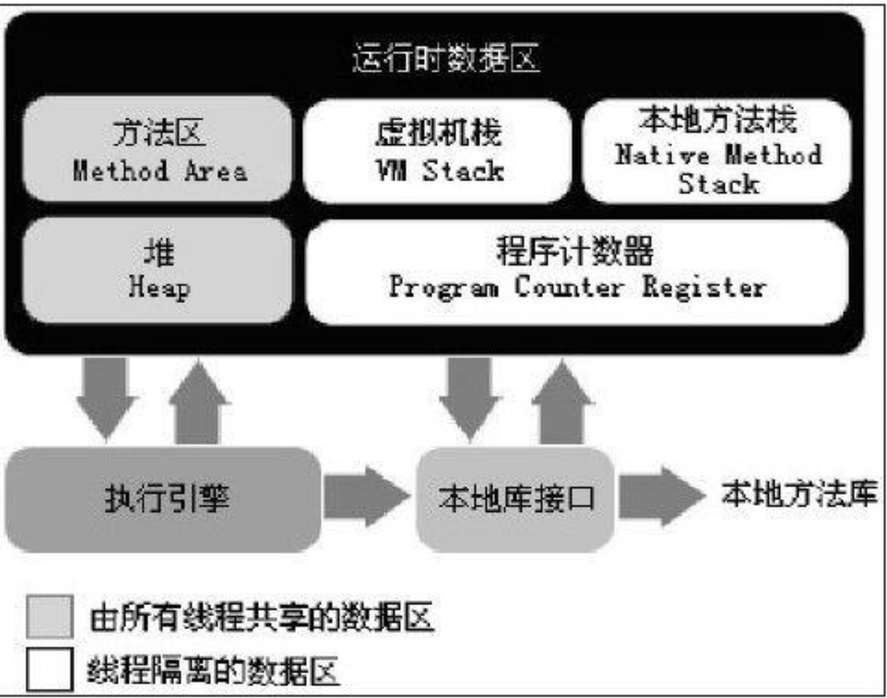

### 运行时数据区域
> 把内存划分成不同的数据区，有其各自用途和创建和销毁时间	

#### 程序计数器
1.是什么
	一块较小的内存空间，可当成线程所执行的字节码的行号指示器。
2.有什么用
	字节码解释器通过改变该计数器来选取下一条所需要执行的字节码，分支、循环、跳转、异常处理、线程恢复依赖于此。
3.特点
- 每个线程有独立的程序计数器，保证线程间互不影响，“线程独立”的内存
- Java方法执行，计数器记录虚拟机字节码指定地址。Native方法执行，计数器为空
- 唯一没有OutOfMemeryError的区域
#### Java虚拟机栈
1.是什么
	描述Java方法执行的内存模型，每个方法执行时会创建一个栈帧，每个方法从调用到执行完成，对应一个栈帧在虚拟机中入栈和出栈的过程
2.有什么用
	对于Java对象内存分配关系最密切的内存区域是堆内存和栈内存，其中栈就是虚拟机栈中的局部变量表部分，存放基本数据类型和对象引用类型。
3.特点
- 局部变量表所需要空间在编译期间完成分配，进入方法后空间确定，运行期间不会变更
- 对单线程请求的的栈深度超过虚拟机允许的深度，抛出StackOverFlowError异常
#### 本地方法栈
#### Java堆
#### 方法区
#### 运行时常量池
#### 直接内存
### 

