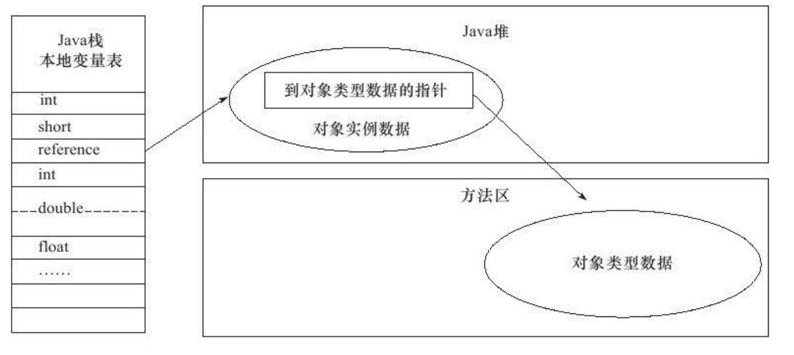

### 运行时数据区域
> 把内存划分成不同的数据区，有其各自用途和创建和销毁时间	

#### 程序计数器
1.是什么
	一块较小的内存空间，可当成线程所执行的字节码的行号指示器。
2.有什么用
	字节码解释器通过改变该计数器来选取下一条所需要执行的字节码，分支、循环、跳转、异常处理、线程恢复依赖于此。
3.特点
- 每个线程有独立的程序计数器，保证线程间互不影响，“线程独立”的内存
- Java方法执行，计数器记录虚拟机字节码指定地址。Native方法执行，计数器为空
- 唯一没有OutOfMemeryError的区域
#### Java虚拟机栈
1.是什么
	描述Java方法执行的内存模型，每个方法执行时会创建一个栈帧，每个方法从调用到执行完成，对应一个栈帧在虚拟机中入栈和出栈的过程
2.有什么用
	对于Java对象内存分配关系最密切的内存区域是堆内存和栈内存，其中栈就是虚拟机栈中的局部变量表部分，存放基本数据类型和对象引用类型。
3.特点
- 局部变量表所需要空间在编译期间完成分配，进入方法后空间确定，运行期间不会变更
- 对单线程请求的的栈深度超过虚拟机允许的深度，抛出StackOverFlowError异常
- 对创建新线程，虚拟机动态扩展无法申请到足够内存，就会抛出OutOfMemoryError异常
#### 本地方法栈
和虚拟机栈作用相似，只是虚拟机栈为Java方法提供服务，而本栈为Native方法提供服务。
#### Java堆
1.是什么
虚拟机中占最大内存，被所有线程共有的内存区域，在虚拟机启动时创建

2.有什么用
存放对象实例，几乎所有的对象实例都在这里分配内存

3.GC堆
- Java对是垃圾收集器管理的主要区域，因此被称为GC堆
- 收集器采用分代收集算法，将java堆细分为：新生代和老年代。
- 划分与存放内容无关，都存放的是对象实例，只是为了更好的垃圾回收和内存分配。

4.特点
- 物理上不连续，逻辑上连续
- 可实现成固定大小，也可以扩展(-Xmx, -Xms)
- 如果Java堆中无内存可分配，也无法扩展，抛出OutOfMemoryError异常

#### 方法区
- 和Java堆一样，各个线程共享的内存区域，用来存放类信息、常量、静态常量、即时编译器编译后的代码等数据。
- 可固定大小也可扩展，只是垃圾回收行为较少在此区域出现，一般内存回收行为是为了常量池回收或者类型卸载，但效果不明显。
- 无法满足内存分配时，抛出OutOfMemoryError异常。
#### 运行时常量池
- 方法区的一部分
- 运行时常量池存放Class文件中常量池信息，常量池中保存编译器生成的各种字面量和符号应用
- 具备动态性，即可以在运行期间将新常量放入池中
#### 直接内存
- 直接内存不是虚拟机运行时数据区的一部分
- 在NIO中引入基于通道和缓冲区的I/O，可使用Native函数库分配内存，通过Java堆内存中的DirectByteBuffer对象作为这块内存的应用来操作。
- 避免Java堆和Native堆来回复制数据
### HotSpot虚拟机对象探秘
#### 对象的创建
- 类加载检查，查看常量池中是否能定位到类的引用符号，并检查该类是否已被加载、解析和初始化过
- 类加载检查通过，需要执行类加载，首先需要为新生对象分配内存，两种分配方式：“指针碰撞”和“空闲列表”。选择哪种分配方式和Java堆是否规整决定，而是否规整由垃圾收集器是否带有压缩整理功能决定。
- 保证并发下创建对象的线程安全，一种是由虚拟机采用CAS的配上失败重试保证更新操作的原子性的。另一种是按照线程划分在不同的时空中进行，预先分配内存，为本地线程分配缓冲(TLAB)。
- 内存分配完成，内存全初始化为零值，接着对对象进行必要的设置，如类的元数据信息、哈希码、GC分代年龄等。即创建完成，但需要初始化才算一个真正可用对象。
#### 对象的内存布局
- 对象头 
  - 一部分存储对象自身的运行时数据，如HashCode(25bit)、GC分代年龄(4bit)、锁状态标识(2bit)、线程持有锁、偏向线程ID、偏向时间戳（1bit固定为0）。
  - 另一部分存放类型指针，即对象的类元数据指针。用以确定对象是哪个类的实例。
- 实例数据：对象真正存储的有效信息，也是在程序代码中定义的各种类型字段的内容。
- 对齐填充：非必然存在，也无特别含义，仅起占位符之用。
#### 对象的访问定位
通过栈上的reference数据来操作堆上的具体对象，目前有两种访问方式：句柄和直接指针。
- 句柄：java堆中划分一块内存作为句柄池，reference指向对象的句柄地址。句柄包含对象实例数据和类型数据的具体地址。

- 直接指针：reference直接指向对象的地址。

优缺点对比
- 句柄：reference中句柄地址稳定，对象被移动时，仅改变句柄中实际数据指针
- 直接指针：速度更快，节省了一次指正定位的时间开销。
### OutOfMemoryError异常
#### Java堆溢出
#### 虚拟机栈和本地方法栈溢出
#### 方法区和运行时常量池溢出
#### 本机直接内存溢出
