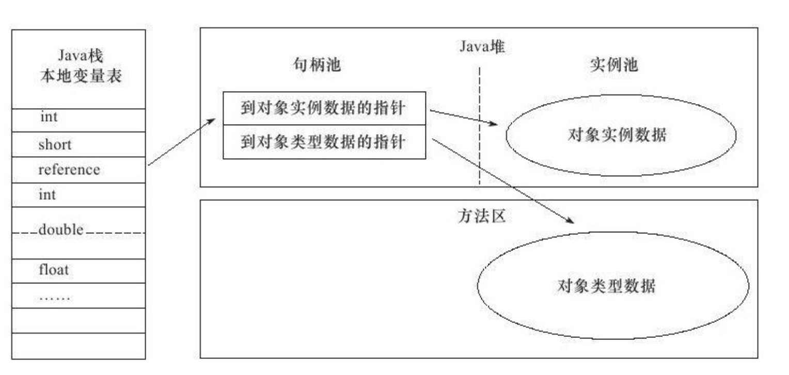

[toc]

### 运行时数据区域
> 把内存划分成不同的数据区，有其各自用途和创建和销毁时间	


#### 程序计数器
1.是什么
	一块较小的内存空间，可当成线程所执行的字节码的行号指示器。
2.有什么用
	字节码解释器通过改变该计数器来选取下一条所需要执行的字节码，分支、循环、跳转、异常处理、线程恢复依赖于此。
3.特点
- 每个线程有独立的程序计数器，保证线程间互不影响，“线程独立”的内存
- Java方法执行，计数器记录虚拟机字节码指定地址。Native方法执行，计数器为空
- 唯一没有OutOfMemeryError的区域
#### Java虚拟机栈
1.是什么
	描述Java方法执行的内存模型，每个方法执行时会创建一个栈帧，每个方法从调用到执行完成，对应一个栈帧在虚拟机中入栈和出栈的过程
2.有什么用
	对于Java对象内存分配关系最密切的内存区域是堆内存和栈内存，其中栈就是虚拟机栈中的局部变量表部分，存放基本数据类型和对象引用类型。
3.特点
- 局部变量表所需要空间在编译期间完成分配，进入方法后空间确定，运行期间不会变更
- 对单线程请求的的栈深度超过虚拟机允许的深度，抛出StackOverFlowError异常
- 对创建新线程，虚拟机动态扩展无法申请到足够内存，就会抛出OutOfMemoryError异常
#### 本地方法栈
和虚拟机栈作用相似，只是虚拟机栈为Java方法提供服务，而本栈为Native方法提供服务。
#### Java堆
1.是什么
虚拟机中占最大内存，被所有线程共有的内存区域，在虚拟机启动时创建

2.有什么用
存放对象实例，几乎所有的对象实例都在这里分配内存

3.GC堆
- Java对是垃圾收集器管理的主要区域，因此被称为GC堆
- 收集器采用分代收集算法，将java堆细分为：新生代和老年代。
- 划分与存放内容无关，都存放的是对象实例，只是为了更好的垃圾回收和内存分配。

4.特点
- 物理上不连续，逻辑上连续
- 可实现成固定大小，也可以扩展(-Xmx, -Xms)
- 如果Java堆中无内存可分配，也无法扩展，抛出OutOfMemoryError异常

#### 方法区
- 和Java堆一样，各个线程共享的内存区域，用来存放类信息、常量、静态常量、即时编译器编译后的代码等数据。
- 可固定大小也可扩展，只是垃圾回收行为较少在此区域出现，一般内存回收行为是为了常量池回收或者类型卸载，但效果不明显。
- 无法满足内存分配时，抛出OutOfMemoryError异常。
#### 运行时常量池
- 方法区的一部分
- 运行时常量池存放Class文件中常量池信息，常量池中保存编译器生成的各种字面量和符号应用
- 具备动态性，即可以在运行期间将新常量放入池中
#### 直接内存
- 直接内存不是虚拟机运行时数据区的一部分
- 在NIO中引入基于通道和缓冲区的I/O，可使用Native函数库分配内存，通过Java堆内存中的DirectByteBuffer对象作为这块内存的应用来操作。
- 避免Java堆和Native堆来回复制数据
### HotSpot虚拟机对象探秘
#### 对象的创建
- 类加载检查，查看常量池中是否能定位到类的引用符号，并检查该类是否已被加载、解析和初始化过
- 类加载检查通过，需要执行类加载，首先需要为新生对象分配内存，两种分配方式：“指针碰撞”和“空闲列表”。选择哪种分配方式和Java堆是否规整决定，而是否规整由垃圾收集器是否带有压缩整理功能决定。
- 保证并发下创建对象的线程安全，一种是由虚拟机采用CAS的配上失败重试保证更新操作的原子性的。另一种是按照线程划分在不同的时空中进行，预先分配内存，为本地线程分配缓冲(TLAB)。
- 内存分配完成，内存全初始化为零值，接着对对象进行必要的设置，如类的元数据信息、哈希码、GC分代年龄等。即创建完成，但需要初始化才算一个真正可用对象。
#### 对象的内存布局
- 对象头 
  - 一部分存储对象自身的运行时数据，如HashCode(25bit)、GC分代年龄(4bit)、锁状态标识(2bit)、线程持有锁、偏向线程ID、偏向时间戳（1bit固定为0）。
  - 另一部分存放类型指针，即对象的类元数据指针。用以确定对象是哪个类的实例。
- 实例数据：对象真正存储的有效信息，也是在程序代码中定义的各种类型字段的内容。
- 对齐填充：非必然存在，也无特别含义，仅起占位符之用。
#### 对象的访问定位
通过栈上的reference数据来操作堆上的具体对象，目前有两种访问方式：句柄和直接指针。
- 句柄：java堆中划分一块内存作为句柄池，reference指向对象的句柄地址。句柄包含对象实例数据和类型数据的具体地址。

- 直接指针：reference直接指向对象的地址。


优缺点对比
- 句柄：reference中句柄地址稳定，对象被移动时，仅改变句柄中实际数据指针
- 直接指针：速度更快，节省了一次指正定位的时间开销。
### 实战：OutOfMemoryError异常
本节目的
- 验证各个运行时区域的存储内容
- 遇到内存溢出异常时，根据异常信息判断哪个区域出现问题，以及如何处理

[设置IDEAJVM运行参数](https://cloud.tencent.com/developer/article/1350309)
IDEA (Run->Edit Configurations->VM Option)

```启动参数记录
//常见配置汇总 
//堆设置 
-Xms:初始堆大小 
-Xmx:最大堆大小 
-XX:NewSize=n:设置年轻代大小 
-XX:NewRatio=n:设置年轻代和年老代的比值.如:为3,表示年轻代与年老代比值为1:3,年轻代占整个年轻代年老代和的1/4 
-XX:SurvivorRatio=n:年轻代中Eden区与两个Survivor区的比值.注意Survivor区有两个.如:3,表示Eden:Survivor=3:2,一个Survivor区占整个年轻代的1/5 
-XX:MaxPermSize=n:设置持久代大小
//收集器设置 
-XX:+UseSerialGC:设置串行收集器 
-XX:+UseParallelGC:设置并行收集器 
-XX:+UseParalledlOldGC:设置并行年老代收集器 
-XX:+UseConcMarkSweepGC:设置并发收集器
//垃圾回收统计信息 
-XX:+PrintGC 
-XX:+PrintGCDetails 
-XX:+PrintGCTimeStamps 
-Xloggc:filename
//并行收集器设置 
-XX:ParallelGCThreads=n:设置并行收集器收集时使用的CPU数.并行收集//线程数. 
-XX:MaxGCPauseMillis=n:设置并行收集最大暂停时间 
-XX:GCTimeRatio=n:设置垃圾回收时间占程序运行时间的百分比.公式为1/(1+n)
//并发收集器设置 
-XX:+CMSIncrementalMode:设置为增量模式.适用于单CPU情况. 
-XX:ParallelGCThreads=n:设置并发收集器年轻代收集方式为并行收集时,使用的CPU数.并行收集线程数.

```
#### Java堆溢出
问题：
java堆中储存对象实例，只要不断创建对象实例，并保证不会进行垃圾回收，对象数量达到一定数量后就会产生内存溢出异常“java.lang.OutOfMemoryError:Java heap space”
```
/**限制Java堆大小20MB,且不可扩展
*VM Args:-Xms20m-Xmx20m-XX:+HeapDumpOnOutOfMemoryError
*@author hby
*/
public class HeapOOM{
	static class OOMObject{
	}
	public static void main(String[]args){
		List<OOMObject> list=new ArrayList<OOMObject>(){
		while(true){
			list.add(new OOMObject());
		}
	}
}
```
解决：
分清楚到底是内存泄漏还是内存溢出，内存泄漏需要掌握泄漏对象和GC引用链之间的信息。内存溢出，若对象必须都存在，需要扩大内存，或者减少对象生命周期和持有状态时长，减少内存消耗。
#### 虚拟机栈和本地方法栈溢出
问题
- 线程请求的栈深度大于虚拟机所允许的的最大深度，出现StackOverFlowError异常。单线程下，无论是由于栈帧太大还是虚拟机栈容量太小，当内存无法分配时，只会出现StackOverFlowError异常。(stack length:2402
Exception in thread"main"java.lang.StackOverflowError
at org.fenixsoft.oom.VMStackSOF.leak(VMStackSOF.java(20))
```
     /**
	 *虚拟机栈溢出
     *VM Args:-Xss128k
     *@author zzm
     */
    public class JavaVMStackSOF{
        private int stackLength=1;
        public void stackLeak(){
            stackLength++;
            stackLeak();
        }
        public static void main(String[]args)throws Throwable{
            JavaVMStackSOF oom=new JavaVMStackSOF();
            try{
                oom.stackLeak();
            }catch(Throwable e){
                System.out.println("stack length:"+oom.stackLength()
                throw e;
            }}}
```
- 不限于单线程时，不停建立线程时可能产生OutOfMemeroyError异常。(java.lang.OutOfMemoryError:unable to create new native thread)
```
    /**
     *VM Args:-Xss2M(设置最小堆容量为2M,稍微偏大)
     *@author hby
     */
    public class JavaVMStackOOM{
        private void dontStop(){
            while(true){
            }
	    }
        public void stackLeakByThread(){
            while(true){
                Thread thread=new Thread(new Runnable(){
                    @Override
                    public void run(){
                        dontStop();
                    }});
                thread.start();
            }
		}
        public static void main(String[]args)throws Throwable{
            JavaVMStackOOM oom=new JavaVMStackOOM();
            oom.stackLeakByThread();
        }
    }
```
解决
如果是建立过多线程导致内存溢出，在不能减少线程数或者更换64位虚拟机时，只能通过减少最大堆和减少栈容量换取更多线程。
#### 方法区和运行时常量池溢出
问题
- 运行时常量池存放不可变常量过多会出现溢出异常。String.intern( )是Native方法，将不存在运行时常量池的String字符串放入池中。（java.lang.OutOfMemoryError：PermGen space）
```
    /**
     * 设置方法区大小
     * VM Args:-XX:PermSize=10M-XX:MaxPermSize=10M
     *
     * @author hby
     */
    public class RuntimeConstantPoolOOM {
        public static void main(String[] args) {
            List<String> list = new ArrayList<String>();
            int i = 0;
            while (true) {
                list.add(String.valueOf(i++).intern());
            }
        }
    }
```
- 方法区存放Class相关信息，如类名，访问修饰符，常量池，字段描述，方法描述等。CGLib字节码增强在很多框架中使用到，增强的类越多，需要更大的方法区存放保证动态Class可以加载到内存。(java.lang.OutOfMemoryError:PermGen space)
```
    /**
     * VM Args:-XX:PermSize=10M-XX:MaxPermSize=10M
     *
     * @author hby
     */
    public class JavaMethodAreaOOM {
        public static void main(String[] args) {
            while (true) {
                Enhancer enhancer = new Enhancer();
                enhancer.setSuperclass(OOMObject.class);
                enhancer.setUseCache(false);
                enhancer.setCallback(new MethodInterceptor() {
                    public Object intercept(Object obj, Method method, Object[] args, MethodProxy proxy) throws Throwable {
                        return proxy.invokeSuper(obj, args);
                    }
                });
                enhancer.create();
            }
        }

        static class OOMObject {
        }
    }
```
解决
在经常动态生成大量Class的应用中，需要注意类的垃圾回收状况
#### 本机直接内存溢出
- 直接内存溢出，在Heap Dump中不会看见明显的异常(java.lang.OutOfMemoryError
at sun.misc.Unsafe.allocateMemory:Native Method)
```
/**
     * VM Args:-Xmx20M-XX:MaxDirectMemorySize=10M
     * 直接内存容量通过-XX:MaxDirectMemorySize指定，默认和Java堆最大值一样
     * @author hby
     */
    public class DirectMemoryOOM {
        private static final int_1MB=1024*1024;

        public static void main(String[] args) throws Exception {
            Field unsafeField = Unsafe.class.getDeclaredFields()[0];
            unsafeField.setAccessible(true);
            Unsafe unsafe = (Unsafe) unsafeField.get(null);
            while (true) {
                unsafe.allocateMemory(_1MB);
            }
        }
    }
```